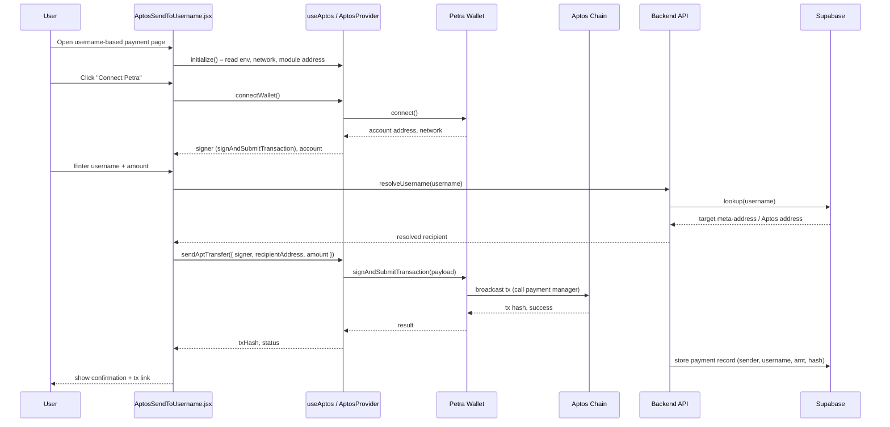

## Aptos Integration – Detailed Architecture (Mermaid)

### Component Topology

```mermaid
flowchart LR
  subgraph Browser[User Browser]
    REACT[React App<br/>Vite + Router]
    SEND_PAGE[AptosSendPage / SendPage.jsx]
    USERNAME_PAGE[AptosSendToUsername.jsx]
    APTOS_PROVIDER[AptosProvider.jsx<br/>useAptos() hook]
  end

  subgraph Wallet
    PETRA[Petra Wallet<br/>(@aptos-labs/wallet-adapter-react)]
  end

  subgraph AptosChain[Aptos Network]
    MOD[Payment Manager Module<br/>(VITE_APTOS_MODULE_ADDRESS)]
    TREASURY[Treasury Account<br/>(VITE_TREASURY_WALLET_ADDRESS)]
    USERS[User Accounts]
  end

  subgraph Backend
    API[Backend API<br/>(VITE_BACKEND_URL)]
    SUPABASE[(Supabase DB<br/>VITE_SUPABASE_URL)]
  end

  subgraph Config
    ENV[Env Vars<br/>VITE_APTOS_MODULE_ADDRESS,<br/>VITE_TREASURY_WALLET_ADDRESS]
  end

  REACT --> APTOS_PROVIDER
  APTOS_PROVIDER --> SEND_PAGE
  APTOS_PROVIDER --> USERNAME_PAGE
  APTOS_PROVIDER --> ENV

  SEND_PAGE -->|connect()| PETRA
  USERNAME_PAGE -->|connect()| PETRA

  PETRA -->|sign & submit tx| MOD
  MOD --> TREASURY
  MOD --> USERS

  SEND_PAGE -->|REST / webhooks| API
  USERNAME_PAGE -->|REST / webhooks| API
  API --> SUPABASE
```

### Username / Payment Link Flow (Sequence)




