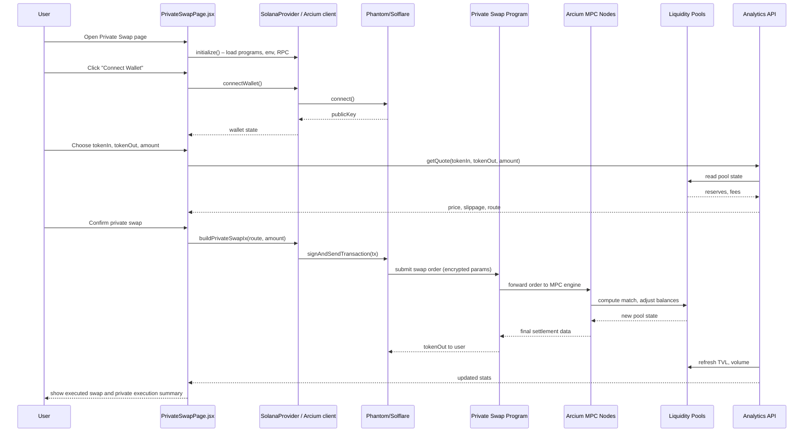

## Arcium / Private DeFi Integration – Detailed Architecture (Mermaid)

### Component Topology

```mermaid
flowchart LR
  subgraph Browser[User Browser]
    REACT[React App<br/>Vite + Router]
    DASH[Main Dashboard<br/>cards for Private DeFi]
    SWAP_PAGE[PrivateSwapPage.jsx]
    DARKPOOL_PAGE[DarkPoolPage.jsx]
    SOLANA_PROVIDER[SolanaProvider.jsx<br/>Arcium client hooks]
  end

  subgraph Wallet
    SOLWALLET[Solana Wallet<br/>(Phantom/Solflare)]
  end

  subgraph SolanaDevnet[Solana Devnet]
    ARCIUM_PROG[Arcium Program<br/>(VITE_ARCIUM_PROGRAM_ID)]
    PRIVPAY_PROG[PrivatePay Program<br/>(VITE_PRIVATE_PAY_PROGRAM_ID)]
    PRIV_SWAP_PROG[Private Swap Program<br/>(VITE_PRIVATE_SWAP_PROGRAM_ID)]
    DARKPOOL_PROG[DarkPool Program<br/>(VITE_DARK_POOL_PROGRAM_ID)]
    POOLS[Liquidity Pools / Vault PDAs]
  end

  subgraph ArciumMPC[Arcium MPC / Off-chain Compute]
    MPC_NODES[MPC Nodes<br/>threshold signing, order matching]
  end

  subgraph Backend
    API[Analytics / Indexer<br/>TVL, APY, PnL]
  end

  REACT --> SOLANA_PROVIDER
  SOLANA_PROVIDER --> DASH
  SOLANA_PROVIDER --> SWAP_PAGE
  SOLANA_PROVIDER --> DARKPOOL_PAGE

  DASH -->|connect| SOLWALLET
  SWAP_PAGE --> SOLWALLET
  DARKPOOL_PAGE --> SOLWALLET

  SOLWALLET -->|MPC powered orders| ARCIUM_PROG
  SOLWALLET --> PRIVPAY_PROG
  SOLWALLET --> PRIV_SWAP_PROG
  SOLWALLET --> DARKPOOL_PROG

  ARCIUM_PROG --> MPC_NODES
  MPC_NODES --> POOLS

  API --> ARCIUM_PROG
  API --> PRIV_SWAP_PROG
  API --> DARKPOOL_PROG
  API --> POOLS

  DASH -->|load stats| API
  SWAP_PAGE -->|price quotes, slippage| API
  DARKPOOL_PAGE -->|batch auction results| API
```

### Private Swap Flow (Sequence)




