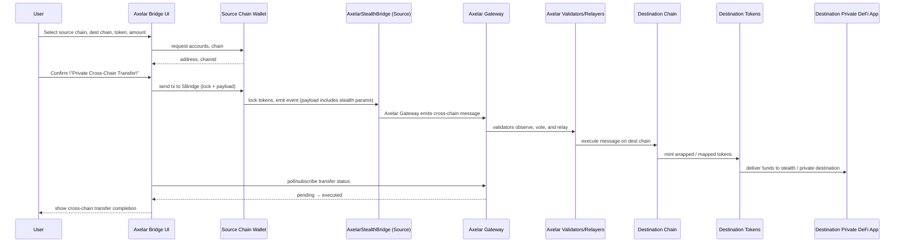

## Axelar Integration – Detailed Architecture (Mermaid)

### Component Topology

```mermaid
flowchart LR
  subgraph Browser[User Browser]
    REACT[React App<br/>Vite + Router]
    AXELAR_PAGE[Axelar Bridge UI<br/>cross-chain flows]
  end

  subgraph SourceChain[EVM Source Chain]
    SRCCHAIN[Source Chain<br/>(Ethereum / Polygon / etc.)]
    SRC_USER[User Wallet<br/>(Metamask, etc.)]
    STEALTH_BRIDGE[AxelarStealthBridge Contract<br/>(VITE_AXELAR_BRIDGE_ADDRESS)]
  end

  subgraph AxelarNet[Axelar Network]
    AXELAR_GATEWAY[Axelar Gateway Contracts]
    AXELAR_VALIDATORS[Axelar Validators & Relayers]
  end

  subgraph DestChain[EVM Destination Chain]
    DSTCHAIN[Destination Chain<br/>(e.g. Sapphire / Rollup)]
    DST_TOKENS[Wrapped / Bridged Assets]
    DST_DAPPS[Private DeFi / Zcash-linked Apps]
  end

  subgraph Backend
    API[Backend / Indexer (optional)]
  end

  REACT --> AXELAR_PAGE

  AXELAR_PAGE --> SRC_USER
  SRC_USER -->|lock tokens, call contract| STEALTH_BRIDGE

  STEALTH_BRIDGE --> AXELAR_GATEWAY
  AXELAR_GATEWAY --> AXELAR_VALIDATORS
  AXELAR_VALIDATORS --> DSTCHAIN

  DSTCHAIN --> DST_TOKENS
  DST_TOKENS --> DST_DAPPS

  AXELAR_PAGE -->|track status| API
  API --> AXELAR_GATEWAY
  API --> DSTCHAIN
```

### Cross-Chain Stealth Transfer Flow (Sequence)




