# Aztec Integration - Complete Code Flow Documentation

This document provides comprehensive Mermaid diagrams showing all Aztec-related code files, their relationships, and how frontend user interactions trigger actions throughout the system.

---

## 📋 Table of Contents

1. [Aztec Code File Structure](#aztec-code-file-structure)
2. [Frontend Navigation Flow](#frontend-navigation-flow)
3. [Aztec Dashboard Click Flow](#aztec-dashboard-click-flow)
4. [Bridge Component Flow](#bridge-component-flow)
5. [Stablecoin Component Flow](#stablecoin-component-flow)
6. [Aztec Client Initialization](#aztec-client-initialization)
7. [Bridge Deposit Flow](#bridge-deposit-flow)
8. [Bridge Withdrawal Flow](#bridge-withdrawal-flow)
9. [Encrypted Notes Flow](#encrypted-notes-flow)
10. [Complete User Interaction Journey](#complete-user-interaction-journey)

---

## 📁 Aztec Code File Structure

### File Organization and Dependencies


### Code File Responsibilities


---

## 🧭 Frontend Navigation Flow

### User Clicks "Aztec" in Navigation Bar


### Navigation State Flow


---

## 🎯 Aztec Dashboard Click Flow

### User Clicks "Explore Zcash Bridge" Button


### Dashboard Feature Card Interaction

```mermaid
flowchart TD
    Start([User on Aztec Dashboard]) --> HoverCard[User hovers over feature card]
    HoverCard --> CardHover[Card shows hover effect]
    CardHover --> ClickCard[User clicks card]
    
    ClickCard --> CheckFeature{Which Feature?}
    
    CheckFeature -->|Zcash Bridge| BridgePath[path = '/bridge']
    CheckFeature -->|Private Stablecoin| StablecoinPath[path = '/stablecoin']
    
    BridgePath --> NavigateBridge[navigate('/bridge')]
    StablecoinPath --> NavigateStablecoin[navigate('/stablecoin')]
    
    NavigateBridge --> LoadBridgePage[Lazy load BridgePage]
    NavigateStablecoin --> LoadStablecoinPage[Lazy load StablecoinPage]
    
    LoadBridgePage --> RenderBridge[Render Bridge component]
    LoadStablecoinPage --> RenderStablecoin[Render Stablecoin component]
    
    RenderBridge --> BridgeUI[Show Bridge UI]
    RenderStablecoin --> StablecoinUI[Show Stablecoin UI]
    
    BridgeUI --> End([User on Bridge Page])
    StablecoinUI --> End2([User on Stablecoin Page])
```

---

## 🌉 Bridge Component Flow

### Complete Bridge Component Initialization


### Bridge Deposit Flow (Zcash → Aztec)


### Bridge Withdrawal Flow (Aztec → Zcash)

```mermaid
sequenceDiagram
    participant User
    participant Bridge
    participant handleWithdrawal
    participant BridgeManager
    participant NoteManager
    participant AztecClient
    participant AztecContract
    participant EncryptedNote

    User->>Bridge: Sets direction to "Aztec → Zcash"
    Note over Bridge: Line 114: setDirection('aztec-to-zcash')
    
    User->>Bridge: Enters amount
    User->>Bridge: Clicks "Withdraw to Zcash" button
    Note over Bridge: Line 138: onClick={handleWithdrawal}
    
    Bridge->>handleWithdrawal: handleWithdrawal() called
    Note over Bridge: Lines 73-97: Withdrawal handler
    
    handleWithdrawal->>handleWithdrawal: Validate amount
    handleWithdrawal->>Bridge: setIsLoading(true)
    handleWithdrawal->>Bridge: setStatus('processing')
    
    handleWithdrawal->>NoteManager: getUnspentNotes(assetId)
    Note over NoteManager: Location: src/lib/aztec/encryptedNotes.js:111
    
    NoteManager-->>handleWithdrawal: List of unspent notes
    
    handleWithdrawal->>NoteManager: selectNotesForPayment(amount)
    Note over NoteManager: Lines 145-165: Select notes algorithm
    
    NoteManager-->>handleWithdrawal: Selected notes array
    
    handleWithdrawal->>EncryptedNote: Create withdrawal note
    Note over EncryptedNote: Location: src/lib/aztec/encryptedNotes.js:11
    
    EncryptedNote-->>handleWithdrawal: EncryptedNote instance
    
    handleWithdrawal->>BridgeManager: createWithdrawal(bzecAmount, zcashAddress, note)
    Note over BridgeManager: Location: src/lib/aztec/bridge.js:182
    
    BridgeManager->>BridgeManager: Create burn transaction
    Note over BridgeManager: Lines 185-189: Transaction object
    
    BridgeManager->>AztecClient: sendTransaction(burnTx)
    Note over AztecClient: Location: src/lib/aztec/aztecClient.js:90
    
    AztecClient->>AztecContract: Submit burn transaction
    Note over AztecContract: Burns bZEC on Aztec
    
    AztecContract-->>AztecClient: aztecTxId
    
    AztecClient-->>BridgeManager: aztecTxId
    
    BridgeManager->>BridgeManager: new BridgeWithdrawal(...)
    Note over BridgeManager: Lines 194-199: Create withdrawal object
    
    BridgeManager->>BridgeManager: withdrawals.set(aztecTxId, withdrawal)
    Note over BridgeManager: Line 201: Store withdrawal
    
    BridgeManager-->>handleWithdrawal: BridgeWithdrawal instance
    
    handleWithdrawal->>Bridge: setTxHash(aztecTxId)
    handleWithdrawal->>Bridge: setStatus('success')
    handleWithdrawal->>Bridge: setIsLoading(false)
    
    Bridge->>Bridge: Show success message
    Bridge-->>User: Withdrawal initiated
    Note over User: Operator processes withdrawal<br/>User receives ZEC on Zcash
```



---

## 💰 Stablecoin Component Flow

### Stablecoin Page Navigation


### Stablecoin Component Initialization


### Stablecoin Mint Flow (ZEC → pZUSD)


### Stablecoin Burn Flow (pZUSD → ZEC)


### Stablecoin Tab Switching Flow


---

## 🔌 Aztec Client Initialization

### PXE Client Connection Flow


---

## 📝 Encrypted Notes Flow

### Note Management Operations


---

## 🎬 Complete User Interaction Journey

### End-to-End Bridge Deposit Journey


### Component Interaction Map


---

## 🔄 State Management Flow

### Bridge Component State Flow


---

## 📊 Code Execution Timeline

### Detailed Execution Flow with File Locations

```mermaid
gantt
    title Aztec Bridge Deposit Execution Timeline
    dateFormat X
    axisFormat %L ms
    
    section User Interaction
    Click Aztec in Navbar          :0, 100
    Router Navigation               :100, 200
    Dashboard Render                :200, 300
    Click Bridge Card               :300, 400
    Navigate to Bridge              :400, 500
    
    section Component Initialization
    Bridge Component Mount          :500, 600
    useState Hooks                  :600, 650
    useEffect Trigger               :650, 700
    
    section Zcash Initialization
    Create RPC Client               :700, 800
    Create Zcash Wallet             :800, 900
    Initialize Wallet               :900, 1500
    
    section Aztec Initialization
    Get PXE URL                     :1500, 1600
    Create PXE Client               :1600, 1700
    Connect to PXE                  :1700, 2500
    
    section User Action
    Enter Amount                    :2500, 3000
    Click Deposit Button            :3000, 3100
    
    section Deposit Process
    Validate Amount                 :3100, 3200
    Send ZEC Transaction            :3200, 10000
    Generate Partial Note           :10000, 11000
    Create Deposit Ticket           :11000, 11100
    Claim bZEC                      :11100, 20000
    Show Success                    :20000, 20100
```

---

## 🗂️ File Reference Map

### Complete File Structure with Line Numbers

| File | Purpose | Key Functions/Lines |
|------|---------|---------------------|
| `src/pages/AztecDashboard.jsx` | Landing page | `navigate()` - Lines 16, 51, 109, 131 |
| `src/pages/BridgePage.jsx` | Route wrapper | `Bridge` component - Line 4 |
| `src/pages/StablecoinPage.jsx` | Route wrapper | `Stablecoin` component - Line 4 |
| `src/components/bridge/Bridge.jsx` | Bridge UI | `handleDeposit()` - Lines 44-68<br/>`handleWithdrawal()` - Lines 73-97<br/>`useEffect()` - Lines 22-39 |
| `src/components/shared/Navbar.jsx` | Navigation | Aztec link - Lines 55-63 |
| `src/router.jsx` | Routing | Aztec routes - Lines 145-156 |
| `src/lib/aztec/index.js` | Main entry | `createConfiguredPXEClient()` - Line 66<br/>`getPXEUrl()` - Line 50 |
| `src/lib/aztec/aztecClient.js` | PXE client | `connect()` - Lines 22-39<br/>`sendTransaction()` - Lines 90-114<br/>`getNotes()` - Lines 68-83 |
| `src/lib/aztec/bridge.js` | Bridge logic | `createDeposit()` - Lines 106-129<br/>`claimBZEC()` - Lines 137-173<br/>`createWithdrawal()` - Lines 182-208 |
| `src/lib/aztec/encryptedNotes.js` | Note management | `addNote()` - Lines 68-70<br/>`getBalance()` - Lines 130-137<br/>`selectNotesForPayment()` - Lines 145-165 |

---

## 🎯 Key Interaction Points

### Where User Clicks and What Happens

```mermaid
flowchart TD
    Start([User on App]) --> NavbarClick{User clicks<br/>in Navbar}
    
    NavbarClick -->|Aztec link| NavbarHandler[Navbar.jsx:56<br/>to='/aztec']
    NavbarHandler --> RouterMatch[Router matches /aztec]
    RouterMatch --> DashboardLoad[Lazy load AztecDashboard.jsx]
    DashboardLoad --> DashboardRender[Render dashboard]
    
    DashboardRender --> CardClick{User clicks<br/>feature card}
    
    CardClick -->|Zcash Bridge| BridgeCard[AztecDashboard.jsx:109<br/>onPress={() => navigate('/bridge')}]
    CardClick -->|Private Stablecoin| StablecoinCard[AztecDashboard.jsx:131<br/>onPress={() => navigate('/stablecoin')}]
    
    BridgeCard --> BridgePageLoad[Load BridgePage.jsx]
    BridgePageLoad --> BridgeComponent[Render Bridge.jsx]
    
    BridgeComponent --> InitEffect[Bridge.jsx:22<br/>useEffect initialization]
    InitEffect --> ZcashInit[Initialize Zcash wallet]
    InitEffect --> AztecInit[Initialize Aztec PXE]
    
    BridgeComponent --> DirectionToggle{Bridge.jsx:106-117<br/>User toggles direction}
    DirectionToggle --> SetDirection[setDirection state]
    
    BridgeComponent --> AmountInput[Bridge.jsx:121-132<br/>User enters amount]
    AmountInput --> UpdateAmount[setAmount state]
    
    BridgeComponent --> ButtonClick{Bridge.jsx:134-150<br/>User clicks button}
    
    ButtonClick -->|direction === 'zcash-to-aztec'| DepositHandler[Bridge.jsx:44<br/>handleDeposit()]
    ButtonClick -->|direction === 'aztec-to-zcash'| WithdrawHandler[Bridge.jsx:73<br/>handleWithdrawal()]
    
    DepositHandler --> ValidateAmount[Validate amount > 0]
    ValidateAmount --> SetLoading[setIsLoading(true)]
    SetLoading --> ZcashSend[Send ZEC to bridge]
    ZcashSend --> CreateDeposit[bridge.js:106<br/>createDeposit()]
    CreateDeposit --> ClaimBZEC[bridge.js:137<br/>claimBZEC()]
    ClaimBZEC --> ShowSuccess[Show success message]
    
    WithdrawHandler --> ValidateAmount2[Validate amount > 0]
    ValidateAmount2 --> SetLoading2[setIsLoading(true)]
    SetLoading2 --> SelectNotes[Select unspent notes]
    SelectNotes --> CreateWithdrawal[bridge.js:182<br/>createWithdrawal()]
    CreateWithdrawal --> BurnBZEC[Burn bZEC on Aztec]
    BurnBZEC --> ShowSuccess2[Show success message]
```

---

---

## 📚 Complete Code File Reference

### All Aztec-Related Files

| File Path | Lines | Purpose | Key Exports/Functions |
|-----------|-------|---------|----------------------|
| `src/pages/AztecDashboard.jsx` | 1-165 | Landing page | `AztecDashboard` component |
| `src/pages/BridgePage.jsx` | 1-10 | Route wrapper | `BridgePage` component |
| `src/pages/StablecoinPage.jsx` | 1-10 | Route wrapper | `StablecoinPage` component |
| `src/components/bridge/Bridge.jsx` | 1-189 | Bridge UI | `Bridge` component<br/>`handleDeposit()` - Line 44<br/>`handleWithdrawal()` - Line 73 |
| `src/components/stablecoin/Stablecoin.jsx` | 1-272 | Stablecoin UI | `Stablecoin` component<br/>`handleMint()` - Line 58<br/>`handleBurn()` - Line 84<br/>`calculateStablecoin()` - Line 38<br/>`calculateZEC()` - Line 48 |
| `src/components/shared/Navbar.jsx` | 55-63 | Navigation | Aztec link with `to="/aztec"` |
| `src/router.jsx` | 145-156 | Routing | `/aztec`, `/bridge`, `/stablecoin` routes |
| `src/lib/aztec/index.js` | 1-73 | Main entry point | `createConfiguredPXEClient()` - Line 66<br/>`getPXEUrl()` - Line 50<br/>`AZTEC_CONFIG` - Line 29 |
| `src/lib/aztec/aztecClient.js` | 1-151 | PXE client | `AztecPXEClient` class<br/>`connect()` - Line 22<br/>`sendTransaction()` - Line 90<br/>`getNotes()` - Line 68<br/>`getAccount()` - Line 46 |
| `src/lib/aztec/bridge.js` | 1-251 | Bridge logic | `BridgeManager` class<br/>`createDeposit()` - Line 106<br/>`claimBZEC()` - Line 137<br/>`createWithdrawal()` - Line 182<br/>`BridgeDeposit` class - Line 15<br/>`BridgeWithdrawal` class - Line 53 |
| `src/lib/aztec/encryptedNotes.js` | 1-208 | Note management | `NoteManager` class<br/>`EncryptedNote` class - Line 11<br/>`addNote()` - Line 68<br/>`getBalance()` - Line 130<br/>`selectNotesForPayment()` - Line 145<br/>`markSpent()` - Line 85 |

### Code File Dependencies Graph

```mermaid
graph TD
    subgraph "Frontend Entry Points"
        Navbar[Navbar.jsx<br/>Line 55-63]
        Router[router.jsx<br/>Lines 145-156]
    end
    
    subgraph "Page Components"
        AztecDashboard[AztecDashboard.jsx<br/>Lines 1-165]
        BridgePage[BridgePage.jsx<br/>Lines 1-10]
        StablecoinPage[StablecoinPage.jsx<br/>Lines 1-10]
    end
    
    subgraph "UI Components"
        Bridge[Bridge.jsx<br/>Lines 1-189]
        Stablecoin[Stablecoin.jsx<br/>Lines 1-272]
    end
    
    subgraph "Library Core"
        Index[index.js<br/>Lines 1-73]
        Client[aztecClient.js<br/>Lines 1-151]
        BridgeLib[bridge.js<br/>Lines 1-251]
        Notes[encryptedNotes.js<br/>Lines 1-208]
    end
    
    Navbar -->|navigate| AztecDashboard
    Router -->|route| AztecDashboard
    Router -->|route| BridgePage
    Router -->|route| StablecoinPage
    
    AztecDashboard -->|navigate| BridgePage
    AztecDashboard -->|navigate| StablecoinPage
    
    BridgePage --> Bridge
    StablecoinPage --> Stablecoin
    
    Bridge -->|import| Index
    Stablecoin -->|import| Index
    
    Index -->|export| Client
    Index -->|export| BridgeLib
    Index -->|export| Notes
    
    Bridge -->|import| BridgeLib
    Bridge -->|import| Client
    BridgeLib -->|uses| Client
    BridgeLib -->|uses| Notes
```

---

## 🎯 Complete Click-to-Action Map

### Every User Click and What It Triggers

```mermaid
flowchart TD
    Start([User on App]) --> NavbarClick[Click Aztec in Navbar<br/>Navbar.jsx:56]
    
    NavbarClick --> NavbarHandler[to='/aztec'<br/>React Router navigation]
    NavbarHandler --> DashboardLoad[Lazy load AztecDashboard.jsx<br/>router.jsx:147]
    DashboardLoad --> DashboardRender[Render AztecDashboard<br/>AztecDashboard.jsx:15]
    
    DashboardRender --> CardHover[User hovers card<br/>AztecDashboard.jsx:108]
    CardHover --> CardClick{User clicks card}
    
    CardClick -->|Zcash Bridge| BridgeCardClick[onPress={() => navigate('/bridge')}<br/>AztecDashboard.jsx:109]
    CardClick -->|Private Stablecoin| StablecoinCardClick[onPress={() => navigate('/stablecoin')}<br/>AztecDashboard.jsx:131]
    
    BridgeCardClick --> BridgeRoute[Route to /bridge<br/>router.jsx:150]
    BridgeRoute --> BridgePageLoad[Load BridgePage.jsx<br/>BridgePage.jsx:4]
    BridgePageLoad --> BridgeComponent[Render Bridge.jsx<br/>Bridge.jsx:14]
    
    BridgeComponent --> BridgeInit[useEffect initialization<br/>Bridge.jsx:22-39]
    BridgeInit --> ZcashInit[Initialize Zcash<br/>Bridge.jsx:25-27]
    BridgeInit --> AztecInit[Connect to PXE<br/>Bridge.jsx:29-30]
    
    BridgeComponent --> DirectionToggle[Toggle direction<br/>Bridge.jsx:106-117<br/>setDirection()]
    DirectionToggle --> AmountInput[Enter amount<br/>Bridge.jsx:121-132<br/>setAmount()]
    
    AmountInput --> DepositButton{Click Deposit?<br/>Bridge.jsx:138}
    AmountInput --> WithdrawButton{Click Withdraw?<br/>Bridge.jsx:138}
    
    DepositButton -->|Yes| DepositHandler[handleDeposit()<br/>Bridge.jsx:44]
    DepositHandler --> ZcashSend[Send ZEC to bridge<br/>Bridge.jsx:54]
    ZcashSend --> CreateDeposit[createDeposit()<br/>bridge.js:106]
    CreateDeposit --> ClaimBZEC[claimBZEC()<br/>bridge.js:137]
    ClaimBZEC --> AztecTx[Send transaction<br/>aztecClient.js:90]
    AztecTx --> DepositSuccess[Show success<br/>Bridge.jsx:59]
    
    WithdrawButton -->|Yes| WithdrawHandler[handleWithdrawal()<br/>Bridge.jsx:73]
    WithdrawHandler --> SelectNotes[Select notes<br/>encryptedNotes.js:145]
    SelectNotes --> CreateWithdrawal[createWithdrawal()<br/>bridge.js:182]
    CreateWithdrawal --> BurnBZEC[Burn bZEC<br/>aztecClient.js:90]
    BurnBZEC --> WithdrawSuccess[Show success<br/>Bridge.jsx:88]
    
    StablecoinCardClick --> StablecoinRoute[Route to /stablecoin<br/>router.jsx:154]
    StablecoinRoute --> StablecoinPageLoad[Load StablecoinPage.jsx<br/>StablecoinPage.jsx:4]
    StablecoinPageLoad --> StablecoinComponent[Render Stablecoin.jsx<br/>Stablecoin.jsx:11]
    
    StablecoinComponent --> PriceFetch[Fetch ZEC price<br/>Stablecoin.jsx:19-33<br/>useEffect]
    PriceFetch --> TabSwitch{Which tab?}
    
    TabSwitch -->|Mint| MintTab[Mint tab<br/>Stablecoin.jsx:123]
    TabSwitch -->|Burn| BurnTab[Burn tab<br/>Stablecoin.jsx:184]
    
    MintTab --> EnterZEC[Enter ZEC amount<br/>Stablecoin.jsx:127-137]
    EnterZEC --> CalcPZUSD[calculateStablecoin()<br/>Stablecoin.jsx:38]
    CalcPZUSD --> ClickMint[Click Mint button<br/>Stablecoin.jsx:167]
    ClickMint --> MintHandler[handleMint()<br/>Stablecoin.jsx:58]
    MintHandler --> MintTx[Mint transaction<br/>Stablecoin.jsx:67-69]
    MintTx --> MintSuccess[Show success<br/>Stablecoin.jsx:72]
    
    BurnTab --> EnterPZUSD[Enter pZUSD amount<br/>Stablecoin.jsx:188-198]
    EnterPZUSD --> CalcZEC[calculateZEC()<br/>Stablecoin.jsx:48]
    CalcZEC --> ClickBurn[Click Redeem button<br/>Stablecoin.jsx:228]
    ClickBurn --> BurnHandler[handleBurn()<br/>Stablecoin.jsx:84]
    BurnHandler --> BurnTx[Burn transaction<br/>Stablecoin.jsx:93-95]
    BurnTx --> BurnSuccess[Show success<br/>Stablecoin.jsx:98]
```

---

## 🔍 Detailed Function Call Trace

### Bridge Deposit Complete Trace

```mermaid
sequenceDiagram
    autonumber
    participant User
    participant Bridge_jsx as Bridge.jsx
    participant bridge_js as bridge.js
    participant aztecClient_js as aztecClient.js
    participant encryptedNotes_js as encryptedNotes.js
    participant zcash_lib as zcash/index.js
    participant Blockchain

    Note over User,Blockchain: User clicks "Deposit to Aztec" button
    
    User->>Bridge_jsx: Click button (Line 138)
    Bridge_jsx->>Bridge_jsx: handleDeposit() called (Line 44)
    Bridge_jsx->>Bridge_jsx: Validate amount (Line 45-48)
    Bridge_jsx->>Bridge_jsx: setIsLoading(true) (Line 50)
    Bridge_jsx->>Bridge_jsx: setStatus('processing') (Line 51)
    
    Bridge_jsx->>zcash_lib: Send ZEC to bridge address (Line 54)
    zcash_lib->>Blockchain: Submit ZEC transaction
    Blockchain-->>zcash_lib: zcashTxId
    zcash_lib-->>Bridge_jsx: zcashTxId returned
    
    Bridge_jsx->>bridge_js: createDeposit(zcashTxId, note, amount) (Line 106)
    bridge_js->>bridge_js: generatePartialNote(zcashNote) (Line 109)
    bridge_js->>bridge_js: generateTicketId() (Line 112)
    bridge_js->>bridge_js: new BridgeDeposit(...) (Line 115-120)
    bridge_js->>bridge_js: deposits.set(ticketId, deposit) (Line 122)
    bridge_js-->>Bridge_jsx: BridgeDeposit instance
    
    Bridge_jsx->>bridge_js: claimBZEC(ticketId, aztecAddress) (Line 137)
    bridge_js->>bridge_js: Get deposit by ticketId (Line 139)
    bridge_js->>bridge_js: createPartialNoteProof() (Line 150)
    bridge_js->>bridge_js: Create claim transaction (Line 156-162)
    bridge_js->>aztecClient_js: sendTransaction(transaction) (Line 164)
    
    aztecClient_js->>aztecClient_js: Check isConnected (Line 91)
    aztecClient_js->>aztecClient_js: POST /transactions (Line 96-102)
    aztecClient_js->>Blockchain: Submit to Aztec PXE
    Blockchain-->>aztecClient_js: aztecTxId
    aztecClient_js-->>bridge_js: aztecTxId
    
    bridge_js->>bridge_js: deposit.status = 'claimed' (Line 166)
    bridge_js-->>Bridge_jsx: aztecTxId
    
    Bridge_jsx->>Bridge_jsx: setTxHash(aztecTxId) (Line 153)
    Bridge_jsx->>Bridge_jsx: setStatus('success') (Line 60)
    Bridge_jsx->>Bridge_jsx: setIsLoading(false) (Line 66)
    Bridge_jsx->>Bridge_jsx: Show success UI (Line 153-159)
    Bridge_jsx-->>User: Deposit successful
```

---

This documentation provides a complete view of all Aztec code files, their relationships, and how every user click triggers actions throughout the system. Each diagram shows the exact file locations and line numbers where actions occur.

