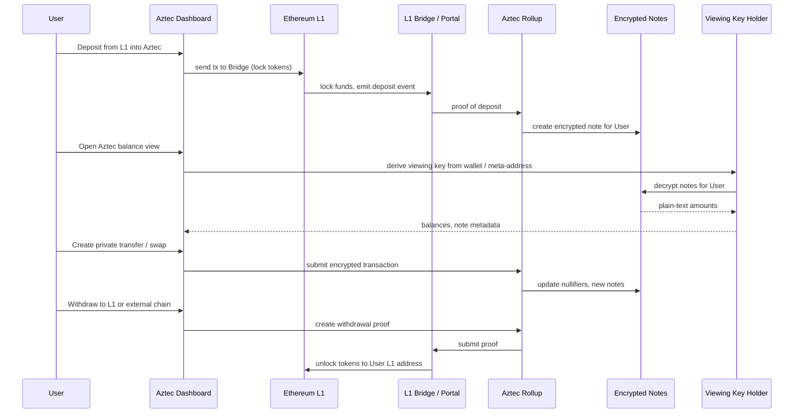

## Aztec / L2 Privacy Integration – Detailed Architecture (Mermaid)

### Component Topology

```mermaid
flowchart LR
  subgraph Browser[User Browser]
    REACT[React App<br/>Vite + Router]
    AZTEC_DASH[Aztec Dashboard / PrivatePay Cards]
  end

  subgraph AztecL2[Aztec L2]
    ROLLUP[Aztec Rollup Sequencer]
    NOTES[Encrypted Notes Storage]
    BRIDGEPORTAL[Bridge / Portal Contracts]
    VIEWKEYS[Viewing Keys / Note Decryption]
  end

  subgraph L1[Ethereum L1]
    L1BRIDGE[L1 Bridge / Rollup Contract]
    L1TOKENS[L1 Tokens / Collateral]
  end

  subgraph ZcashSide[Zcash / External Chains]
    ZCASH[Zcash Chain]
    EXTERNAL[Other Chains (Aptos, Osmosis, etc.)]
  end

  REACT --> AZTEC_DASH

  AZTEC_DASH --> ROLLUP
  ROLLUP --> NOTES
  ROLLUP --> BRIDGEPORTAL

  BRIDGEPORTAL --> L1BRIDGE
  L1BRIDGE --> L1TOKENS

  BRIDGEPORTAL <-.- ZCASH
  BRIDGEPORTAL <-.- EXTERNAL
```

### High-Level Private Flow (Sequence)




