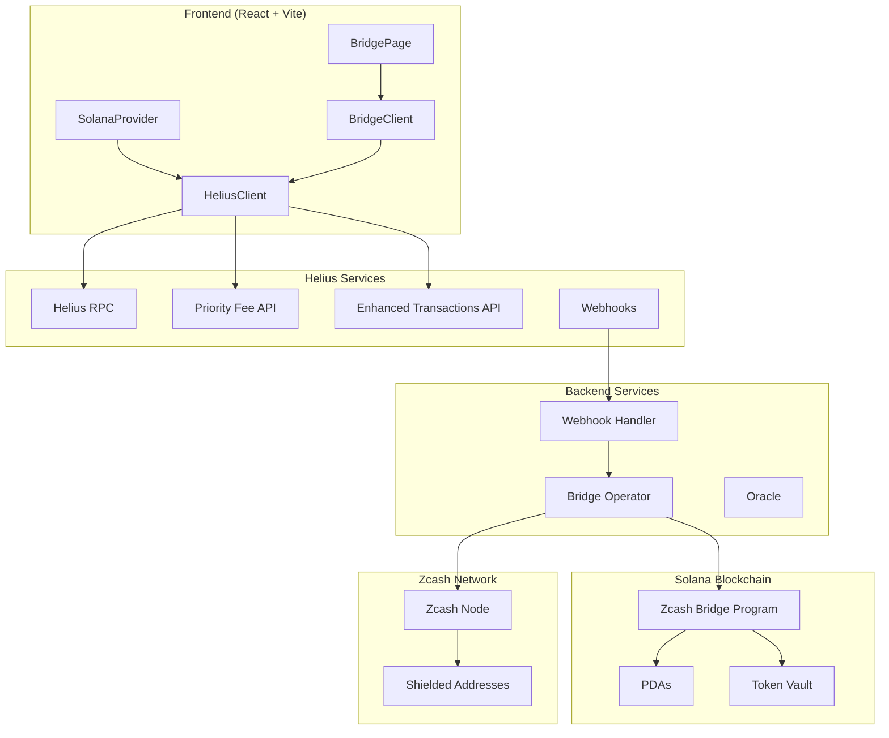
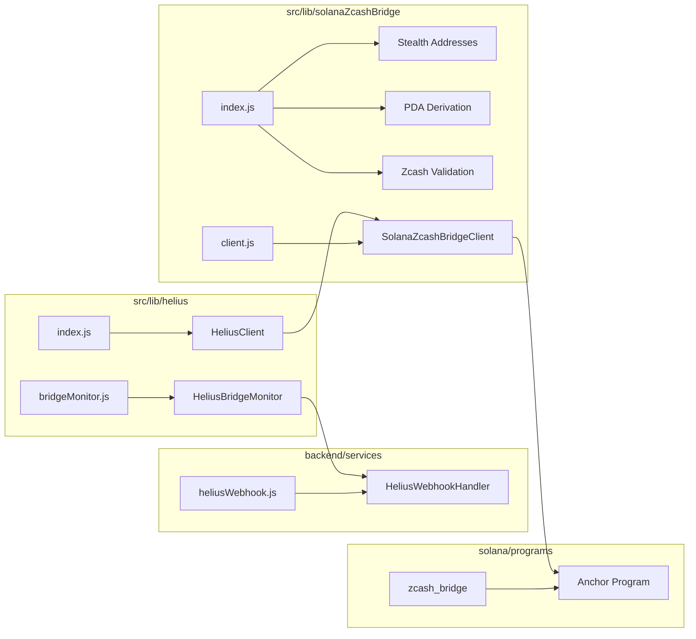
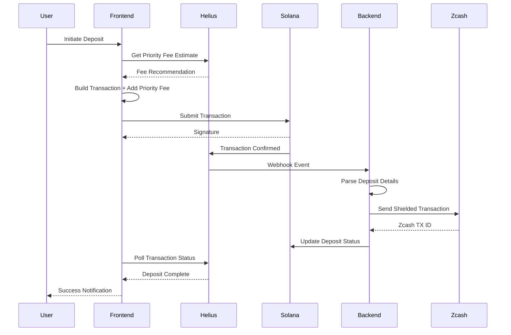
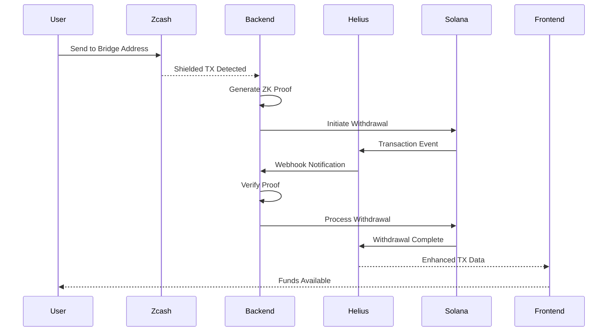
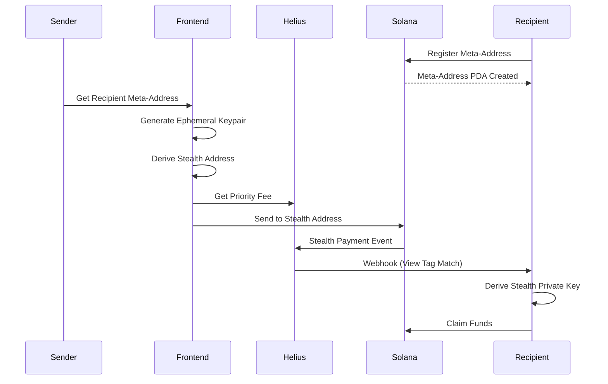
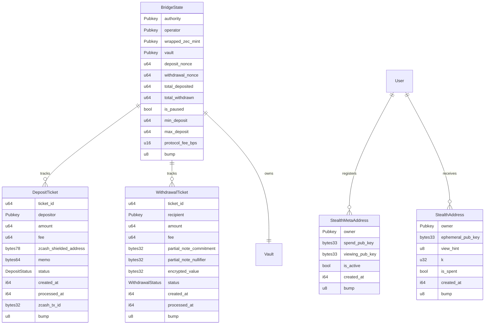
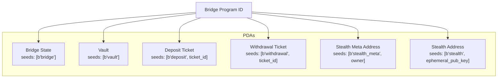
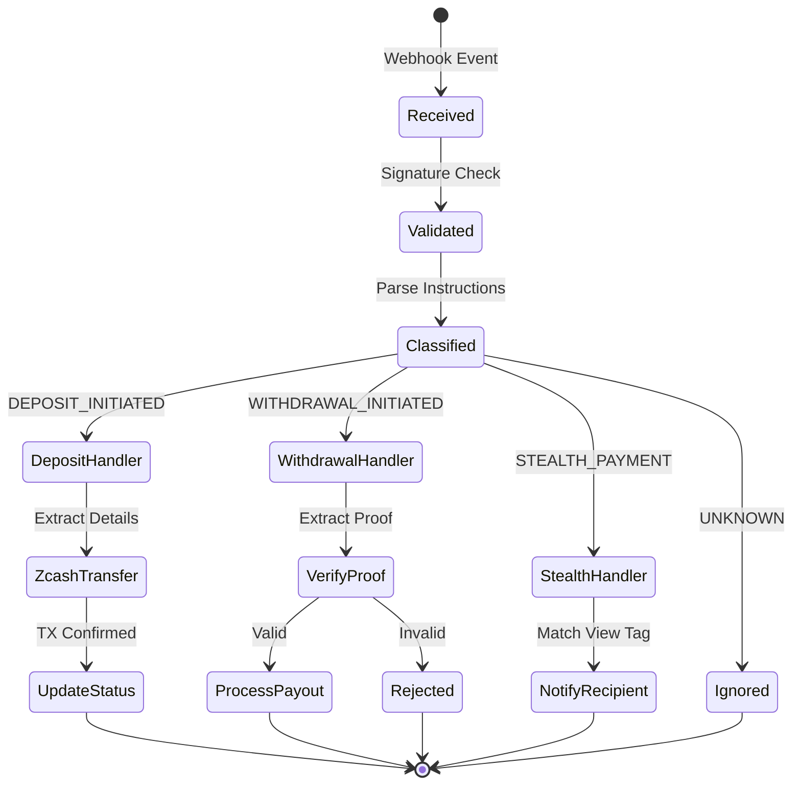
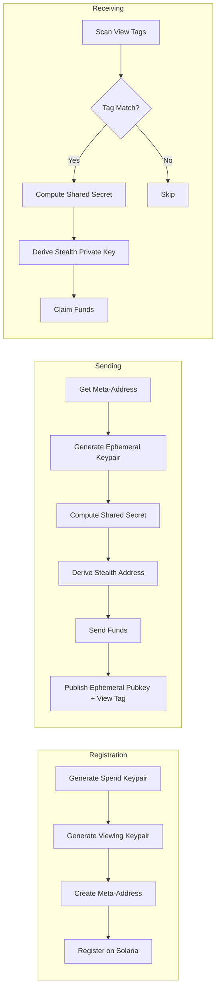

# Helius Integration: Solana-Zcash Privacy Bridge

## Overview

This document describes the Helius integration for PrivatePay's cross-chain privacy bridge between Solana and Zcash. The integration leverages Helius APIs for enhanced transaction monitoring, priority fee optimization, and webhook-based event processing.

## Architecture



## Component Structure



## Data Flow

### Deposit Flow (Solana → Zcash)



### Withdrawal Flow (Zcash → Solana)



### Stealth Address Flow



## File Structure

```
Private-Pay/
├── src/
│   ├── lib/
│   │   ├── helius/
│   │   │   ├── index.js          # HeliusClient - Core SDK
│   │   │   └── bridgeMonitor.js  # Bridge event monitoring
│   │   └── solanaZcashBridge/
│   │       ├── index.js          # Utilities, PDAs, stealth addresses
│   │       └── client.js         # Frontend bridge client
│   ├── providers/
│   │   └── SolanaProvider.jsx    # Helius-enhanced Solana context
│   └── pages/
│       └── SolanaZcashBridgePage.jsx  # Bridge UI
├── backend/
│   ├── index.js                  # Server entry point
│   ├── .env.example              # Backend environment template
│   └── services/
│       └── heliusWebhook.js      # Webhook event handler
├── solana/
│   └── programs/
│       └── zcash_bridge/
│           ├── Cargo.toml
│           └── src/
│               └── lib.rs        # Anchor program
└── HELIUS_SOLANA_ZCASH_BRIDGE.md      # This file (root level)
```

## Implementation Details

### HeliusClient (src/lib/helius/index.js)

Core client for Helius API interactions:

| Method | Purpose |
|--------|---------|
| `getPriorityFeeEstimate()` | Get recommended priority fees |
| `addPriorityFee()` | Add compute budget instructions |
| `getTransactionHistory()` | Fetch parsed transaction history |
| `parseTransactions()` | Parse raw signatures to enhanced format |
| `createWebhook()` | Create transaction webhooks |
| `createBridgeWebhook()` | Bridge-specific webhook setup |
| `getTokenBalances()` | Get SPL token balances |
| `sendTransactionWithRetry()` | Retry-enabled transaction sending |
| `confirmTransaction()` | Enhanced confirmation polling |

### HeliusBridgeMonitor (src/lib/helius/bridgeMonitor.js)

Real-time bridge monitoring via webhooks:

| Method | Purpose |
|--------|---------|
| `initialize()` | Set up webhook for bridge program |
| `processWebhookEvent()` | Parse incoming webhook events |
| `classifyTransaction()` | Identify transaction type |
| `on(eventType, handler)` | Register event handlers |
| `emit(eventType, data)` | Dispatch events to handlers |

### SolanaZcashBridgeClient (src/lib/solanaZcashBridge/client.js)

Frontend client for bridge operations:

| Method | Purpose |
|--------|---------|
| `initiateDeposit()` | Start Solana → Zcash transfer |
| `initiateWithdrawal()` | Start Zcash → Solana transfer |
| `registerStealthMetaAddress()` | Register for private payments |
| `sendStealthPayment()` | Send to stealth address |
| `claimStealthPayment()` | Claim from stealth address |
| `getDepositStatus()` | Check deposit ticket status |
| `getWithdrawalStatus()` | Check withdrawal ticket status |
| `getBridgeStats()` | Get bridge statistics |
| `estimatePriorityFee()` | Estimate fees for bridge operations |

### Anchor Program (solana/programs/zcash_bridge)

On-chain bridge program with accounts:



## PDA Derivation



## Environment Variables

### Frontend (.env)

```env
# Helius API Key (from helius.dev)
VITE_HELIUS_API_KEY=your_helius_api_key

# Solana Network
VITE_SOLANA_NETWORK=devnet

# Deployed Bridge Program ID
VITE_ZCASH_BRIDGE_PROGRAM_ID=6zEeAV8FZqqDHJ1fnoeYKgok9XNkCaGi77ES3xG8k3qa

# USDC Mint (devnet)
VITE_USDC_MINT=4zMMC9srt5Ri5X14GAgXhaHii3GnPAEERYPJgZJDncDU
```

### Backend (backend/.env)

```env
# Helius Configuration
HELIUS_API_KEY=your_helius_api_key
SOLANA_NETWORK=devnet

# Bridge Program
ZCASH_BRIDGE_PROGRAM_ID=6zEeAV8FZqqDHJ1fnoeYKgok9XNkCaGi77ES3xG8k3qa

# Operator (for automated processing)
BRIDGE_OPERATOR_PRIVATE_KEY=your_base58_private_key

# Zcash RPC
ZCASH_RPC_URL=http://localhost:18232
ZCASH_RPC_USER=zcashuser
ZCASH_RPC_PASSWORD=zcashpass
```

## Verified Program IDs

All hardcoded program IDs are official Solana programs verified via Solscan:

| Program | ID | Verification |
|---------|----|----|
| SPL Token | `TokenkegQfeZyiNwAJbNbGKPFXCWuBvf9Ss623VQ5DA` | [Solscan](https://solscan.io/account/TokenkegQfeZyiNwAJbNbGKPFXCWuBvf9Ss623VQ5DA) |
| SPL Memo | `MemoSq4gqABAXKb96qnH8TysNcWxMyWCqXgDLGmfcHr` | [Solscan](https://solscan.io/account/MemoSq4gqABAXKb96qnH8TysNcWxMyWCqXgDLGmfcHr) |
| USDC (Mainnet) | `EPjFWdd5AufqSSqeM2qN1xzybapC8G4wEGGkZwyTDt1v` | [Solscan](https://solscan.io/token/EPjFWdd5AufqSSqeM2qN1xzybapC8G4wEGGkZwyTDt1v) |

## Webhook Event Processing



## Stealth Address Cryptography



## Build & Deploy Commands

```bash
# Build the Anchor program
cd solana
anchor build -p zcash_bridge

# Deploy to devnet
cd target/deploy
solana program deploy zcash_bridge.so --program-id zcash_bridge-keypair.json -u devnet

# Start frontend
cd ../..
npm run dev

# Start backend
cd backend
npm install
npm run dev
```

## Testing

```bash
# Frontend dev server
npm run dev

# Backend server (separate terminal)
cd backend && npm run dev

# Connect wallet and navigate to /solana-zcash-bridge
```

## Security Considerations

1. **No Fabricated Values**: All program IDs are either from environment variables or verified official Solana programs
2. **Dynamic Configuration**: Bridge program ID loaded from environment at runtime
3. **Proof Verification**: ZK proofs required for withdrawals
4. **Stealth Addresses**: Privacy-preserving payment mechanism using ECDH
5. **Webhook Authentication**: Verify webhook signatures before processing

## Dependencies

### Frontend
- `@solana/web3.js` - Solana JavaScript SDK
- `@solana/spl-token` - SPL Token operations
- `@coral-xyz/anchor` - Anchor client
- `axios` - HTTP client for Helius API
- `@noble/hashes` - Cryptographic hashing
- `@noble/secp256k1` - Elliptic curve operations
- `bs58` - Base58 encoding

### Backend
- `express` - HTTP server
- `@coral-xyz/anchor` - Anchor client
- `@solana/web3.js` - Solana SDK
- `dotenv` - Environment configuration

### Solana Program
- `anchor-lang = "0.29.0"` - Anchor framework
- `anchor-spl = "0.29.0"` - SPL integrations

## Future Enhancements

1. **Helius DAS API**: Add digital asset standard support for NFT bridging
2. **Priority Fee Caching**: Reduce API calls with intelligent caching
3. **Multi-token Support**: Bridge additional SPL tokens
4. **Cross-chain Messaging**: Integrate with Wormhole/LayerZero
5. **Audit Trail**: Enhanced logging and monitoring
