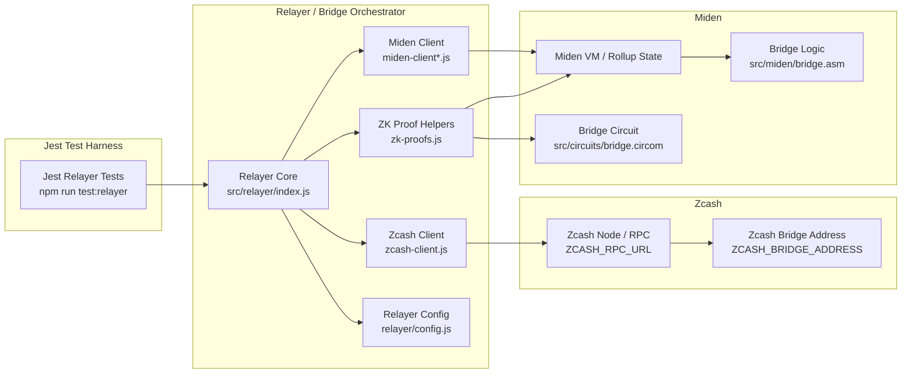
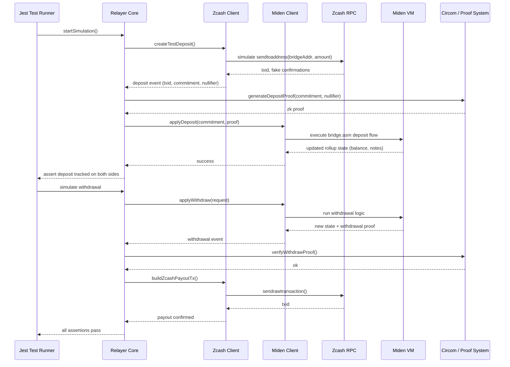

## Miden Integration (Zcash–Miden Bridge) – Detailed Architecture (Mermaid)

### Component Topology

```mermaid
flowchart LR
  subgraph Tests[Jest Test Harness]
    TESTS[Jest Relayer Tests<br/>npm run test:relayer]
  end

  subgraph RelayerLayer[Relayer / Bridge Orchestrator]
    RELAYER[Relayer Core<br/>src/relayer/index.js]
    ZCASH_CLIENT[Zcash Client<br/>zcash-client.js]
    MIDEN_CLIENT[Miden Client<br/>miden-client*.js]
    ZKPROOFS[ZK Proof Helpers<br/>zk-proofs.js]
    CONFIG[Relayer Config<br/>relayer/config.js]
  end

  subgraph ZcashSide[Zcash]
    ZNODE[Zcash Node / RPC<br/>ZCASH_RPC_URL]
    ZADDR[Zcash Bridge Address<br/>ZCASH_BRIDGE_ADDRESS]
  end

  subgraph MidenSide[Miden]
    MIDENVM[Miden VM / Rollup State]
    BRIDGEASM[Bridge Logic<br/>src/miden/bridge.asm]
    CIRCUITS[Bridge Circuit<br/>src/circuits/bridge.circom]
  end

  TESTS --> RELAYER
  RELAYER --> CONFIG
  RELAYER --> ZCASH_CLIENT
  RELAYER --> MIDEN_CLIENT
  RELAYER --> ZKPROOFS

  ZCASH_CLIENT --> ZNODE
  ZNODE --> ZADDR

  MIDEN_CLIENT --> MIDENVM
  MIDENVM --> BRIDGEASM
  ZKPROOFS --> CIRCUITS
  ZKPROOFS --> MIDENVM
```

### Simulated Bridge Flow (Sequence)

```mermaid
sequenceDiagram
  participant Jest as Jest Test Runner
  participant Relayer as Relayer Core
  participant ZClient as Zcash Client
  participant MClient as Miden Client
  participant ZNode as Zcash RPC
  participant MVM as Miden VM
  participant Circuits as Circom / Proof System

  Jest->>Relayer: startSimulation()
  Relayer->>ZClient: createTestDeposit()
  ZClient->>ZNode: simulate sendtoaddress(bridgeAddr, amount)
  ZNode-->>ZClient: txid, fake confirmations
  ZClient-->>Relayer: deposit event (txid, commitment, nullifier)

  Relayer->>Circuits: generateDepositProof(commitment, nullifier)
  Circuits-->>Relayer: zk proof
  Relayer->>MClient: applyDeposit(commitment, proof)
  MClient->>MVM: execute bridge.asm deposit flow
  MVM-->>MClient: updated rollup state (balance, notes)
  MClient-->>Relayer: success

  Relayer-->>Jest: assert deposit tracked on both sides

  Jest->>Relayer: simulate withdrawal
  Relayer->>MClient: applyWithdraw(request)
  MClient->>MVM: run withdrawal logic
  MVM-->>MClient: new state + withdrawal proof
  MClient-->>Relayer: withdrawal event

  Relayer->>Circuits: verifyWithdrawProof()
  Circuits-->>Relayer: ok
  Relayer->>ZClient: buildZcashPayoutTx()
  ZClient->>ZNode: sendrawtransaction()
  ZNode-->>ZClient: txid
  ZClient-->>Relayer: payout confirmed
  Relayer-->>Jest: all assertions pass
```

