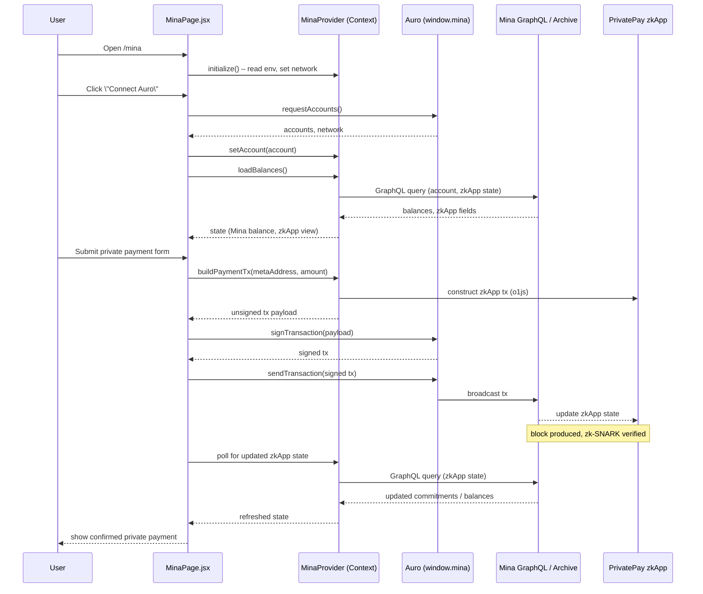

## Mina Integration – Detailed Architecture (Mermaid)

### Component Topology

```mermaid
flowchart LR
  subgraph Browser[User Browser]
    REACT[React App<br/>Vite + React Router]
    MINA_PAGE[MinaPage.jsx<br/>/mina route]
    MINA_PROVIDER[MinaProvider.jsx<br/>Mina context]
  end

  subgraph WalletSide
    AURO[Auro Wallet<br/>(window.mina)]
  end

  subgraph ChainSide[Mina Network]
    MINA_RPC[Mina Archive / GraphQL Endpoint]
    ZKAPP[PrivatePay Mina zkApp<br/>(zk-SNARK logic)]
  end

  subgraph Config[Config / Env]
    ENV_VARS[Env Vars<br/>VITE_WEBSITE_HOST,<br/>Mina endpoints]
  end

  REACT --> MINA_PAGE
  REACT --> MINA_PROVIDER

  MINA_PROVIDER -->|injects| MINA_PAGE
  MINA_PROVIDER -->|reads| ENV_VARS

  MINA_PAGE -->|connect()| AURO
  AURO -->|exposes account, network| MINA_PROVIDER

  MINA_PAGE -->|load balance, zkApp state| MINA_PROVIDER
  MINA_PROVIDER -->|GraphQL queries| MINA_RPC

  MINA_PAGE -->|build tx payload| MINA_PROVIDER
  MINA_PROVIDER -->|create zkApp tx| ZKAPP
  AURO -->|sign & send tx| ZKAPP

  ZKAPP --> MINA_RPC
  MINA_RPC --> MINA_PROVIDER
  MINA_PROVIDER --> MINA_PAGE
```

### Payment Flow (Sequence)




