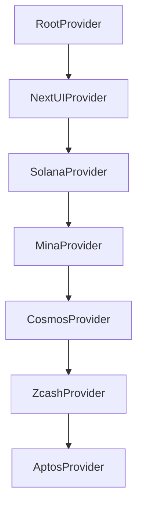
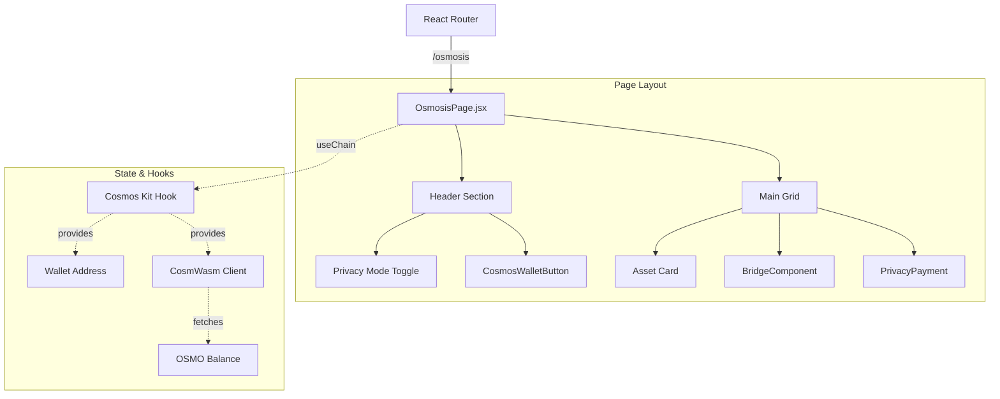
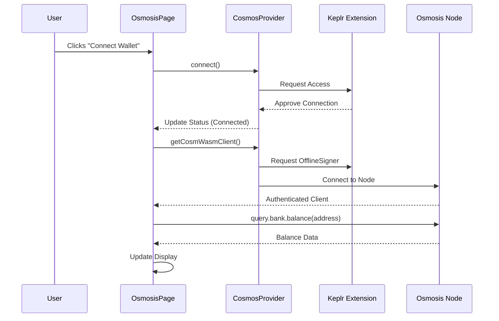

# Osmosis Integration Architecture

This document outlines the technical implementation of the Osmosis integration within PrivatePay, visualizing the component hierarchy and data flow using standard diagrams.

## 1. Provider Architecture
We integrated the **Cosmos Layer** by wrapping the existing provider tree. This ensures that Cosmos wallet context is available globally alongside Solana, Aptos, and Zcash.

## 2. Component Hierarchy & Flow
The `OsmosisPage` serves as the main entry point, composing the specialized privacy components and accessing the chain context.

## 3. Data Flow: Wallet Connection
How the application talks to Keplr behind the scenes.

