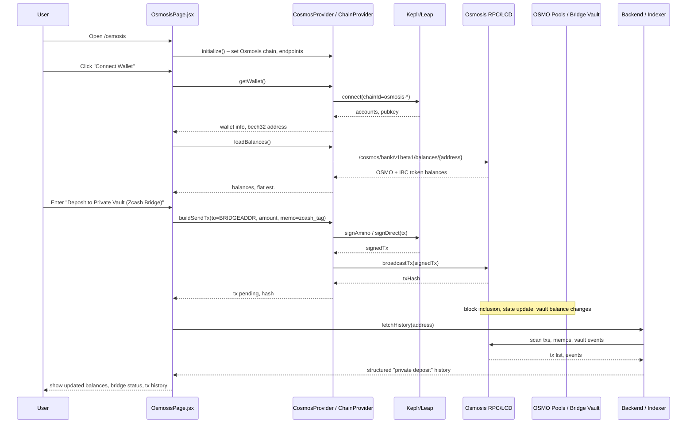

## Osmosis / CosmosKit Integration – Detailed Architecture (Mermaid)

### Component Topology

```mermaid
flowchart LR
  subgraph Browser[User Browser]
    REACT[React App<br/>Vite + Router]
    OSMOSIS_PAGE[OsmosisPage.jsx<br/>/osmosis route]
    COSMOS_PROVIDER[CosmosProvider.jsx<br/>ChainProvider wrapper]
  end

  subgraph Wallets
    KEPLR[Keplr Wallet Extension]
    LEAP[Leap Wallet Extension]
  end

  subgraph CosmosKitLayer[CosmosKit]
    CKIT[ChainProvider<br/>@cosmos-kit/react]
    OSMOCHAIN[Osmosis Chain Config<br/>@chain-registry/osmosis]
  end

  subgraph OsmosisZone[Osmosis Chain]
    OSMO_RPC[OSMO RPC / LCD]
    OSMOPOOL[OSMO Pools / Vault Contracts]
    BRIDGEADDR[Zcash Bridge / Vault Address]
  end

  subgraph Backend
    API[Backend / Indexer (optional)]
  end

  REACT --> COSMOS_PROVIDER
  COSMOS_PROVIDER --> CKIT
  CKIT --> OSMOCHAIN

  COSMOS_PROVIDER --> OSMOSIS_PAGE

  OSMOSIS_PAGE -->|connect()| KEPLR
  OSMOSIS_PAGE -->|connect()| LEAP

  KEPLR -->|sign send / IBC tx| OSMO_RPC
  LEAP -->|sign send / IBC tx| OSMO_RPC

  OSMOSIS_PAGE -->|query balances, pools| OSMO_RPC
  OSMO_RPC --> OSMOPOOL
  OSMOPOOL --> BRIDGEADDR

  OSMOSIS_PAGE -->|analytics, history| API
  API --> OSMOPOOL
```

### User + Behind-the-Scenes Flow (Sequence)




