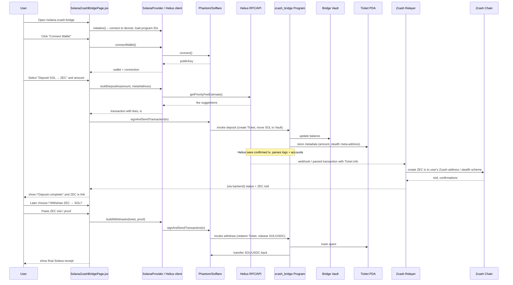

## Solana + Helius + Zcash Bridge – Detailed Architecture (Mermaid)

### Component Topology

```mermaid
flowchart LR
  subgraph Browser[User Browser]
    REACT[React App<br/>Vite + Router]
    BRIDGE_PAGE[SolanaZcashBridgePage.jsx<br/>/solana-zcash-bridge]
    SOLANA_PROVIDER[SolanaProvider.jsx<br/>HeliusSolanaProvider]
  end

  subgraph Wallets
    PHANTOM[Phantom Wallet]
    SOLFLARE[Solflare Wallet]
  end

  subgraph SolanaDevnet[Solana Devnet]
    ZBRIDGE[zcash_bridge Program<br/>(VITE_ZCASH_BRIDGE_PROGRAM_ID)]
    VAULT[Bridge Vault PDA]
    META[Stealth Meta-Address PDA Accounts]
    TICKETS[Deposit / Withdraw Ticket Accounts]
    USDC[USDC Mint<br/>(VITE_USDC_MINT)]
  end

  subgraph HeliusInfra[Helius]
    HELIUS[Helius RPC + APIs<br/>(VITE_HELIUS_API_KEY)]
  end

  subgraph ZcashSide[Zcash]
    ZECCHAIN[Zcash Chain<br/>(VITE_ZCASH_NETWORK)]
    ZECBRIDGE[Zcash Bridge Address<br/>(ZCASH_BRIDGE_ADDRESS)]
  end

  subgraph Relayer
    RELAYER[Solana–Zcash Relayer<br/>(Node.js)]
  end

  REACT --> SOLANA_PROVIDER
  SOLANA_PROVIDER --> BRIDGE_PAGE

  BRIDGE_PAGE -->|connect()| PHANTOM
  BRIDGE_PAGE -->|connect()| SOLFLARE

  PHANTOM -->|sign deposit/withdraw ix| ZBRIDGE
  SOLFLARE -->|sign deposit/withdraw ix| ZBRIDGE

  ZBRIDGE --> VAULT
  ZBRIDGE --> META
  ZBRIDGE --> TICKETS
  ZBRIDGE --> USDC

  BRIDGE_PAGE -->|priority fees, tx parse| HELIUS
  HELIUS --> ZBRIDGE

  RELAYER -->|subscribe via Helius| HELIUS
  RELAYER -->|submit proofs| ZECCHAIN
  ZECCHAIN --> ZECBRIDGE
```

### Deposit / Withdraw Flow (Sequence)




