# Starknet Integration (Ztarknet)

## Overview

This document describes the Starknet integration for PrivatePay, enabling cross-chain privacy transfers between Zcash and Starknet. The integration follows the existing patterns used for Aptos, Mina, and Zcash integrations.

## Architecture

### High-Level System Architecture

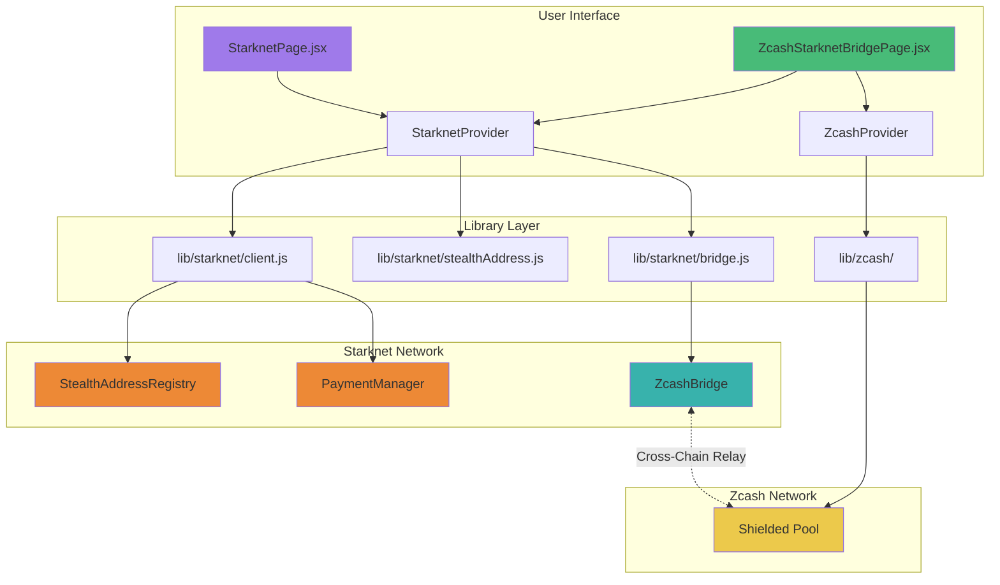

### Component Architecture

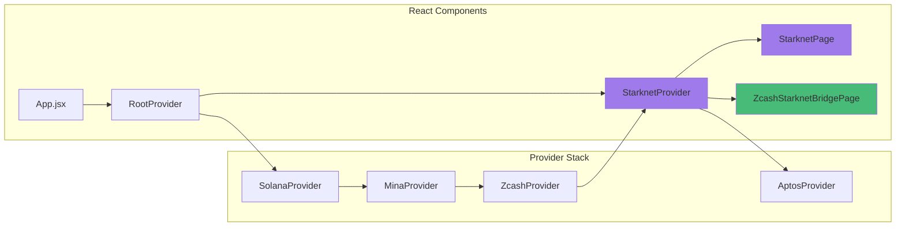

### Smart Contract Architecture

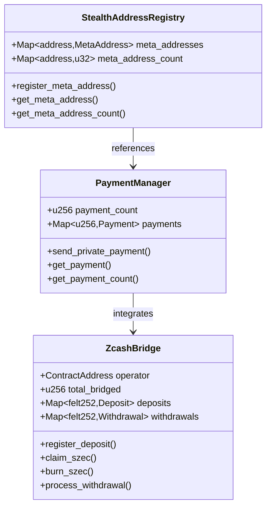

## Bridge Flow Diagrams

### Deposit Flow: Zcash → Starknet (ZEC → sZEC)

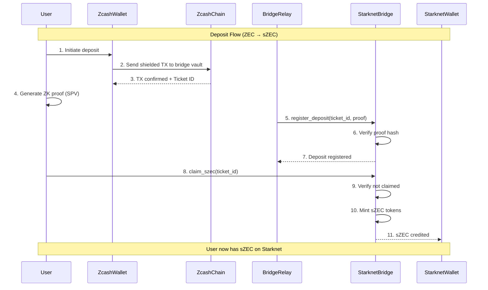

### Withdrawal Flow: Starknet → Zcash (sZEC → ZEC)

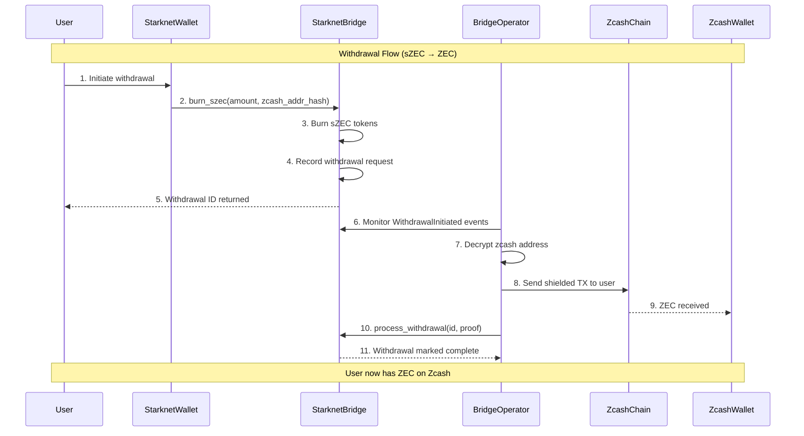

### Stealth Payment Flow

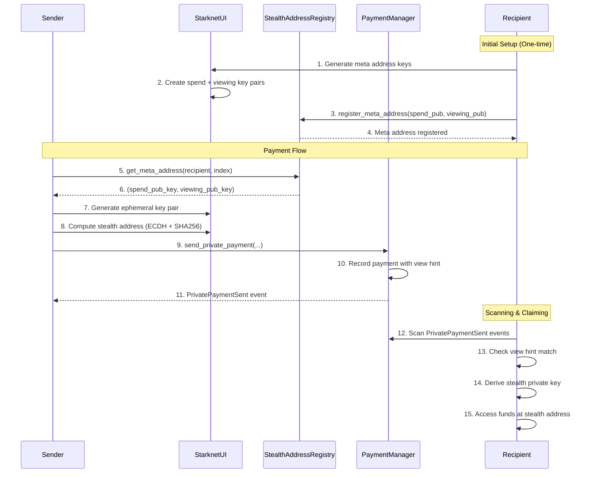

## Cryptographic Flow

### Stealth Address Generation

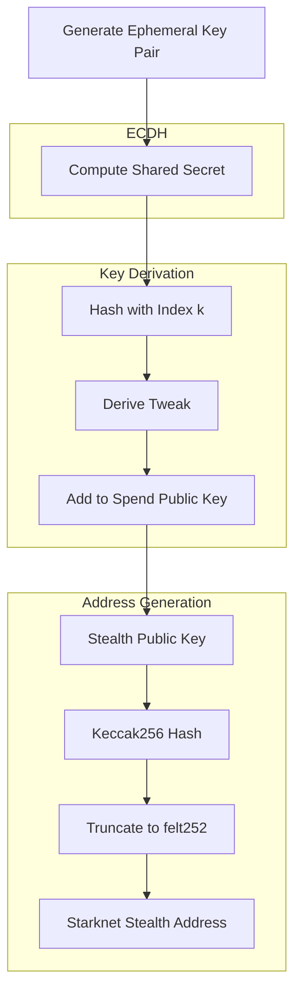

### Meta Address Key Structure

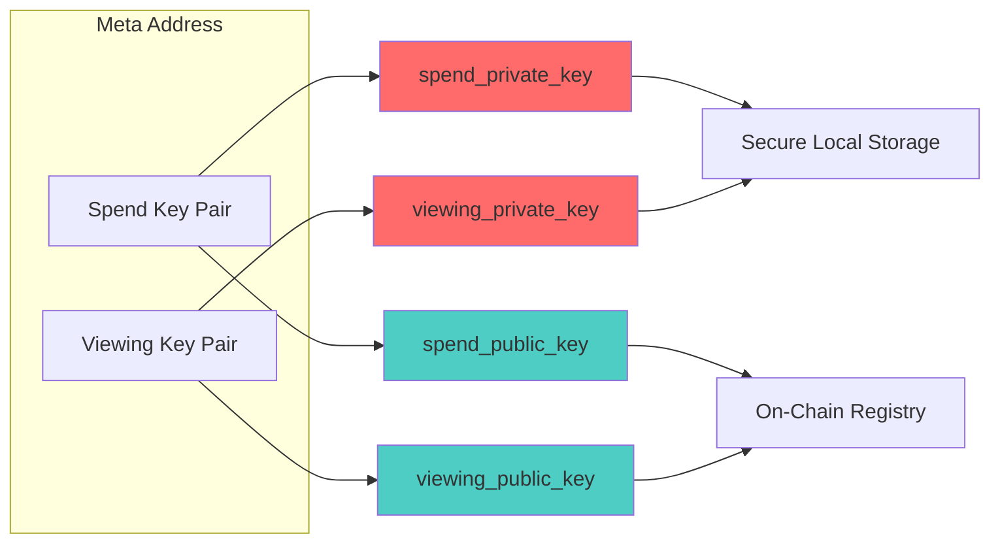

## File Structure

```
Private-Pay/
├── starknet/                           # Cairo Smart Contracts
│   ├── Scarb.toml                      # Package manifest
│   ├── README.md                       # Contract documentation
│   └── src/
│       ├── lib.cairo                   # Module root
│       ├── stealth_address.cairo       # Meta address registry
│       ├── payment_manager.cairo       # Stealth payments
│       └── zcash_bridge.cairo          # ZEC ↔ sZEC bridge
│
├── src/
│   ├── lib/starknet/                   # Frontend Library
│   │   ├── index.js                    # Main exports
│   │   ├── client.js                   # Starknet.js setup
│   │   ├── stealthAddress.js           # Stealth address crypto
│   │   ├── bridge.js                   # Bridge operations
│   │   └── constants.js                # Configuration
│   │
│   ├── providers/
│   │   └── StarknetProvider.jsx        # React context provider
│   │
│   ├── pages/
│   │   ├── StarknetPage.jsx            # Main dashboard
│   │   └── ZcashStarknetBridgePage.jsx # Bridge UI
│   │
│   └── components/
│       └── shared/
│           └── PrivacyNavbar.jsx       # Updated with Starknet links
│
└── STARKNET_INTEGRATION.md             # This file (root level)
```

## Configuration

### Environment Variables

```bash
# Starknet Configuration
VITE_STARKNET_NETWORK=testnet
VITE_STARKNET_RPC_URL=https://starknet-sepolia-rpc.publicnode.com
VITE_STARKNET_STEALTH_REGISTRY=<deployed_address>
VITE_STARKNET_PAYMENT_MANAGER=<deployed_address>
VITE_STARKNET_ZCASH_BRIDGE=<deployed_address>
VITE_STARKNET_SZEC_TOKEN=<deployed_address>
```

### Chain Configuration

```javascript
// Added to src/config.js
{
  id: "SN_SEPOLIA",
  name: "Starknet Sepolia",
  rpcUrl: "https://starknet-sepolia-rpc.publicnode.com",
  nativeToken: "ETH",
  blockExplorerUrl: "https://sepolia.starkscan.co",
  isTestnet: true,
  isStarknet: true,
}
```

## Wallet Support

### Supported Wallets

| Wallet | Status | Detection |
|--------|--------|-----------|
| ArgentX | Supported | `window.starknet_argentX` |
| Braavos | Supported | `window.starknet_braavos` |

### Connection Flow

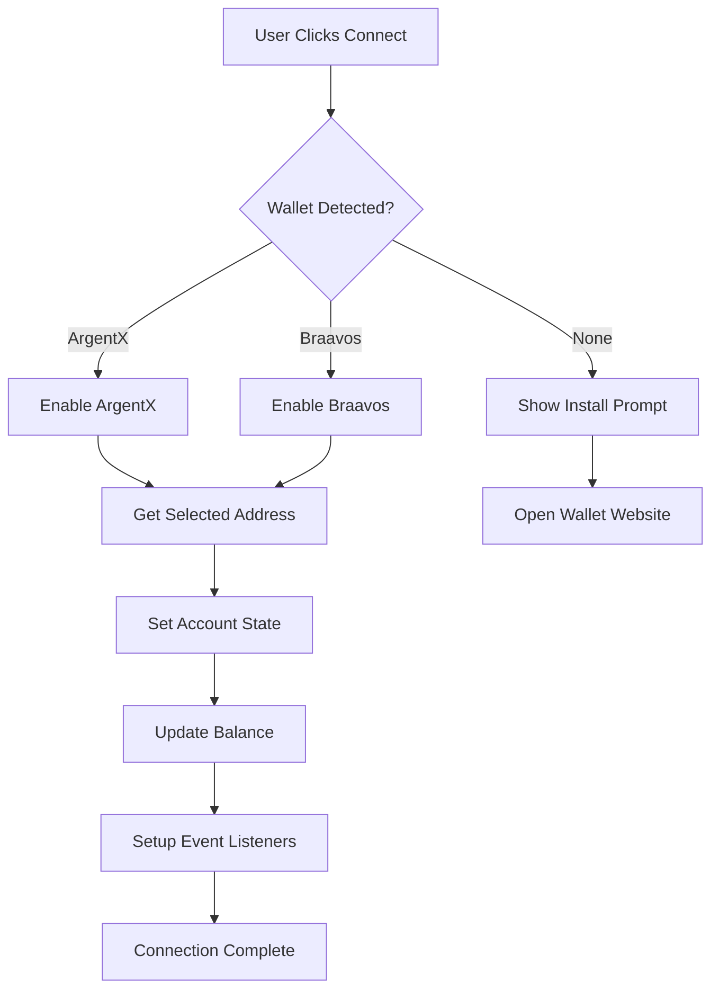

## Security Considerations

### Key Management

1. **Private Keys**: Spend and viewing private keys are stored in browser localStorage. Users should back up these keys securely.

2. **Stealth Addresses**: Each payment generates a unique stealth address, ensuring transaction unlinkability.

3. **View Hints**: Only the first byte of the shared secret is revealed as a view hint, minimizing information leakage while enabling efficient scanning.

### Bridge Security

1. **Operator Trust**: The bridge currently uses a trusted operator model. In production, implement:
   - Multi-signature operator set
   - Threshold signatures (TSS)
   - Decentralized verification

2. **Proof Verification**: Current implementation uses proof hashes. Production should:
   - Verify full ZK proofs on-chain
   - Implement SPV proofs for Zcash transactions
   - Use Garaga for efficient elliptic curve operations

3. **Rate Limiting**: Implement deposit/withdrawal limits to prevent bridge drainage attacks.

## API Reference

### StarknetProvider

```typescript
interface StarknetContextValue {
  // State
  account: string | null;
  isConnected: boolean;
  isConnecting: boolean;
  provider: Provider | null;
  walletType: 'argentX' | 'braavos' | null;
  chainId: string | null;
  network: 'mainnet' | 'testnet';
  balance: {
    eth: string;
    strk: string;
    szec: string;
    simulated: number;
  };
  availableWallets: { argentX: boolean; braavos: boolean };

  // Actions
  connect: (walletId?: string) => Promise<void>;
  disconnect: () => void;
  executeTransaction: (calls: Call[]) => Promise<TransactionResult>;
  signMessage: (message: any) => Promise<Signature>;
  simulateDeposit: (amount: number) => void;
  updateBalance: () => Promise<void>;
  getExplorerUrl: (txHash: string) => string;
  truncateAddress: (address?: string) => string;
}
```

### Stealth Address Functions

```typescript
// Generate new meta address keys
generateMetaAddressKeys(): {
  spend: { privateKey: string; publicKey: string };
  viewing: { privateKey: string; publicKey: string };
}

// Generate stealth address for payment
generateStealthAddress(
  spendPubKeyHex: string,
  viewingPubKeyHex: string,
  ephemeralPrivKey: Uint8Array,
  k?: number
): {
  stealthAddress: string;
  stealthPubKey: string;
  ephemeralPubKey: string;
  viewHint: string;
  k: number;
}

// Validate public key format
validatePublicKey(pubKeyHex: string): {
  valid: boolean;
  error?: string;
}
```

## Testing

### Unit Tests

```bash
# Run Cairo contract tests
cd starknet
scarb test
```

### Integration Tests

```bash
# Run frontend tests
npm run test
```

### Manual Testing Checklist

- [ ] ArgentX wallet connects successfully
- [ ] Braavos wallet connects successfully
- [ ] Meta address generation works
- [ ] Stealth address derivation is deterministic
- [ ] Bridge deposit flow completes
- [ ] Bridge withdrawal flow completes
- [ ] Simulated deposits update balance
- [ ] Navigation links work correctly
- [ ] Existing integrations (Aptos, Mina, Zcash) still function

## Deployment

### Cairo Contracts

```bash
# Install Scarb
curl --proto '=https' --tlsv1.2 -sSf https://docs.swmansion.com/scarb/install.sh | sh

# Build contracts
cd starknet
scarb build

# Deploy using Starkli
starkli deploy ./target/dev/privatepay_starknet_StealthAddressRegistry.contract_class.json \
  --network sepolia

starkli deploy ./target/dev/privatepay_starknet_PaymentManager.contract_class.json \
  --network sepolia

starkli deploy ./target/dev/privatepay_starknet_ZcashBridge.contract_class.json \
  <OPERATOR_ADDRESS> \
  --network sepolia
```

### Frontend

```bash
# Install dependencies
npm install

# Build for production
npm run build

# Preview build
npm run preview
```

## Private Lending Protocol

### Lending Architecture

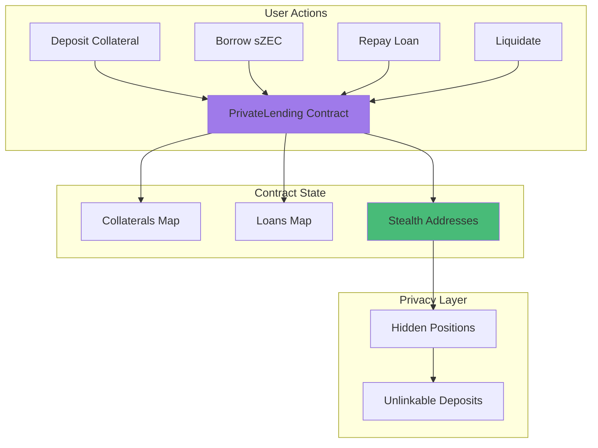

### Lending Flow

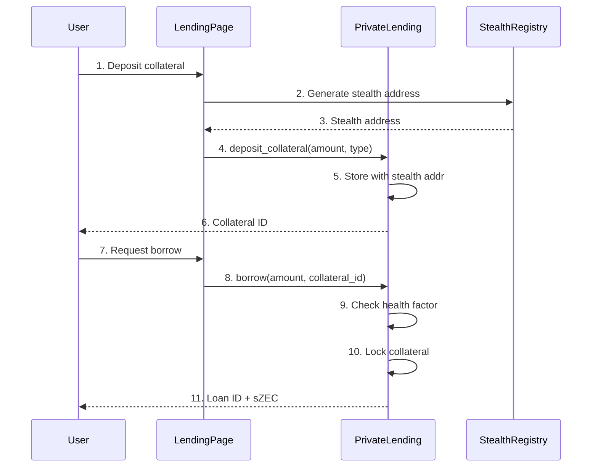

## Atomic Swap (HTLC)

### Swap Architecture

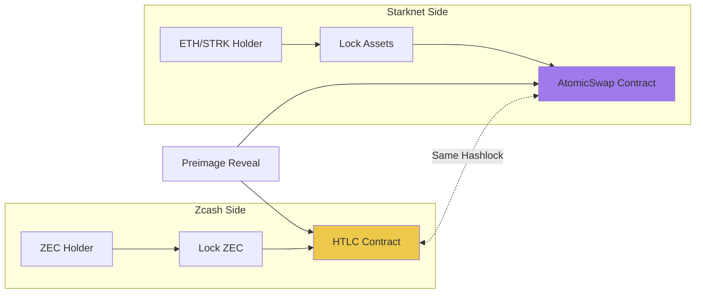

### Atomic Swap Flow

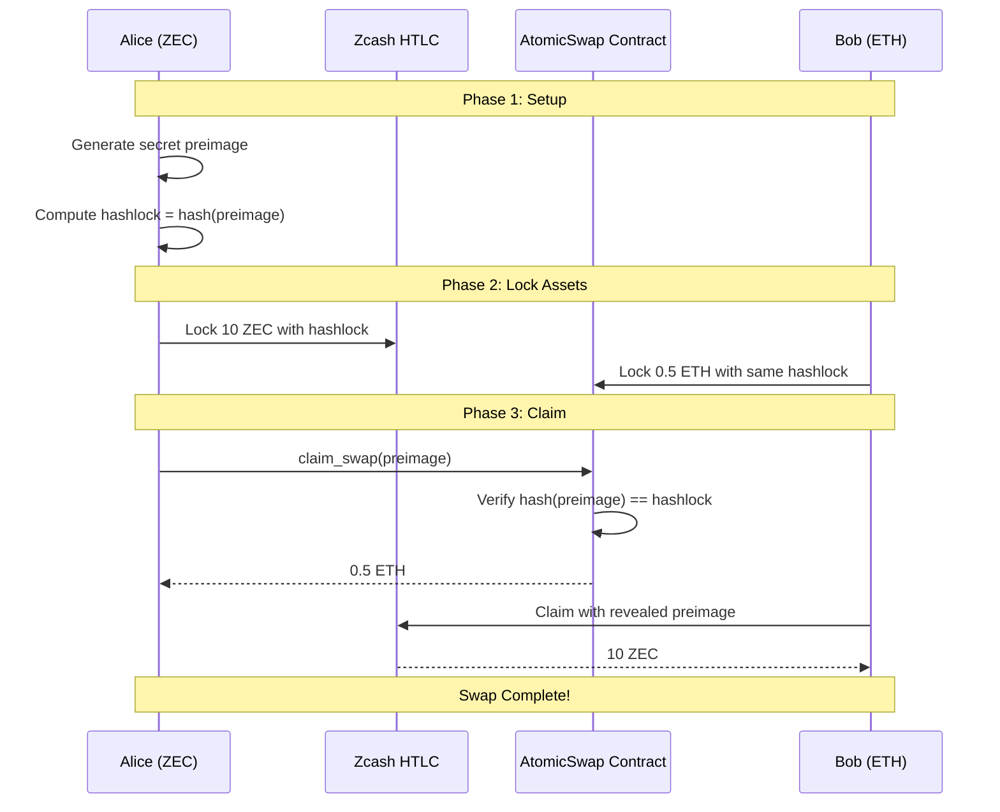

## Cross-Chain Relay Orchestrator

### Relay Architecture

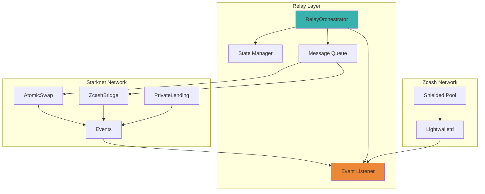

### Message Flow

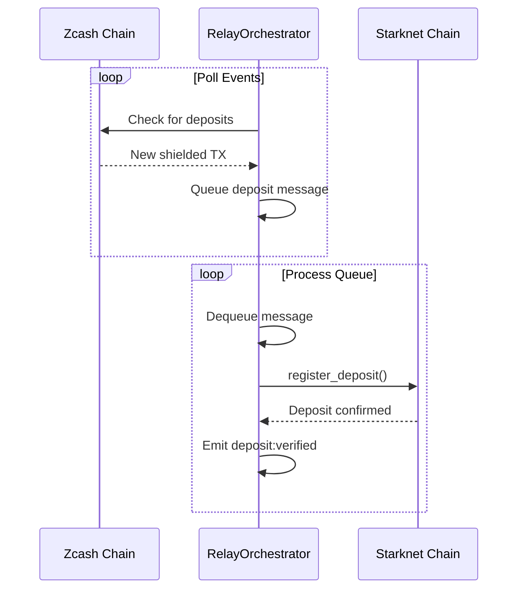

## Garaga Verifier

### Cryptographic Operations

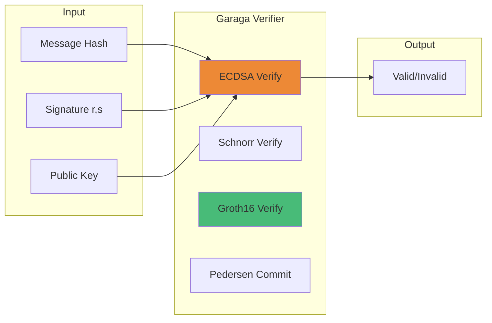

## Complete System Architecture

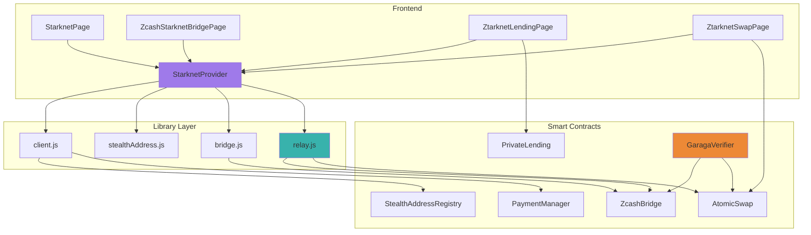

## License

MIT

---

*Last updated: December 2024*
*Integration by: PrivatePay Team*
