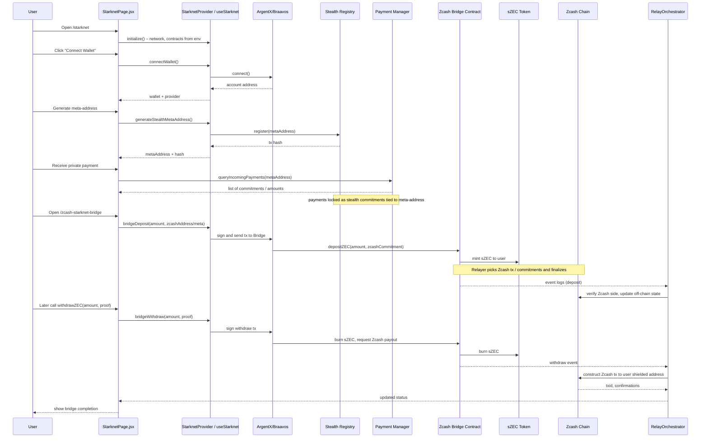

## Starknet + Ztarknet (Zcash Bridge, Lending, Swap) – Detailed Architecture (Mermaid)

### Component Topology

```mermaid
flowchart LR
  subgraph Browser[User Browser]
    REACT[React App<br/>Vite + Router]
    STARKNET_PAGE[StarknetPage.jsx<br/>/starknet]
    BRIDGE_PAGE[ZcashStarknetBridgePage.jsx<br/>/zcash-starknet-bridge]
    LEND_PAGE[ZtarknetLendingPage.jsx<br/>/ztarknet-lending]
    SWAP_PAGE[ZtarknetSwapPage.jsx<br/>/ztarknet-swap]
    STARKNET_PROVIDER[StarknetProvider.jsx<br/>useStarknet() context]
  end

  subgraph Wallet
    ARGENTX[ArgentX Wallet]
    BRAAVOS[Braavos Wallet]
  end

  subgraph StarknetSepolia[Starknet Sepolia]
    REG[Stealth Registry<br/>(VITE_STARKNET_STEALTH_CONTRACT)]
    PM[Payment Manager<br/>(VITE_STARKNET_PAYMENT_MANAGER)]
    BRIDGE[Zcash Bridge Contract<br/>(VITE_STARKNET_BRIDGE_CONTRACT)]
    LEND[Lending Contract<br/>(VITE_STARKNET_LENDING_CONTRACT)]
    SWAP[Swap Contract<br/>(VITE_STARKNET_SWAP_CONTRACT)]
    SZEC[sZEC Token<br/>(VITE_STARKNET_SZEC_TOKEN)]
    GARAGA[Garaga Verifier<br/>(VITE_STARKNET_GARAGA_VERIFIER)]
  end

  subgraph ZcashSide[Zcash]
    ZECCHAIN[Zcash Chain]
    ZECBRIDGE[Zcash Bridge Address]
  end

  subgraph Relayer
    RELAYER[Zcash–Starknet Relayer<br/>relay.js + bridge.js]
  end

  REACT --> STARKNET_PROVIDER
  STARKNET_PROVIDER --> STARKNET_PAGE
  STARKNET_PROVIDER --> BRIDGE_PAGE
  STARKNET_PROVIDER --> LEND_PAGE
  STARKNET_PROVIDER --> SWAP_PAGE

  STARKNET_PAGE -->|connect()| ARGENTX
  STARKNET_PAGE -->|connect()| BRAAVOS
  BRIDGE_PAGE --> ARGENTX
  LEND_PAGE --> ARGENTX
  SWAP_PAGE --> ARGENTX

  ARGENTX -->|register meta-address| REG
  ARGENTX -->|send private payment| PM
  ARGENTX -->|bridge deposit / withdraw| BRIDGE
  ARGENTX -->|deposit collateral| LEND
  ARGENTX -->|create / fill swaps| SWAP

  BRIDGE --> SZEC
  BRIDGE <-.-|Zcash proof / commitments| ZECCHAIN

  LEND --> SZEC
  SWAP --> SZEC

  GARAGA --> BRIDGE
  GARAGA --> LEND
  GARAGA --> SWAP

  RELAYER --> ZECCHAIN
  RELAYER --> BRIDGE
```

### Starknet Private Payment + Bridge Flow (Sequence)




