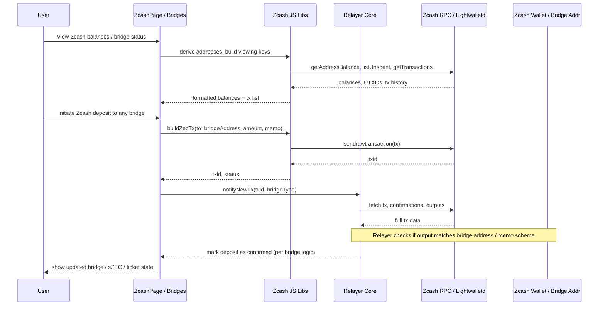

## Zcash Core Integration – Detailed Architecture (Mermaid)

### Component Topology

```mermaid
flowchart LR
  subgraph Browser[User Browser]
    REACT[React App<br/>Vite + Router]
    ZCASH_PAGE[ZcashPage.jsx<br/>/zcash]
    BRIDGE_PAGES[Bridge Pages<br/>(Solana, Starknet, Miden, Osmosis)]
    ZCASH_LIB[Zcash JS Libs<br/>zcash-bitcore-lib, proofs.js]
  end

  subgraph Backend
    RELAYER[Relayer / Orchestrator<br/>src/relayer/*]
    RELAYER_CFG[Relayer Config<br/>relayer/config.js]
  end

  subgraph ZcashNode[Zcash Node / Lightwalletd]
    RPC[Zcash RPC / Lightwalletd<br/>(ZCASH_RPC_URL)]
    WALLET[Zcash Wallet / Bridge Address<br/>(ZCASH_BRIDGE_ADDRESS)]
  end

  subgraph Integrations
    SOL_BRIDGE[Solana–Zcash Bridge]
    STARK_BRIDGE[Ztarknet Bridge]
    MIDEN_BRIDGE[Miden Bridge]
    OSMO_BRIDGE[Osmosis Vault / Bridge]
  end

  REACT --> ZCASH_PAGE
  REACT --> BRIDGE_PAGES

  ZCASH_PAGE --> ZCASH_LIB
  BRIDGE_PAGES --> ZCASH_LIB

  ZCASH_LIB --> RELAYER
  RELAYER --> RELAYER_CFG

  RELAYER --> RPC
  RPC --> WALLET

  RELAYER --> SOL_BRIDGE
  RELAYER --> STARK_BRIDGE
  RELAYER --> MIDEN_BRIDGE
  RELAYER --> OSMO_BRIDGE
```

### Core Zcash Interaction Flow (Sequence)




