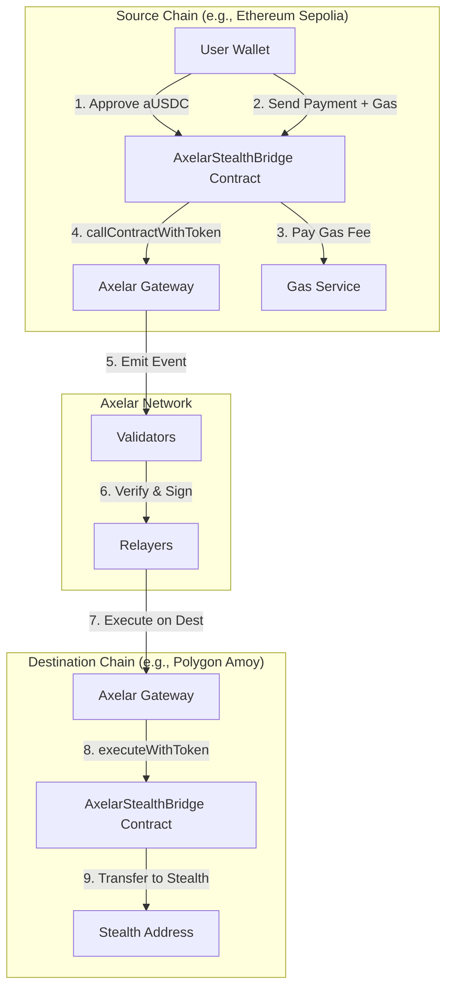
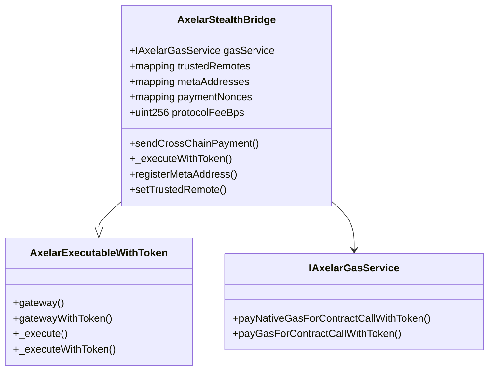
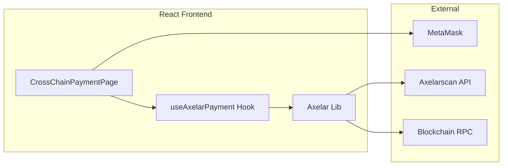

# Axelar Cross-Chain Stealth Payments - Architecture

## Overview

This document explains the architecture of Axelar integration for cross-chain stealth payments in Private-Pay.

## High-Level Architecture

## Component Breakdown

### 1. Smart Contracts

### 2. Frontend Components

## Supported Networks (Testnet)

| Chain     | Axelar Name      | Chain ID | Gateway                                    |
| --------- | ---------------- | -------- | ------------------------------------------ |
| Ethereum  | ethereum-sepolia | 11155111 | 0xe432150cce91c13a887f7D836923d5597adD8E31 |
| Polygon   | polygon-sepolia  | 80002    | 0xe432150cce91c13a887f7D836923d5597adD8E31 |
| Avalanche | avalanche        | 43113    | 0xC249632c2D40b9001FE907806902f63038B737Ab |
| Arbitrum  | arbitrum-sepolia | 421614   | 0xe1cE95479C84e9809269227C7F8524aE051Ae77a |
| Optimism  | optimism-sepolia | 11155420 | 0xe432150cce91c13a887f7D836923d5597adD8E31 |
| Base      | base-sepolia     | 84532    | 0xe432150cce91c13a887f7D836923d5597adD8E31 |
| BNB       | binance          | 97       | 0x4D147dCb984e6affEEC47e44293DA442580A3Ec0 |
| Fantom    | fantom           | 4002     | 0x97837985Ec0494E7b9C71f5D3f9250188477ae14 |
| Moonbeam  | moonbeam         | 1287     | 0x5769D84DD62a6fD969856c75c7D321b84d455929 |

## Token: aUSDC

- **Symbol**: `aUSDC`
- **Decimals**: 6
- **Type**: Axelar-wrapped USDC
- **Testnet Faucet**: Discord `!faucet ethereum-sepolia <address>`
