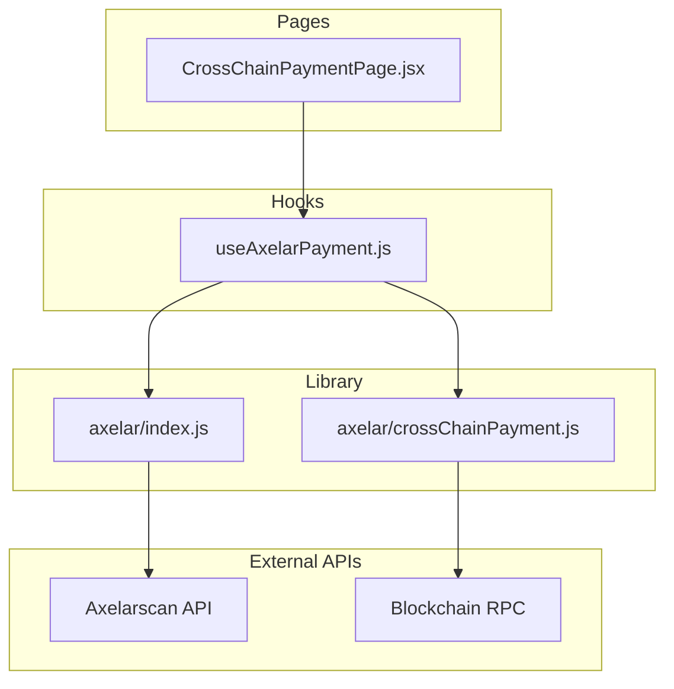
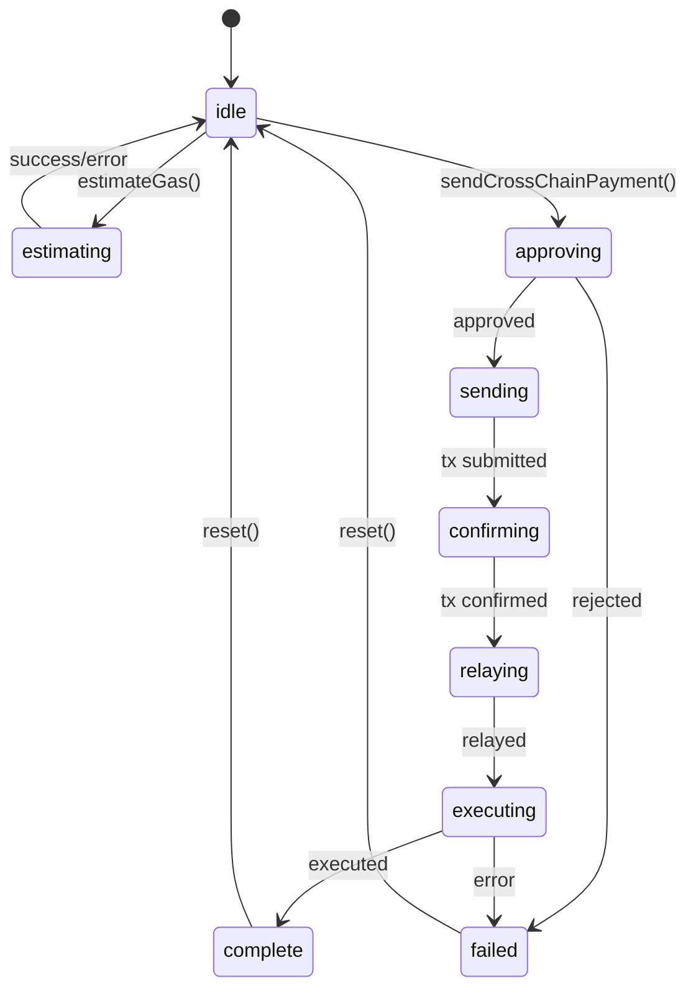
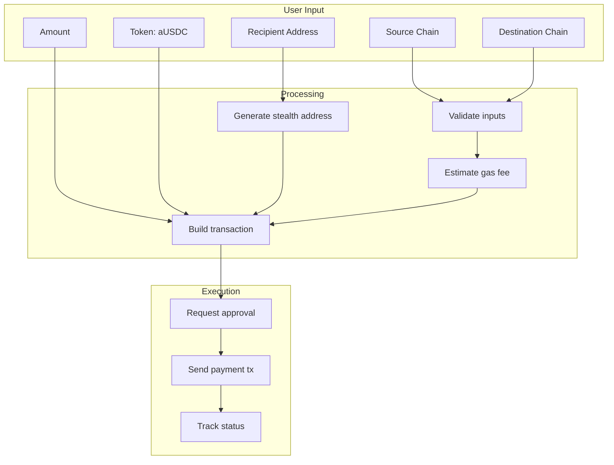
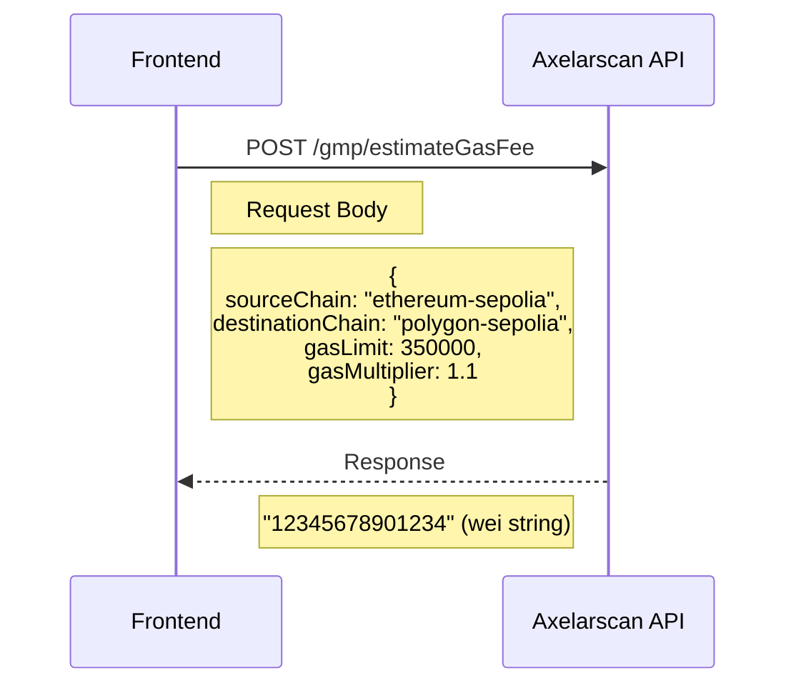
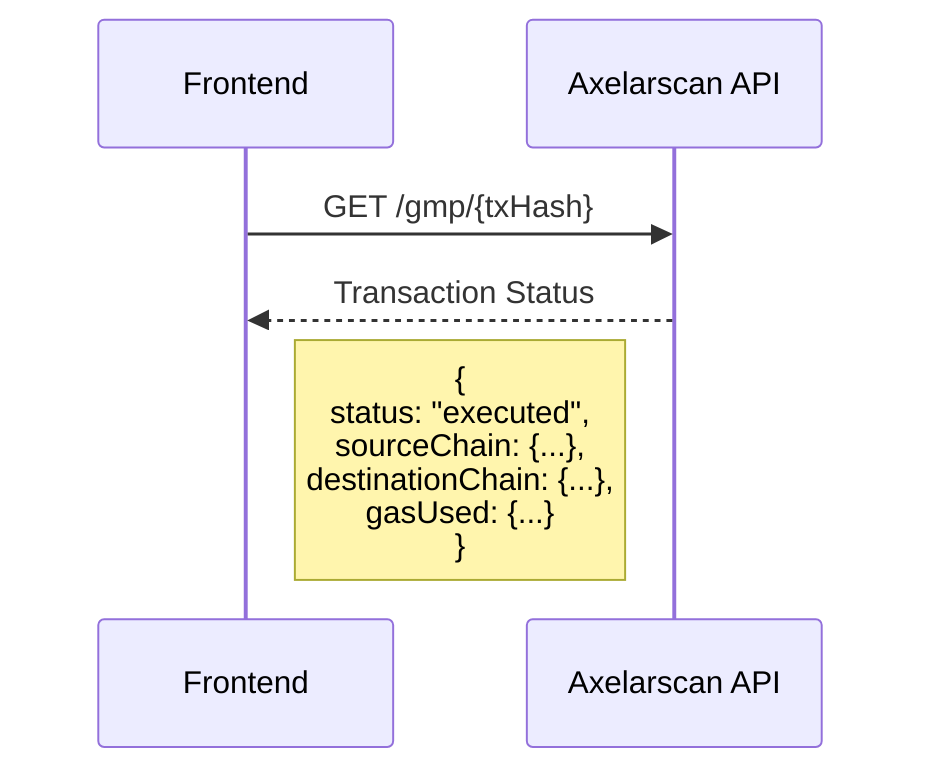
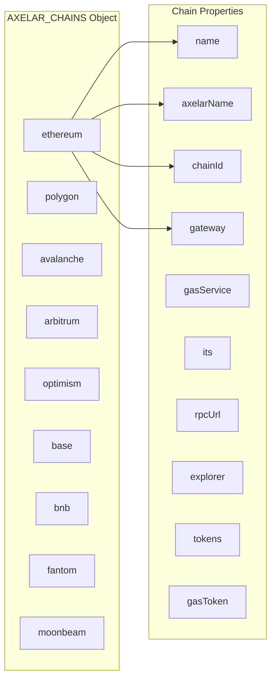
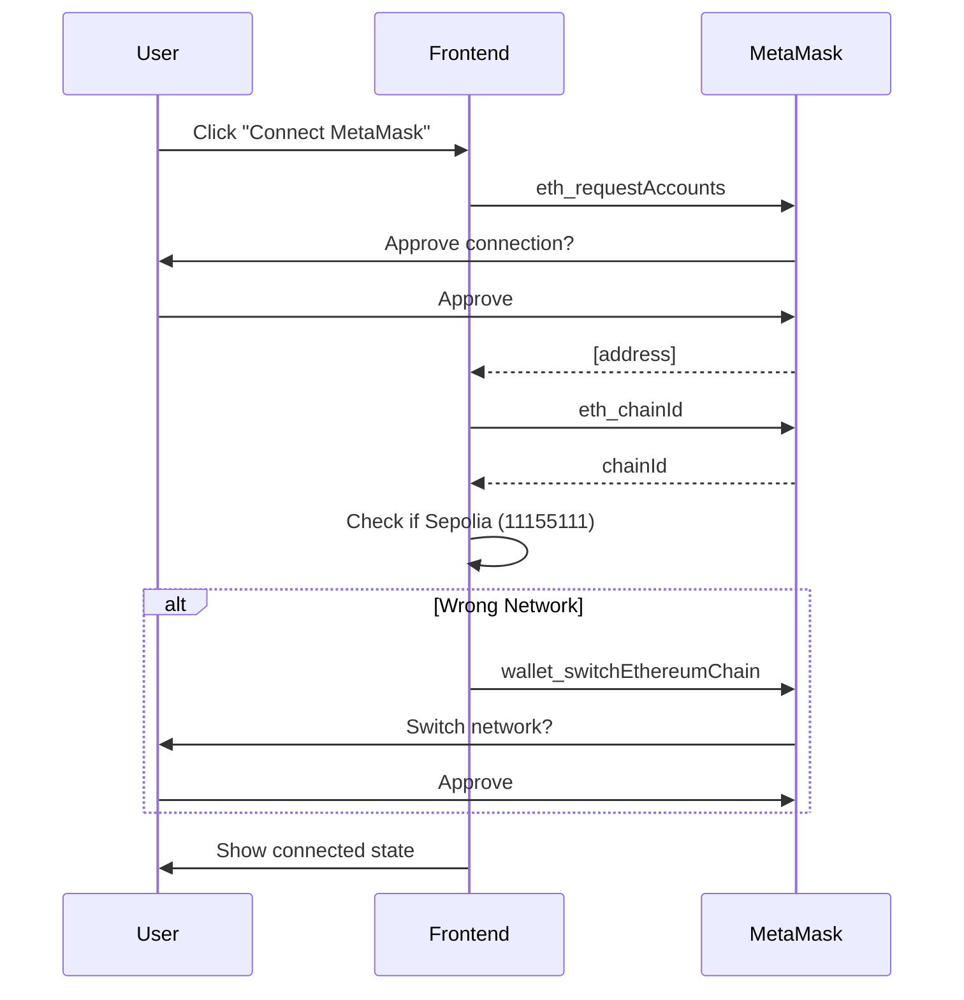
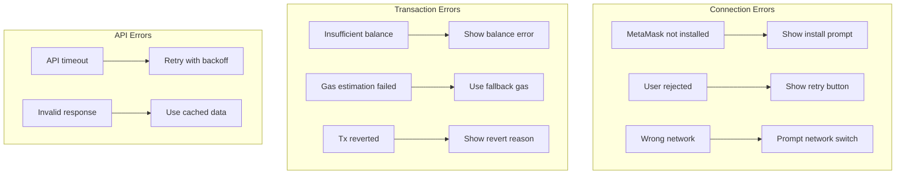

# Axelar Frontend Integration

## Component Architecture



## useAxelarPayment Hook State Machine



## Data Flow



## API Calls

### Gas Estimation



### Transaction Tracking



## Chain Configuration



## Wallet Connection Flow



## Error Handling



## File Structure

```
src/
├── lib/
│   └── axelar/
│       ├── index.js              # Main exports, chain config
│       └── crossChainPayment.js  # Payment execution logic
├── hooks/
│   └── useAxelarPayment.js       # React hook for payments
└── pages/
    └── CrossChainPaymentPage.jsx # UI component
```

## Key Functions

| Function                | File                 | Purpose                |
| ----------------------- | -------------------- | ---------------------- |
| `estimateCrossChainGas` | index.js             | Get gas fee from API   |
| `getSupportedChains`    | index.js             | List available chains  |
| `trackTransaction`      | index.js             | Monitor tx status      |
| `sendCrossChainPayment` | crossChainPayment.js | Execute payment        |
| `useAxelarPayment`      | useAxelarPayment.js  | React state management |
