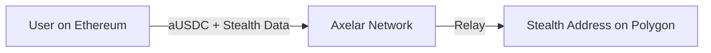
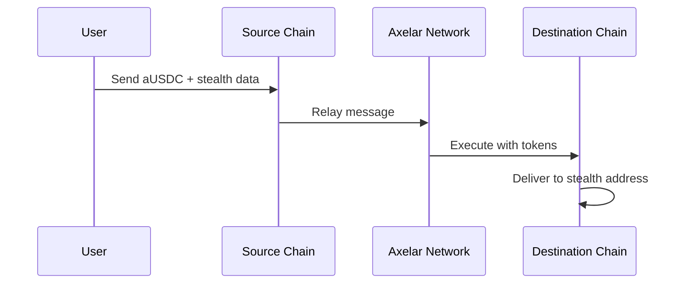

# Axelar Cross-Chain Stealth Payments

## Overview

Axelar integration enables **cross-chain stealth payments** in Private-Pay. Users can send private payments from one blockchain to another using Axelar's General Message Passing (GMP) protocol.



## Documentation

| Document                                             | Description                    |
| ---------------------------------------------------- | ------------------------------ |
| [ARCHITECTURE.md](./ARCHITECTURE.md)                 | High-level system architecture |
| [PAYMENT_FLOW.md](./PAYMENT_FLOW.md)                 | Step-by-step payment flow      |
| [CONTRACT_INTERNALS.md](./CONTRACT_INTERNALS.md)     | Smart contract details         |
| [FRONTEND_INTEGRATION.md](./FRONTEND_INTEGRATION.md) | Frontend implementation        |
| [DEPLOYMENT_GUIDE.md](./DEPLOYMENT_GUIDE.md)         | How to deploy contracts        |

## Quick Start

### 1. Get Test Tokens

```bash
# Join Axelar Discord and use faucet
!faucet ethereum-sepolia <your-address>
```

### 2. Connect Wallet

- Open Private-Pay
- Connect MetaMask
- Switch to Sepolia testnet

### 3. Send Cross-Chain Payment

1. Select source chain (e.g., Ethereum)
2. Select destination chain (e.g., Polygon)
3. Enter recipient address
4. Enter amount
5. Click "Estimate Gas Fee"
6. Click "Send Cross-Chain Payment"

## How It Works



## Supported Chains (Testnet)

| Chain            | Status |
| ---------------- | ------ |
| Ethereum Sepolia | ✅     |
| Polygon Amoy     | ✅     |
| Avalanche Fuji   | ✅     |
| Arbitrum Sepolia | ✅     |
| Optimism Sepolia | ✅     |
| Base Sepolia     | ✅     |
| BNB Testnet      | ✅     |
| Fantom Testnet   | ✅     |
| Moonbeam Alpha   | ✅     |

## Token

- **Symbol**: `aUSDC`
- **Type**: Axelar-wrapped USDC
- **Decimals**: 6

## Key Addresses (Testnet)

| Contract    | Address                                      |
| ----------- | -------------------------------------------- |
| Bridge      | `0x1764681c26D04f0E9EBb305368cfda808A9F6f8f` |
| Gateway     | `0xe432150cce91c13a887f7D836923d5597adD8E31` |
| Gas Service | `0xbE406F0189A0B4cf3A05C286473D23791Dd44Cc6` |

## Files

```
├── hardhat/
│   └── contracts/
│       └── AxelarStealthBridge.sol    # Main contract
├── src/
│   ├── lib/
│   │   └── axelar/
│   │       ├── index.js               # Chain config & API
│   │       └── crossChainPayment.js   # Payment logic
│   ├── hooks/
│   │   └── useAxelarPayment.js        # React hook
│   └── pages/
│       └── CrossChainPaymentPage.jsx  # UI
└── docs/
    └── axelar/                        # This documentation
```

## Resources

- [Axelar Docs](https://docs.axelar.dev/)
- [Axelar GMP](https://docs.axelar.dev/dev/general-message-passing/overview)
- [Axelarscan Testnet](https://testnet.axelarscan.io/)
- [Axelar Discord](https://discord.gg/aRZ3Ra6f7D)
