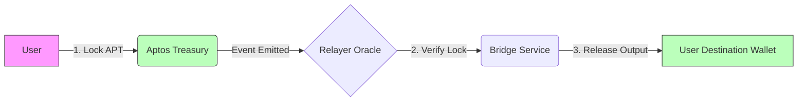

# Cross-Chain Privacy Bridge Documentation

## Overview
The **Private Pay Bridge** is a feature designed to enable the movement of assets from **Public Chains** (like Aptos) to **Privacy-Focused Chains** (like Mina Protocol and Zcash). It aims to solve the "lack of privacy" on public chains by allowing users to exit into a privacy shield.

## Features

### 1. Public-to-Privacy Bridge through Relay
**Route**: `/bridge`
**Supported Pairs**:
- **Source**: Aptos (Testnet)
- **Destination**: Mina Protocol, Zcash

#### How it Works:
1.  **Lock (Public)**: The user locks an asset (APT) on the source chain. This transaction is **publicly visible**.
    - *Technical*: Calls `coin::transfer` to a designated treasury address.
2.  **Relay (Simulated)**: A relayer observes the lock event. In a production system, this would generate a proof of inclusion. In this demo, we simulate the verification time.
3.  **Release (Private)**: The user receives equivalent "wrapped" or native tokens on the destination privacy chain.
    - *Technical*: The app simulates the incoming deposit on the client-side (`ZcashProvider` / `MinaProvider`).

#### Workflow Diagram

---

### 2. Zcash <-> Mina Programmability PoC
**Route**: `/zcash-mina-bridge`
**Goal**: Demonstrate how Mina's recursive ZK proofs can verify Zcash state, bringing smart contract capabilities to Zcash.

#### Architecture:
- **Zcash SPV**: We simulate a client-side prover generating a ZK-SNARK attesting to a Zcash transaction.
- **Recursive Verification**: A mock Mina zkApp verifies this proof.
- **Result**: Trustless state update on Mina based on Zcash activity.

See [ZcashMinaBridge.md](./ZcashMinaBridge.md) for the deep-dive cryptographic architecture.

---

## User Guide

### Prerequisites
- **Aptos Wallet**: Petra Wallet (set to Testnet).
- **Mina Wallet**: Auro Wallet (set to Devnet/Mainnet).
- **Zcash Wallet**: Generates a web-based wallet automatically.

### Bridging Assets
1.  Navigate to **Bridge** in the header.
2.  Select **Aptos** as Source and **Mina** as Destination.
3.  Connect both wallets.
4.  Enter Amount (e.g., `10`).
5.  Click **Bridge Assets**.
6.  Approve the Aptos transaction.
7.  Wait for the "Verifying Proof" step.
8.  Sign the simulated claim.
9.  **Result**: Your Mina balance on the website will update (e.g., `+10 Simulated`).

## Technical Implementation Details

### Providers
- `ZcashProvider.jsx`: Manages `zcash-bitcore-lib` keys and simulated balances.
- `MinaProvider.jsx`: Interacts with `window.mina` (Auro) and persists simulated balances to `localStorage` to survive refreshes.

### Limitations (Demo vs Production)
| Feature | Demo (Current) | Production (Goal) |
|Ref|---|---|
| **Locking** | Real Aptos Tx (Treasury Transfer) | Smart Contract Escrow |
| **Relaying** | Frontend Simulation | Decentralized ZK-Relayer Network |
| **Minting** | Simulated Client Balance | On-Chain Minting (Requires Bridge Key) |
| **Proofs** | Mocked Latency | Real WASM-based ZK Prover |

## Future Work
- Implement a real **Mina zkApp** (Smart Contract) to verify simple state proofs.
- Integrate **RenVM** or similar MPC networks for actual asset custody.
- Add **Shielded Zcash** support (Sapling/Orchard) via WebAssembly.
