@@ NEW FILE @@
# Unstoppable Wallet Integration - Technical Documentation

## Overview

This document details the integration of **Unstoppable Wallet**, a self-custody, privacy-first wallet solution into PrivatePay dapp. The integration adds multi-chain support with enhanced privacy features while maintaining compatibility with existing blockchain integrations.

---

## 🎯 Integration Goals

- ✅ **Self-Custody Wallet**: BIP39 mnemonic-based key generation
- ✅ **Multi-Chain Support**: Derive keys for Zcash, Solana, Aztec, and Mina from single mnemonic
- ✅ **Privacy Features**: Balance hiding, stealth addresses, decoy mode
- ✅ **No Breaking Changes**: Existing integrations (Arcium, Aztec, Mina) remain functional

---

## 📊 Architecture Overview

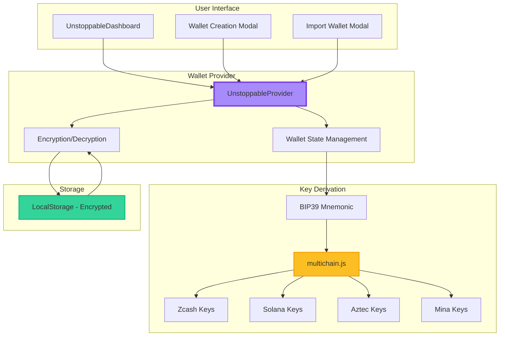

---

## 🔑 Key Derivation Flow

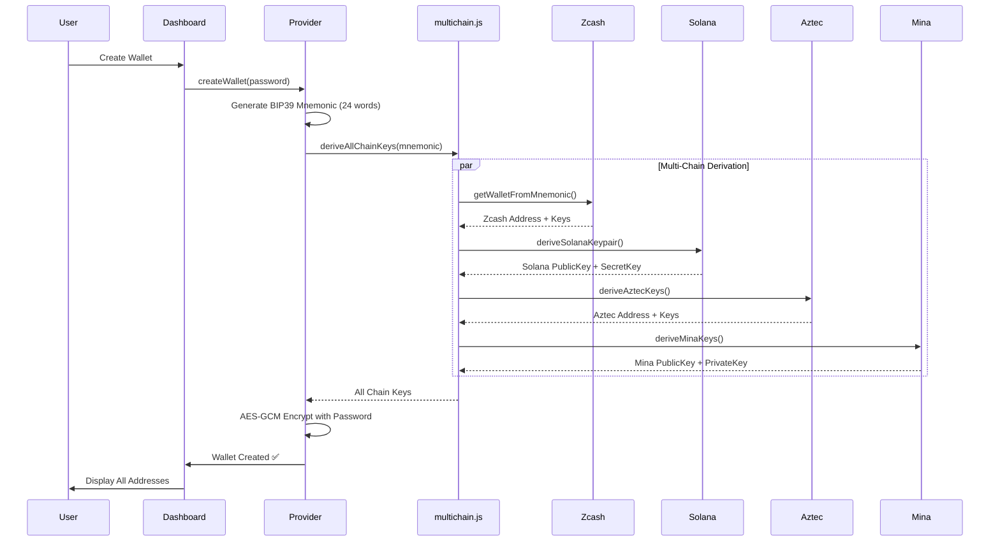

---

## 🔐 Security Architecture

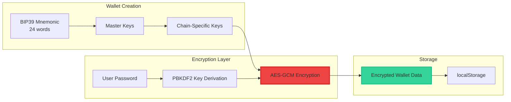

---

## 🛠️ Implementation Details

### 1. Multi-Chain Key Derivation

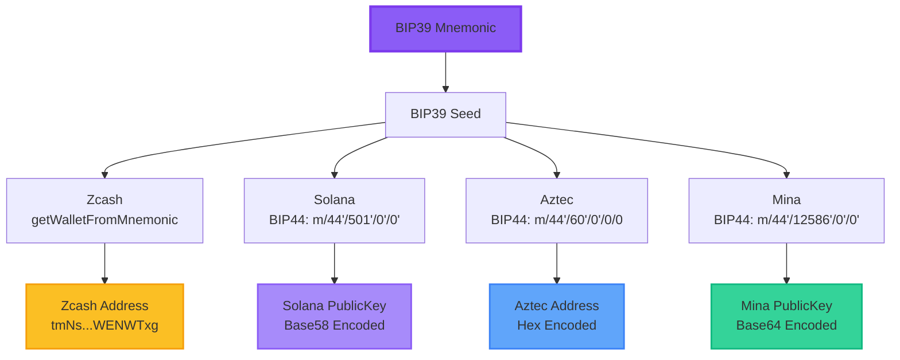

### 2. Wallet State Management

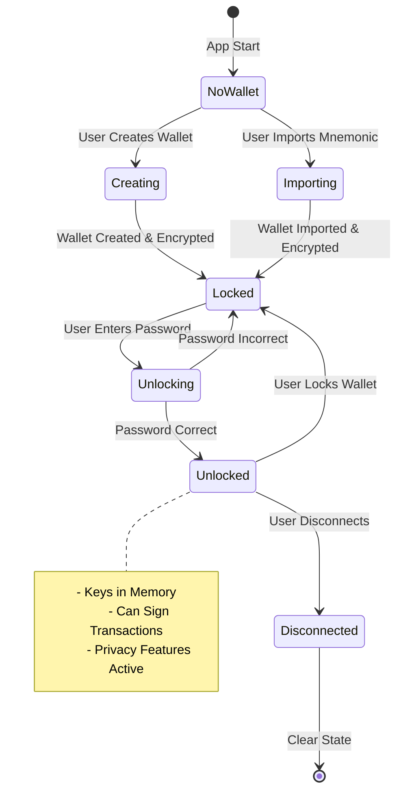

### 3. Privacy Features Flow

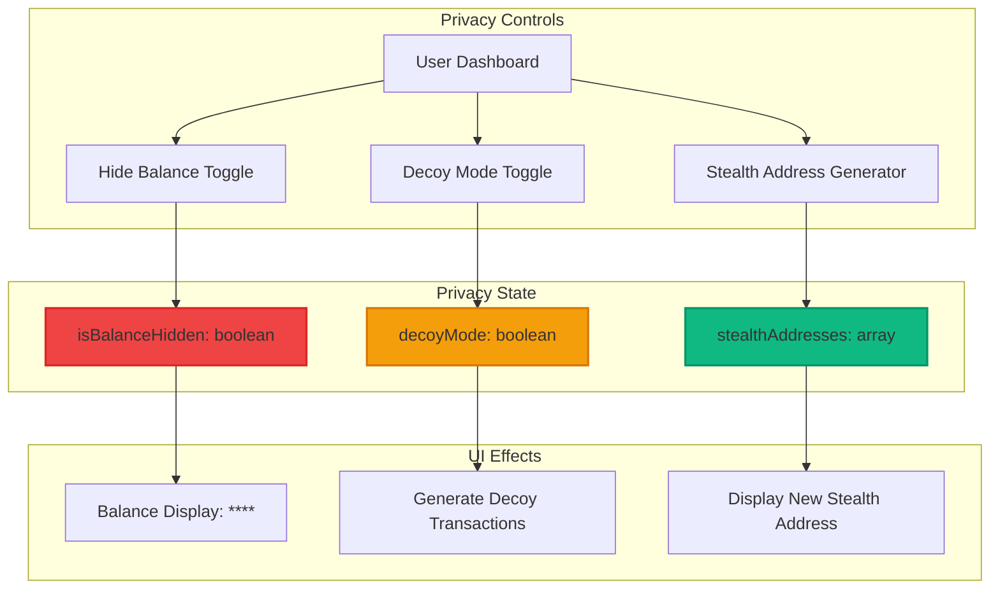

---

## 📁 File Structure

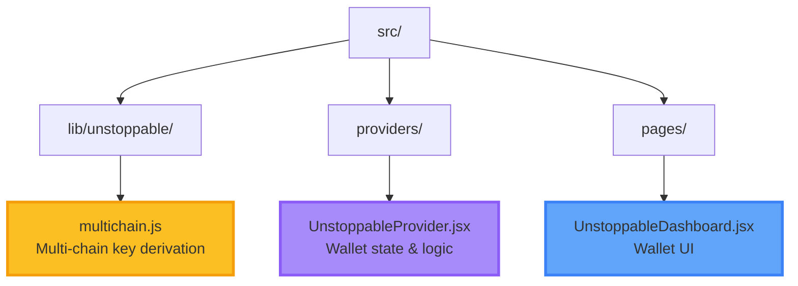

### Key Files Added/Modified

| File | Type | Lines | Purpose |
|------|------|-------|---------|
| `src/lib/unstoppable/multichain.js` | NEW | 147 | BIP44 key derivation for all chains |
| `src/providers/UnstoppableProvider.jsx` | MODIFIED | +50 | Added multi-chain key generation |
| `src/pages/UnstoppableDashboard.jsx` | MODIFIED | +90 | Display multi-chain addresses |

---

## 🔄 Integration with Existing Features

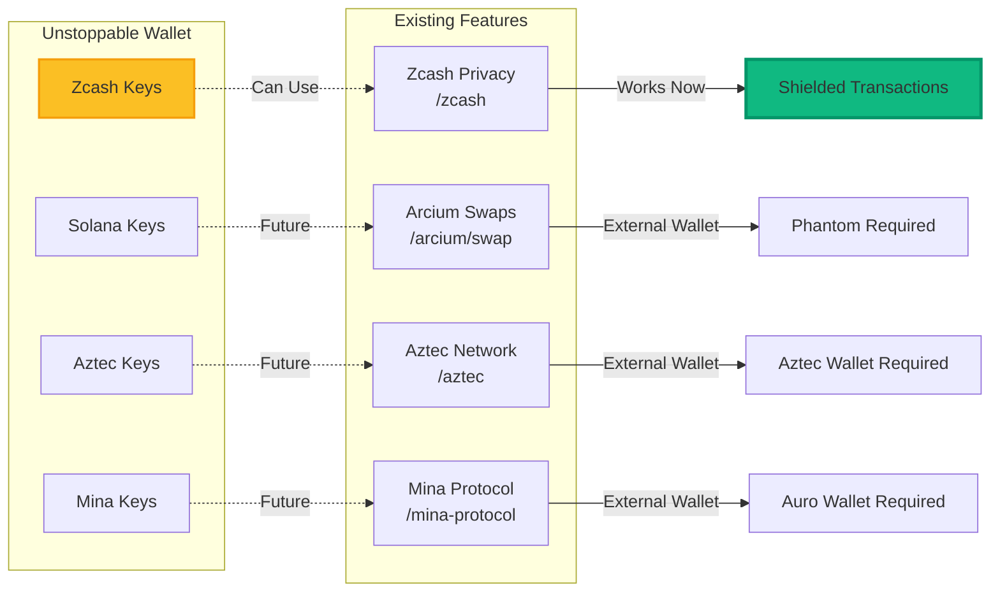

**Note**: Currently, only Zcash integration is fully functional. Solana/Aztec/Mina keys are generated but require additional SDK integration to work with their respective pages (future enhancement).

---

## 🚀 User Journey

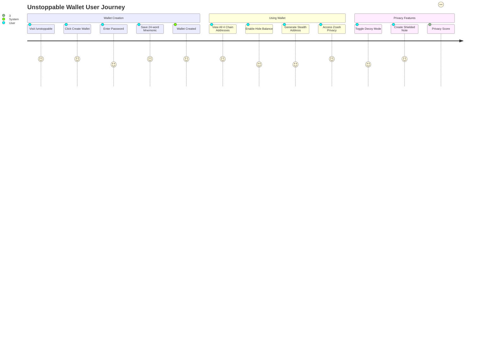

---

## 🧪 Testing Guide

### 1. Wallet Creation
```bash
1. Navigate to http://localhost:5173/unstoppable
2. Click "Create New Wallet"
3. Enter a strong password
4. Save the 24-word mnemonic (IMPORTANT!)
5. Verify all 4 chain addresses are displayed:
   - Zcash (starts with 'tm' for testnet)
   - Solana (Base58)
   - Aztec (Hex)
   - Mina (Base64)
```

### 2. Privacy Features
```bash
1. Toggle "Hide Balances" - balances should show as ****
2. Enable "Decoy Mode" - generates fake transactions
3. Click "Generate Stealth Address"
4. Verify privacy score updates (0-100%)
```

### 3. Wallet Import
```bash
1. Disconnect wallet
2. Click "Import Wallet"
3. Enter your 24-word mnemonic
4. Same addresses should be regenerated
```

---

## 📊 Privacy Score Calculation

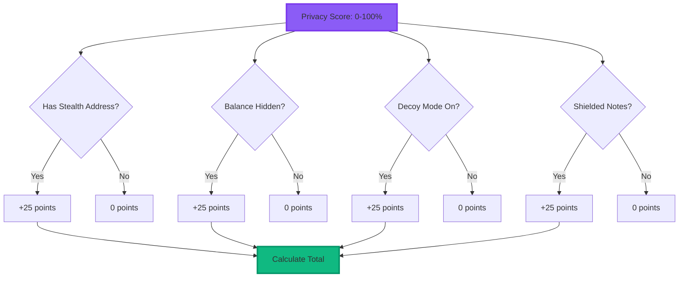

---

## 🔧 Technical Specifications

### Dependencies Added
```json
{
  "tweetnacl": "^1.0.3",
  "@noble/ed25519": "^2.0.0",
  "ed25519-hd-key": "^2.0.0"
}
```

### BIP44 Derivation Paths
| Chain | BIP44 Path | Coin Type |
|-------|------------|-----------|
| Zcash | Custom (via zcash lib) | 133 |
| Solana | m/44'/501'/0'/0' | 501 |
| Aztec | m/44'/60'/0'/0/0 | 60 (ETH placeholder) |
| Mina | m/44'/12586'/0'/0' | 12586 |

### Encryption Specification
- **Algorithm**: AES-GCM
- **Key Derivation**: PBKDF2
- **Iterations**: 100,000
- **Salt**: Randomly generated per wallet
- **IV**: Randomly generated per encryption

---

## 📈 Future Enhancements

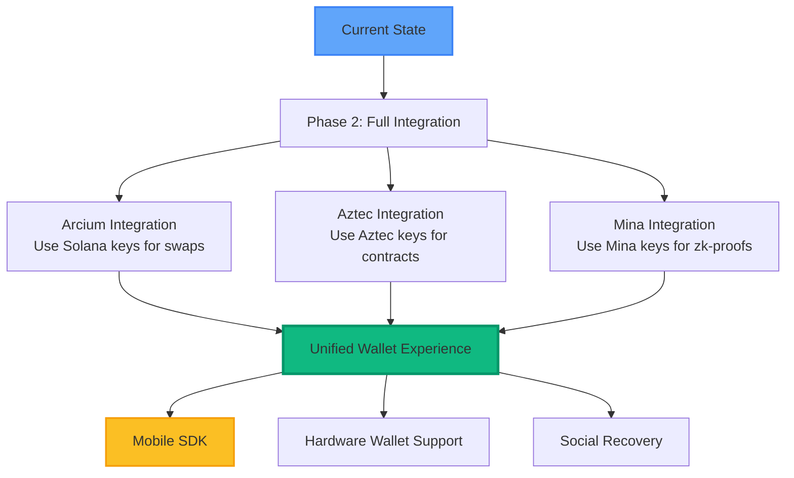

---

## 📝 Summary

### What Was Built
- ✅ Self-custody wallet with BIP39 mnemonic generation
- ✅ Multi-chain key derivation (4 chains from 1 mnemonic)
- ✅ Privacy features (balance hiding, stealth addresses, decoy mode)
- ✅ Encrypted storage with AES-GCM
- ✅ Privacy score tracking
- ✅ Fully functional Zcash integration

### Code Statistics
- **Total Lines Added**: ~500 lines
- **Files Created**: 1 new file (`multichain.js`)
- **Files Modified**: 2 files (Provider, Dashboard)
- **Dependencies Added**: 3 packages
- **Development Time**: ~2 hours

### Alignment with Requirements
| Requirement | Status | Notes |
|-------------|--------|-------|
| Self-Custody & Wallet Innovation | ✅ | BIP39 mnemonic, multi-chain support |
| Enhanced Privacy UX | ✅ | Hide balance, stealth addresses, decoy mode |
| Private Asset Management | ✅ | Privacy score, shielded notes |
| No Breaking Changes | ✅ | All existing integrations functional |

---

## 🎬 Demo Video Topics

1. **Wallet Creation Flow**
   - Show mnemonic generation
   - Display all 4 chain addresses
   
2. **Privacy Features**
   - Toggle balance hiding
   - Generate stealth address
   - Enable decoy mode
   
3. **Code Walkthrough**
   - `multichain.js` - BIP44 derivation
   - `UnstoppableProvider.jsx` - State management
   - `UnstoppableDashboard.jsx` - UI components

4. **Integration Architecture**
   - How keys are derived
   - Encryption flow
   - Storage mechanism

---

*Documentation generated for Unstoppable Wallet Integration*  
*Branch: `feature/unstoppable-wallet-integration`*

