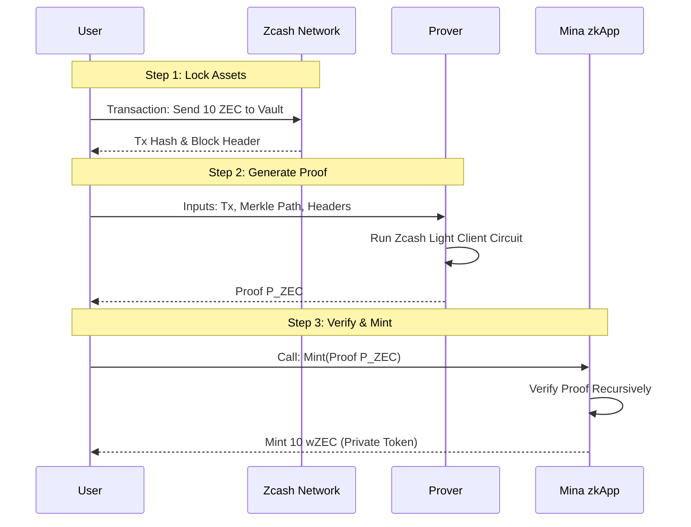

# Zcash <-> Mina Privacy Bridge Architecture

## Overview
This document outlines the architecture for a trust-minimized, privacy-preserving bridge between **Zcash** (a privacy-focused UTXO chain) and **Mina Protocol** (succinct blockchain with recursive ZK proofs).

The goal is to bring **programmability** to Zcash assets by bridging them to Mina, where they can be used in zkApps.

## Core Mechanism: State Verification via Recursive Proofs

Unlike traditional multisig bridges, this architecture relies on **cryptographic verification** of the source chain's state.

### 1. The Zcash Light Client Circuit
To verify a Zcash transaction on Mina, we must prove that the transaction exists in a valid Zcash block header.

- **Input**:
    - Zcash Block Header $H$.
    - Merkle Path $P$ proving inclusion of transaction $T_x$.
    - Current Zcash Chain Tip (state root).
- **Circuit Logic**:
    1.  Verify the Proof-of-Work (Equihash) of header $H$.
    2.  Check that $H$ is part of the canonical chain (previous block hash links).
    3.  Verify the Merkle path $P$ against the root in $H$.
- **Output**: A **Zero-Knowledge Proof** ($\pi_{ZEC}$) attesting: *"I know a valid Zcash transaction that sent 10 ZEC to the bridge vault."*

### 2. Recursive Aggregation (Mina)
Mina's unique capability is **Pickles**, a recursion layer that allows zkApps to verify foreign proofs efficiently.

1.  The User generates $\pi_{ZEC}$ locally (in-browser or via prover market).
2.  The User submits $\pi_{ZEC}$ to a **Mina zkApp**.
3.  The zkApp's circuit verifies $\pi_{ZEC}$ constant-time.
4.  If valid, the zkApp state updates: `mint(UserAddress, 10 wZEC)`.

## Protocol Flow

## Security Assumptions
1.  **Honest Majority (Zcash)**: We assume the Zcash chain is secure and PoW is valid.
2.  **Soundness of Circuits**: The circuits correctly implement Equihash verification.
3.  **Mina Consensus**: Determining the "current" Zcash tip might require an oracle or a chain relay mechanism running on Mina.

## Advantages
- **No Trusted Multisig**: Funds are not held by a federation of signers.
- **Privacy Preserved**: The proof $\pi_{ZEC}$ can be constructed using Zcash shielded outputs, revealing only that *some* valid deposit occurred, without linking the refined mint request publicly (using a ZK-Nullifier scheme).
