# PrivatePay System Flows Documentation

This document provides comprehensive Mermaid diagrams that walk through what happens, where it happens, and when it happens behind the scenes in the PrivatePay application.

---

## 📐 Table of Contents

1. [System Architecture](#system-architecture)
2. [Authentication Flow](#authentication-flow)
3. [Network Switching Flow](#network-switching-flow)
4. [Meta Address Registration Flow](#meta-address-registration-flow)
5. [Stealth Address Generation Flow](#stealth-address-generation-flow)
6. [Payment Sending Flow](#payment-sending-flow)
7. [Payment Detection Flow](#payment-detection-flow)
8. [Fund Withdrawal Flow](#fund-withdrawal-flow)
9. [Backend API Interactions](#backend-api-interactions)
10. [Database Operations Flow](#database-operations-flow)

---

## 🏗️ System Architecture

### High-Level Architecture

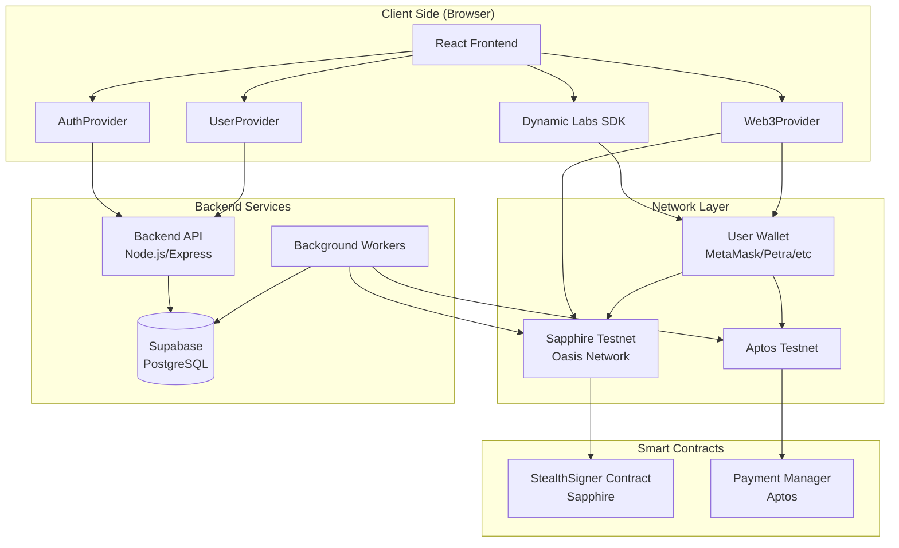
```mermaid
graph TB
    subgraph "Client Side (Browser)"
        UI[React Frontend]
        Dynamic[Dynamic Labs SDK]
        Web3[Web3Provider]
        Auth[AuthProvider]
        User[UserProvider]
    end
    
    subgraph "Network Layer"
        Wallet[User Wallet<br/>MetaMask/Petra/etc]
        Sapphire[Sapphire Testnet<br/>Oasis Network]
        Aptos[Aptos Testnet]
    end
    
    subgraph "Backend Services"
        API[Backend API<br/>Node.js/Express]
        DB[(Supabase<br/>PostgreSQL)]
        Workers[Background Workers]
    end
    
    subgraph "Smart Contracts"
        StealthContract[StealthSigner Contract<br/>Sapphire]
        AptosContract[Payment Manager<br/>Aptos]
    end
    
    UI --> Dynamic
    UI --> Web3
    UI --> Auth
    UI --> User
    Dynamic --> Wallet
    Web3 --> Wallet
    Auth --> API
    User --> API
    Web3 --> Sapphire
    Wallet --> Sapphire
    Wallet --> Aptos
    Sapphire --> StealthContract
    Aptos --> AptosContract
    API --> DB
    Workers --> DB
    Workers --> Sapphire
    Workers --> Aptos
```

### Component Interaction Architecture

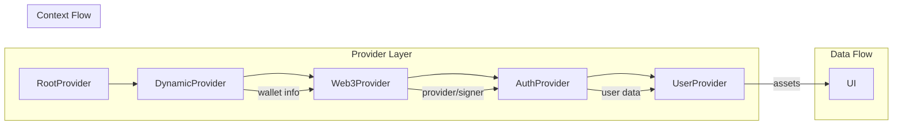
```mermaid
graph LR
    subgraph "Provider Layer"
        Root[RootProvider]
        DynamicP[DynamicProvider]
        Web3P[Web3Provider]
        AuthP[AuthProvider]
        UserP[UserProvider]
    end
    
    subgraph "Context Flow"
        Root --> DynamicP
        DynamicP --> Web3P
        Web3P --> AuthP
        AuthP --> UserP
    end
    
    subgraph "Data Flow"
        DynamicP -->|wallet info| Web3P
        Web3P -->|provider/signer| AuthP
        AuthP -->|user data| UserP
        UserP -->|assets| UI
    end
```

---

## 🔐 Authentication Flow

### Complete Authentication Sequence

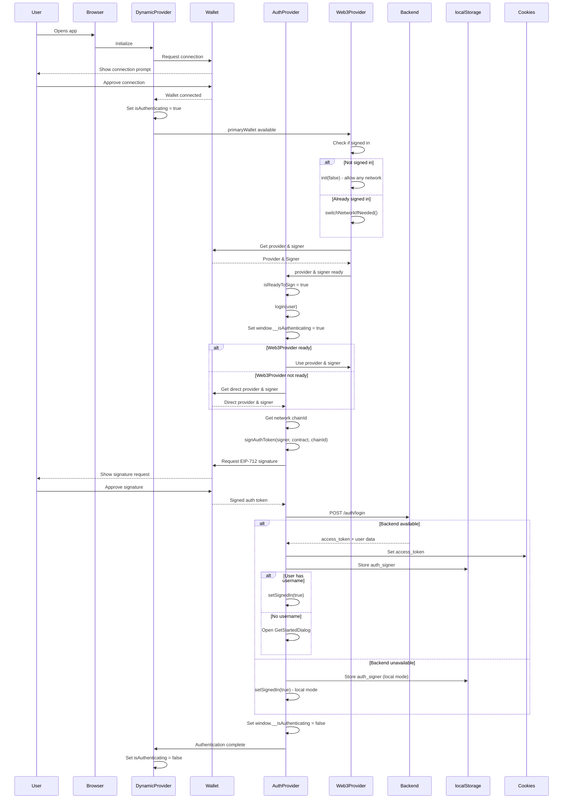
```mermaid
sequenceDiagram
    participant User
    participant Browser
    participant DynamicProvider
    participant Wallet
    participant AuthProvider
    participant Web3Provider
    participant Backend
    participant localStorage
    participant Cookies

    User->>Browser: Opens app
    Browser->>DynamicProvider: Initialize
    DynamicProvider->>Wallet: Request connection
    Wallet-->>User: Show connection prompt
    User->>Wallet: Approve connection
    Wallet-->>DynamicProvider: Wallet connected
    DynamicProvider->>DynamicProvider: Set isAuthenticating = true
    
    DynamicProvider->>Web3Provider: primaryWallet available
    Web3Provider->>Web3Provider: Check if signed in
    alt Not signed in
        Web3Provider->>Web3Provider: init(false) - allow any network
    else Already signed in
        Web3Provider->>Web3Provider: switchNetworkIfNeeded()
    end
    
    Web3Provider->>Wallet: Get provider & signer
    Wallet-->>Web3Provider: Provider & Signer
    
    Web3Provider->>AuthProvider: provider & signer ready
    AuthProvider->>AuthProvider: isReadyToSign = true
    
    AuthProvider->>AuthProvider: login(user)
    AuthProvider->>AuthProvider: Set window.__isAuthenticating = true
    
    alt Web3Provider ready
        AuthProvider->>Web3Provider: Use provider & signer
    else Web3Provider not ready
        AuthProvider->>Wallet: Get direct provider & signer
        Wallet-->>AuthProvider: Direct provider & signer
    end
    
    AuthProvider->>AuthProvider: Get network chainId
    AuthProvider->>AuthProvider: signAuthToken(signer, contract, chainId)
    AuthProvider->>Wallet: Request EIP-712 signature
    Wallet-->>User: Show signature request
    User->>Wallet: Approve signature
    Wallet-->>AuthProvider: Signed auth token
    
    AuthProvider->>Backend: POST /auth/login
    alt Backend available
        Backend-->>AuthProvider: access_token + user data
        AuthProvider->>Cookies: Set access_token
        AuthProvider->>localStorage: Store auth_signer
        alt User has username
            AuthProvider->>AuthProvider: setSignedIn(true)
        else No username
            AuthProvider->>AuthProvider: Open GetStartedDialog
        end
    else Backend unavailable
        AuthProvider->>localStorage: Store auth_signer (local mode)
        AuthProvider->>AuthProvider: setSignedIn(true) - local mode
    end
    
    AuthProvider->>AuthProvider: Set window.__isAuthenticating = false
    AuthProvider->>DynamicProvider: Authentication complete
    DynamicProvider->>DynamicProvider: Set isAuthenticating = false
```

### Authentication State Machine

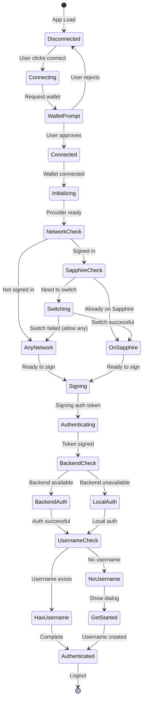
```mermaid
stateDiagram-v2
    [*] --> Disconnected: App Load
    
    Disconnected --> Connecting: User clicks connect
    Connecting --> WalletPrompt: Request wallet
    WalletPrompt --> Connected: User approves
    WalletPrompt --> Disconnected: User rejects
    
    Connected --> Initializing: Wallet connected
    Initializing --> NetworkCheck: Provider ready
    
    NetworkCheck --> AnyNetwork: Not signed in
    NetworkCheck --> SapphireCheck: Signed in
    
    AnyNetwork --> Signing: Ready to sign
    SapphireCheck --> OnSapphire: Already on Sapphire
    SapphireCheck --> Switching: Need to switch
    
    Switching --> OnSapphire: Switch successful
    Switching --> AnyNetwork: Switch failed (allow any)
    
    OnSapphire --> Signing: Ready to sign
    Signing --> Authenticating: Signing auth token
    
    Authenticating --> BackendCheck: Token signed
    BackendCheck --> BackendAuth: Backend available
    BackendCheck --> LocalAuth: Backend unavailable
    
    BackendAuth --> UsernameCheck: Auth successful
    LocalAuth --> UsernameCheck: Local auth
    
    UsernameCheck --> HasUsername: Username exists
    UsernameCheck --> NoUsername: No username
    
    HasUsername --> Authenticated: Complete
    NoUsername --> GetStarted: Show dialog
    
    GetStarted --> Authenticated: Username created
    Authenticated --> [*]: Logout
```

---

## 🌐 Network Switching Flow

### Network Detection and Switching

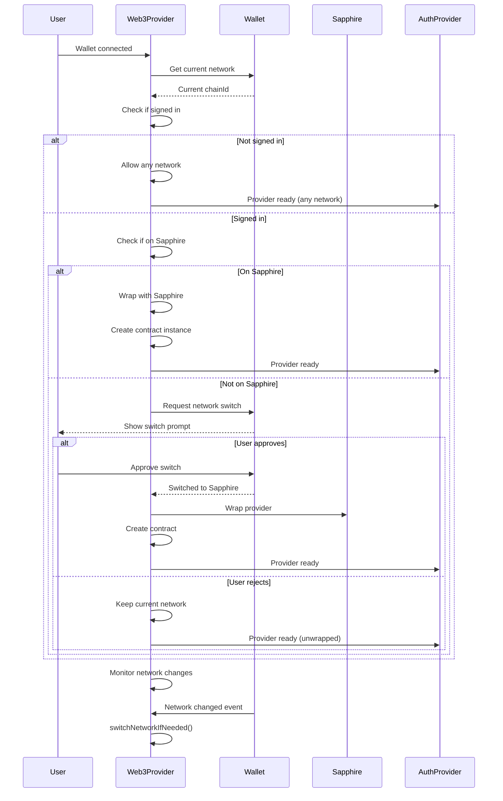
```mermaid
sequenceDiagram
    participant User
    participant Web3Provider
    participant Wallet
    participant Sapphire
    participant AuthProvider

    User->>Web3Provider: Wallet connected
    Web3Provider->>Wallet: Get current network
    Wallet-->>Web3Provider: Current chainId
    
    Web3Provider->>Web3Provider: Check if signed in
    alt Not signed in
        Web3Provider->>Web3Provider: Allow any network
        Web3Provider->>AuthProvider: Provider ready (any network)
    else Signed in
        Web3Provider->>Web3Provider: Check if on Sapphire
        alt On Sapphire
            Web3Provider->>Web3Provider: Wrap with Sapphire
            Web3Provider->>Web3Provider: Create contract instance
            Web3Provider->>AuthProvider: Provider ready
        else Not on Sapphire
            Web3Provider->>Wallet: Request network switch
            Wallet-->>User: Show switch prompt
            alt User approves
                User->>Wallet: Approve switch
                Wallet-->>Web3Provider: Switched to Sapphire
                Web3Provider->>Sapphire: Wrap provider
                Web3Provider->>Web3Provider: Create contract
                Web3Provider->>AuthProvider: Provider ready
            else User rejects
                Web3Provider->>Web3Provider: Keep current network
                Web3Provider->>AuthProvider: Provider ready (unwrapped)
            end
        end
    end
    
    Web3Provider->>Web3Provider: Monitor network changes
    Wallet->>Web3Provider: Network changed event
    Web3Provider->>Web3Provider: switchNetworkIfNeeded()
```

---

## 📝 Meta Address Registration Flow

### Complete Registration Sequence

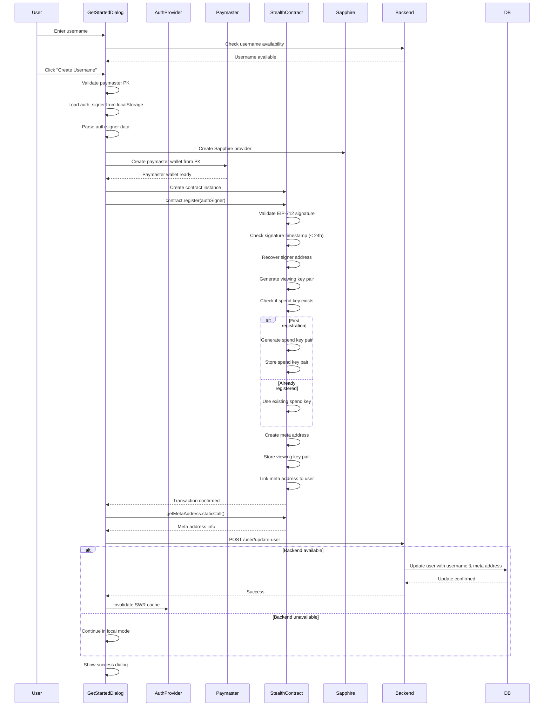
```mermaid
sequenceDiagram
    participant User
    participant GetStartedDialog
    participant AuthProvider
    participant Paymaster
    participant StealthContract
    participant Sapphire
    participant Backend
    participant DB

    User->>GetStartedDialog: Enter username
    GetStartedDialog->>Backend: Check username availability
    Backend-->>GetStartedDialog: Username available
    
    User->>GetStartedDialog: Click "Create Username"
    GetStartedDialog->>GetStartedDialog: Validate paymaster PK
    
    GetStartedDialog->>GetStartedDialog: Load auth_signer from localStorage
    GetStartedDialog->>GetStartedDialog: Parse auth signer data
    
    GetStartedDialog->>Sapphire: Create Sapphire provider
    GetStartedDialog->>Paymaster: Create paymaster wallet from PK
    Paymaster-->>GetStartedDialog: Paymaster wallet ready
    
    GetStartedDialog->>StealthContract: Create contract instance
    GetStartedDialog->>StealthContract: contract.register(authSigner)
    
    StealthContract->>StealthContract: Validate EIP-712 signature
    StealthContract->>StealthContract: Check signature timestamp (< 24h)
    StealthContract->>StealthContract: Recover signer address
    
    StealthContract->>StealthContract: Generate viewing key pair
    StealthContract->>StealthContract: Check if spend key exists
    
    alt First registration
        StealthContract->>StealthContract: Generate spend key pair
        StealthContract->>StealthContract: Store spend key pair
    else Already registered
        StealthContract->>StealthContract: Use existing spend key
    end
    
    StealthContract->>StealthContract: Create meta address
    StealthContract->>StealthContract: Store viewing key pair
    StealthContract->>StealthContract: Link meta address to user
    StealthContract-->>GetStartedDialog: Transaction confirmed
    
    GetStartedDialog->>StealthContract: getMetaAddress.staticCall()
    StealthContract-->>GetStartedDialog: Meta address info
    
    GetStartedDialog->>Backend: POST /user/update-user
    alt Backend available
        Backend->>DB: Update user with username & meta address
        DB-->>Backend: Update confirmed
        Backend-->>GetStartedDialog: Success
        GetStartedDialog->>AuthProvider: Invalidate SWR cache
    else Backend unavailable
        GetStartedDialog->>GetStartedDialog: Continue in local mode
    end
    
    GetStartedDialog->>GetStartedDialog: Show success dialog
```

### Meta Address Registration State Flow

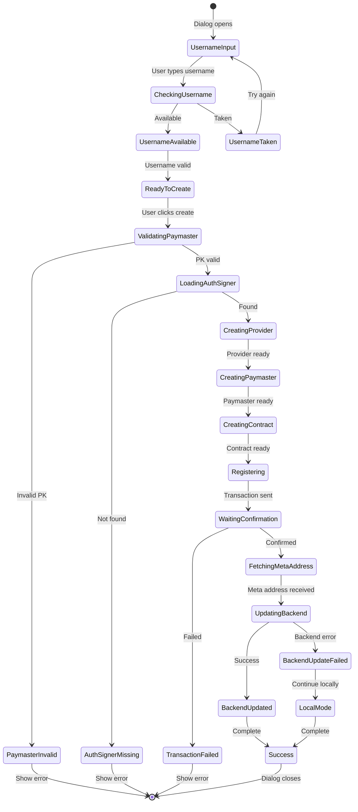
```mermaid
stateDiagram-v2
    [*] --> UsernameInput: Dialog opens
    
    UsernameInput --> CheckingUsername: User types username
    CheckingUsername --> UsernameAvailable: Available
    CheckingUsername --> UsernameTaken: Taken
    UsernameTaken --> UsernameInput: Try again
    UsernameAvailable --> ReadyToCreate: Username valid
    
    ReadyToCreate --> ValidatingPaymaster: User clicks create
    ValidatingPaymaster --> PaymasterInvalid: Invalid PK
    ValidatingPaymaster --> LoadingAuthSigner: PK valid
    
    PaymasterInvalid --> [*]: Show error
    
    LoadingAuthSigner --> AuthSignerMissing: Not found
    LoadingAuthSigner --> CreatingProvider: Found
    
    AuthSignerMissing --> [*]: Show error
    
    CreatingProvider --> CreatingPaymaster: Provider ready
    CreatingPaymaster --> CreatingContract: Paymaster ready
    CreatingContract --> Registering: Contract ready
    
    Registering --> WaitingConfirmation: Transaction sent
    WaitingConfirmation --> TransactionFailed: Failed
    WaitingConfirmation --> FetchingMetaAddress: Confirmed
    
    TransactionFailed --> [*]: Show error
    
    FetchingMetaAddress --> UpdatingBackend: Meta address received
    UpdatingBackend --> BackendUpdateFailed: Backend error
    UpdatingBackend --> BackendUpdated: Success
    
    BackendUpdateFailed --> LocalMode: Continue locally
    BackendUpdated --> Success: Complete
    LocalMode --> Success: Complete
    
    Success --> [*]: Dialog closes
```

---

## 🎭 Stealth Address Generation Flow

### Cryptographic Stealth Address Generation

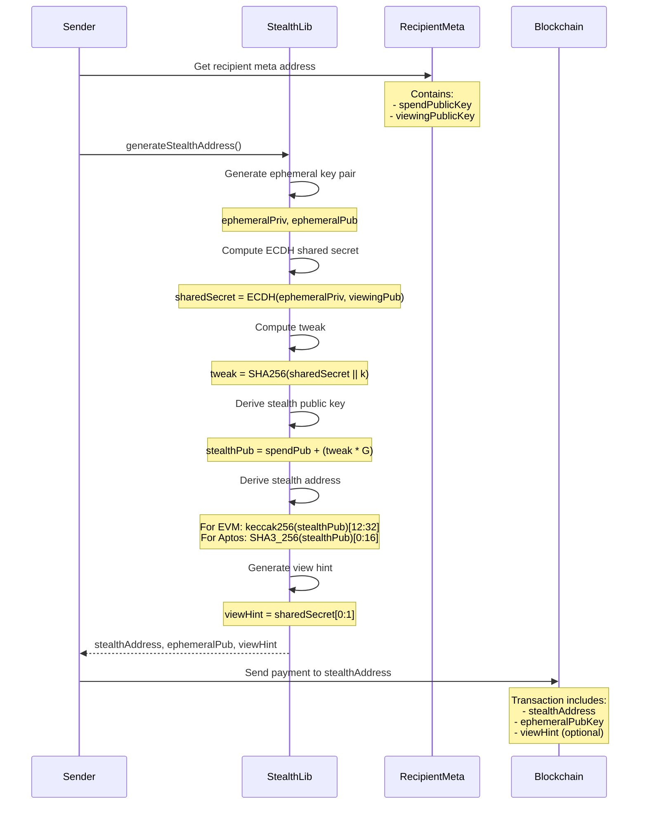
```mermaid
sequenceDiagram
    participant Sender
    participant StealthLib
    participant RecipientMeta
    participant Blockchain

    Sender->>RecipientMeta: Get recipient meta address
    Note over RecipientMeta: Contains:<br/>- spendPublicKey<br/>- viewingPublicKey
    
    Sender->>StealthLib: generateStealthAddress()
    StealthLib->>StealthLib: Generate ephemeral key pair
    Note over StealthLib: ephemeralPriv, ephemeralPub
    
    StealthLib->>StealthLib: Compute ECDH shared secret
    Note over StealthLib: sharedSecret = ECDH(ephemeralPriv, viewingPub)
    
    StealthLib->>StealthLib: Compute tweak
    Note over StealthLib: tweak = SHA256(sharedSecret || k)
    
    StealthLib->>StealthLib: Derive stealth public key
    Note over StealthLib: stealthPub = spendPub + (tweak * G)
    
    StealthLib->>StealthLib: Derive stealth address
    Note over StealthLib: For EVM: keccak256(stealthPub)[12:32]<br/>For Aptos: SHA3_256(stealthPub)[0:16]
    
    StealthLib->>StealthLib: Generate view hint
    Note over StealthLib: viewHint = sharedSecret[0:1]
    
    StealthLib-->>Sender: stealthAddress, ephemeralPub, viewHint
    
    Sender->>Blockchain: Send payment to stealthAddress
    Note over Blockchain: Transaction includes:<br/>- stealthAddress<br/>- ephemeralPubKey<br/>- viewHint (optional)
```

### Stealth Address Generation Algorithm

```mermaid
flowchart TD
    Start([Start: Recipient Meta Address]) --> GetKeys[Extract spendPub & viewingPub]
    GetKeys --> GenEphemeral[Generate ephemeral key pair]
    GenEphemeral --> ECDH[Compute ECDH shared secret]
    ECDH --> HashTweak[Hash: SHA256 sharedSecret || k]
    HashTweak --> DerivePub[Derive stealth public key]
    DerivePub --> DeriveAddr{Blockchain Type?}
    
    DeriveAddr -->|EVM| EVMAddr[keccak256 stealthPub<br/>Take last 20 bytes]
    DeriveAddr -->|Aptos| AptosAddr[SHA3_256 stealthPub<br/>Take first 16 bytes]
    
    EVMAddr --> ViewHint[Generate view hint]
    AptosAddr --> ViewHint
    ViewHint --> Return([Return: stealthAddress,<br/>ephemeralPub, viewHint])
```

---

## 💸 Payment Sending Flow

### Complete Payment Sending Sequence

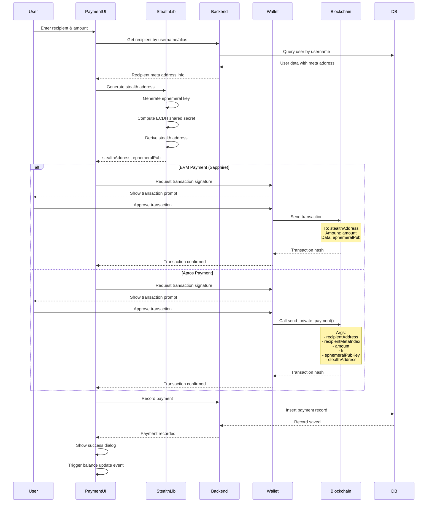
```mermaid
sequenceDiagram
    participant User
    participant PaymentUI
    participant StealthLib
    participant Backend
    participant Wallet
    participant Blockchain
    participant DB

    User->>PaymentUI: Enter recipient & amount
    PaymentUI->>Backend: Get recipient by username/alias
    Backend->>DB: Query user by username
    DB-->>Backend: User data with meta address
    Backend-->>PaymentUI: Recipient meta address info
    
    PaymentUI->>StealthLib: Generate stealth address
    StealthLib->>StealthLib: Generate ephemeral key
    StealthLib->>StealthLib: Compute ECDH shared secret
    StealthLib->>StealthLib: Derive stealth address
    StealthLib-->>PaymentUI: stealthAddress, ephemeralPub
    
    alt EVM Payment (Sapphire)
        PaymentUI->>Wallet: Request transaction signature
        Wallet-->>User: Show transaction prompt
        User->>Wallet: Approve transaction
        Wallet->>Blockchain: Send transaction
        Note over Blockchain: To: stealthAddress<br/>Amount: amount<br/>Data: ephemeralPub
        Blockchain-->>Wallet: Transaction hash
        Wallet-->>PaymentUI: Transaction confirmed
    else Aptos Payment
        PaymentUI->>Wallet: Request transaction signature
        Wallet-->>User: Show transaction prompt
        User->>Wallet: Approve transaction
        Wallet->>Blockchain: Call send_private_payment()
        Note over Blockchain: Args:<br/>- recipientAddress<br/>- recipientMetaIndex<br/>- amount<br/>- k<br/>- ephemeralPubKey<br/>- stealthAddress
        Blockchain-->>Wallet: Transaction hash
        Wallet-->>PaymentUI: Transaction confirmed
    end
    
    PaymentUI->>Backend: Record payment
    Backend->>DB: Insert payment record
    DB-->>Backend: Record saved
    Backend-->>PaymentUI: Payment recorded
    
    PaymentUI->>PaymentUI: Show success dialog
    PaymentUI->>PaymentUI: Trigger balance update event
```

### Payment Sending State Machine

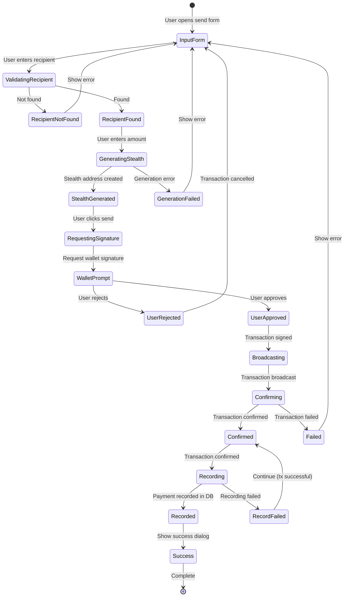
```mermaid
stateDiagram-v2
    [*] --> InputForm: User opens send form
    
    InputForm --> ValidatingRecipient: User enters recipient
    ValidatingRecipient --> RecipientNotFound: Not found
    ValidatingRecipient --> RecipientFound: Found
    
    RecipientNotFound --> InputForm: Show error
    
    RecipientFound --> GeneratingStealth: User enters amount
    GeneratingStealth --> StealthGenerated: Stealth address created
    GeneratingStealth --> GenerationFailed: Generation error
    
    GenerationFailed --> InputForm: Show error
    
    StealthGenerated --> RequestingSignature: User clicks send
    RequestingSignature --> WalletPrompt: Request wallet signature
    WalletPrompt --> UserRejected: User rejects
    WalletPrompt --> UserApproved: User approves
    
    UserRejected --> InputForm: Transaction cancelled
    
    UserApproved --> Broadcasting: Transaction signed
    Broadcasting --> Confirming: Transaction broadcast
    Confirming --> Confirmed: Transaction confirmed
    Confirming --> Failed: Transaction failed
    
    Failed --> InputForm: Show error
    
    Confirmed --> Recording: Transaction confirmed
    Recording --> Recorded: Payment recorded in DB
    Recording --> RecordFailed: Recording failed
    
    RecordFailed --> Confirmed: Continue (tx successful)
    
    Recorded --> Success: Show success dialog
    Success --> [*]: Complete
```

---

## 🔍 Payment Detection Flow

### Off-Chain Payment Scanning

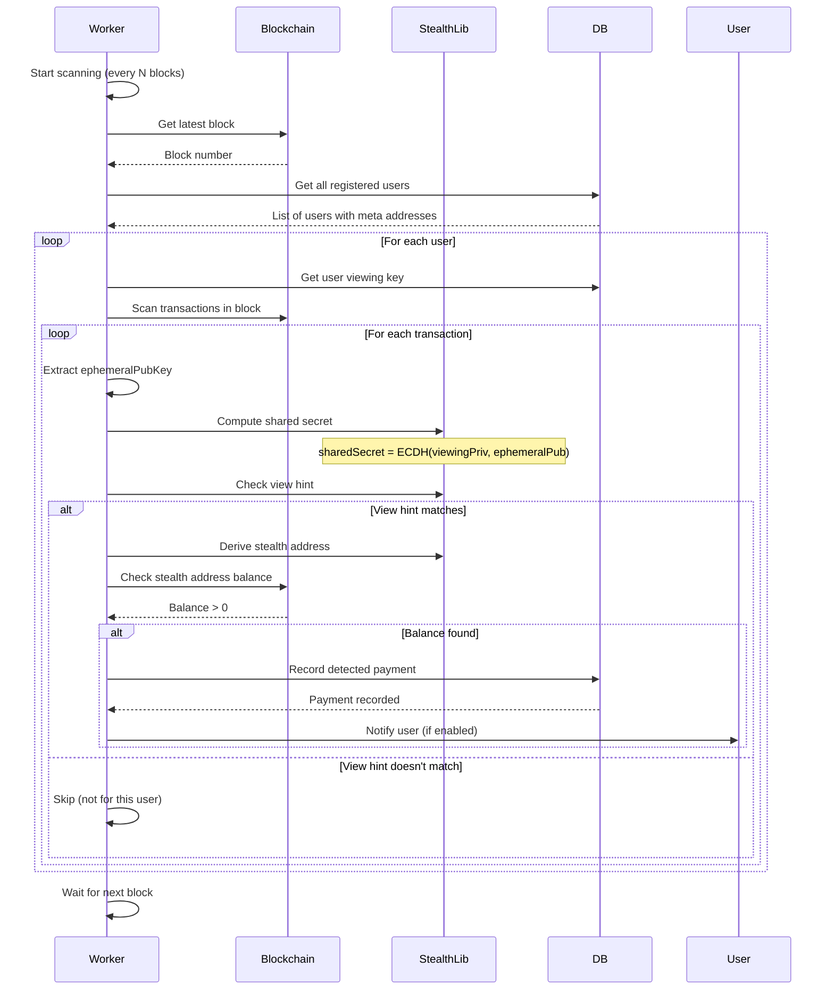
```mermaid
sequenceDiagram
    participant Worker
    participant Blockchain
    participant StealthLib
    participant DB
    participant User

    Worker->>Worker: Start scanning (every N blocks)
    Worker->>Blockchain: Get latest block
    Blockchain-->>Worker: Block number
    
    Worker->>DB: Get all registered users
    DB-->>Worker: List of users with meta addresses
    
    loop For each user
        Worker->>DB: Get user viewing key
        Worker->>Blockchain: Scan transactions in block
        
        loop For each transaction
            Worker->>Worker: Extract ephemeralPubKey
            Worker->>StealthLib: Compute shared secret
            Note over StealthLib: sharedSecret = ECDH(viewingPriv, ephemeralPub)
            
            Worker->>StealthLib: Check view hint
            alt View hint matches
                Worker->>StealthLib: Derive stealth address
                Worker->>Blockchain: Check stealth address balance
                Blockchain-->>Worker: Balance > 0
                
                alt Balance found
                    Worker->>DB: Record detected payment
                    DB-->>Worker: Payment recorded
                    Worker->>User: Notify user (if enabled)
                end
            else View hint doesn't match
                Worker->>Worker: Skip (not for this user)
            end
        end
    end
    
    Worker->>Worker: Wait for next block
```

### Payment Detection Algorithm

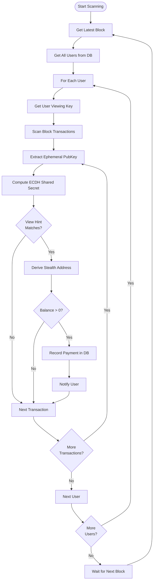
```mermaid
flowchart TD
    Start([Start Scanning]) --> GetBlock[Get Latest Block]
    GetBlock --> GetUsers[Get All Users from DB]
    GetUsers --> ForEachUser[For Each User]
    
    ForEachUser --> GetViewingKey[Get User Viewing Key]
    GetViewingKey --> ScanTxs[Scan Block Transactions]
    ScanTxs --> ExtractEphemeral[Extract Ephemeral PubKey]
    
    ExtractEphemeral --> ComputeSecret[Compute ECDH Shared Secret]
    ComputeSecret --> CheckHint{View Hint<br/>Matches?}
    
    CheckHint -->|No| NextTx[Next Transaction]
    CheckHint -->|Yes| DeriveStealth[Derive Stealth Address]
    
    DeriveStealth --> CheckBalance{Balance > 0?}
    CheckBalance -->|No| NextTx
    CheckBalance -->|Yes| RecordPayment[Record Payment in DB]
    
    RecordPayment --> NotifyUser[Notify User]
    NotifyUser --> NextTx
    NextTx --> MoreTxs{More<br/>Transactions?}
    
    MoreTxs -->|Yes| ExtractEphemeral
    MoreTxs -->|No| NextUser[Next User]
    
    NextUser --> MoreUsers{More<br/>Users?}
    MoreUsers -->|Yes| ForEachUser
    MoreUsers -->|No| WaitBlock[Wait for Next Block]
    
    WaitBlock --> GetBlock
```

---

## 💰 Fund Withdrawal Flow

### Withdrawing Funds from Stealth Address

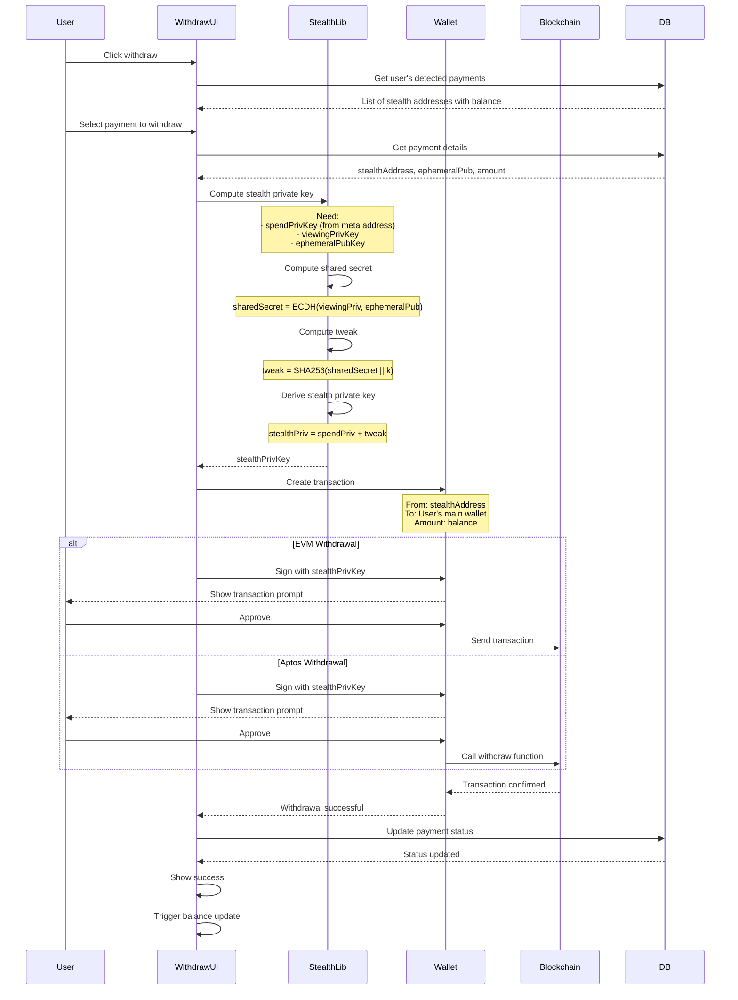
```mermaid
sequenceDiagram
    participant User
    participant WithdrawUI
    participant StealthLib
    participant Wallet
    participant Blockchain
    participant DB

    User->>WithdrawUI: Click withdraw
    WithdrawUI->>DB: Get user's detected payments
    DB-->>WithdrawUI: List of stealth addresses with balance
    
    User->>WithdrawUI: Select payment to withdraw
    WithdrawUI->>DB: Get payment details
    DB-->>WithdrawUI: stealthAddress, ephemeralPub, amount
    
    WithdrawUI->>StealthLib: Compute stealth private key
    Note over StealthLib: Need:<br/>- spendPrivKey (from meta address)<br/>- viewingPrivKey<br/>- ephemeralPubKey
    
    StealthLib->>StealthLib: Compute shared secret
    Note over StealthLib: sharedSecret = ECDH(viewingPriv, ephemeralPub)
    
    StealthLib->>StealthLib: Compute tweak
    Note over StealthLib: tweak = SHA256(sharedSecret || k)
    
    StealthLib->>StealthLib: Derive stealth private key
    Note over StealthLib: stealthPriv = spendPriv + tweak
    
    StealthLib-->>WithdrawUI: stealthPrivKey
    
    WithdrawUI->>Wallet: Create transaction
    Note over Wallet: From: stealthAddress<br/>To: User's main wallet<br/>Amount: balance
    
    alt EVM Withdrawal
        WithdrawUI->>Wallet: Sign with stealthPrivKey
        Wallet-->>User: Show transaction prompt
        User->>Wallet: Approve
        Wallet->>Blockchain: Send transaction
    else Aptos Withdrawal
        WithdrawUI->>Wallet: Sign with stealthPrivKey
        Wallet-->>User: Show transaction prompt
        User->>Wallet: Approve
        Wallet->>Blockchain: Call withdraw function
    end
    
    Blockchain-->>Wallet: Transaction confirmed
    Wallet-->>WithdrawUI: Withdrawal successful
    
    WithdrawUI->>DB: Update payment status
    DB-->>WithdrawUI: Status updated
    
    WithdrawUI->>WithdrawUI: Show success
    WithdrawUI->>WithdrawUI: Trigger balance update
```

### Withdrawal State Flow

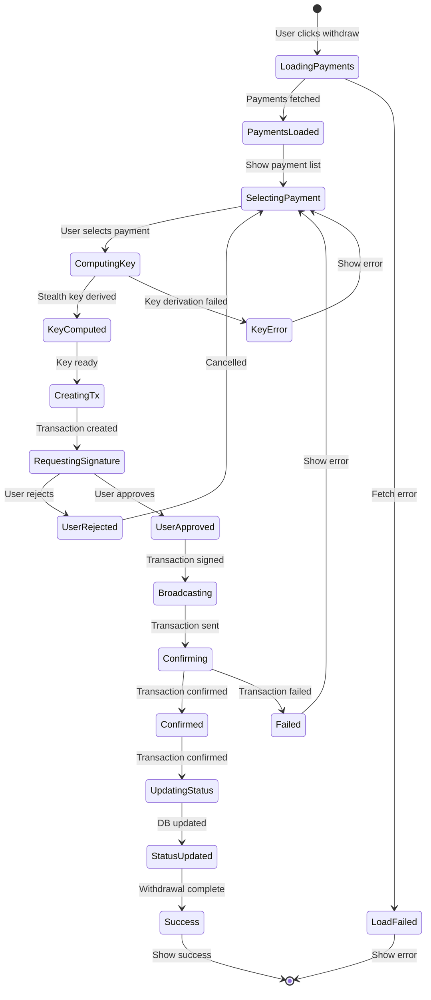
```mermaid
stateDiagram-v2
    [*] --> LoadingPayments: User clicks withdraw
    
    LoadingPayments --> PaymentsLoaded: Payments fetched
    LoadingPayments --> LoadFailed: Fetch error
    
    LoadFailed --> [*]: Show error
    
    PaymentsLoaded --> SelectingPayment: Show payment list
    SelectingPayment --> ComputingKey: User selects payment
    
    ComputingKey --> KeyComputed: Stealth key derived
    ComputingKey --> KeyError: Key derivation failed
    
    KeyError --> SelectingPayment: Show error
    
    KeyComputed --> CreatingTx: Key ready
    CreatingTx --> RequestingSignature: Transaction created
    RequestingSignature --> UserRejected: User rejects
    RequestingSignature --> UserApproved: User approves
    
    UserRejected --> SelectingPayment: Cancelled
    
    UserApproved --> Broadcasting: Transaction signed
    Broadcasting --> Confirming: Transaction sent
    Confirming --> Confirmed: Transaction confirmed
    Confirming --> Failed: Transaction failed
    
    Failed --> SelectingPayment: Show error
    
    Confirmed --> UpdatingStatus: Transaction confirmed
    UpdatingStatus --> StatusUpdated: DB updated
    StatusUpdated --> Success: Withdrawal complete
    Success --> [*]: Show success
```

---

## 🔌 Backend API Interactions

### API Request Flow

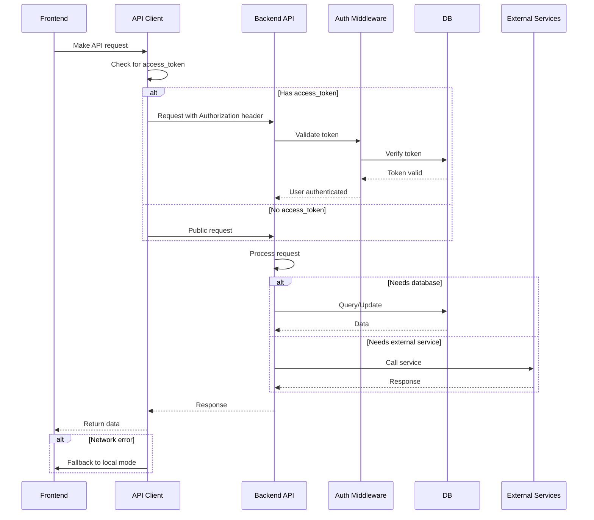
```mermaid
sequenceDiagram
    participant Frontend
    participant API Client
    participant Backend API
    participant Auth Middleware
    participant DB
    participant External Services

    Frontend->>API Client: Make API request
    API Client->>API Client: Check for access_token
    
    alt Has access_token
        API Client->>Backend API: Request with Authorization header
        Backend API->>Auth Middleware: Validate token
        Auth Middleware->>DB: Verify token
        DB-->>Auth Middleware: Token valid
        Auth Middleware-->>Backend API: User authenticated
    else No access_token
        API Client->>Backend API: Public request
    end
    
    Backend API->>Backend API: Process request
    
    alt Needs database
        Backend API->>DB: Query/Update
        DB-->>Backend API: Data
    else Needs external service
        Backend API->>External Services: Call service
        External Services-->>Backend API: Response
    end
    
    Backend API-->>API Client: Response
    API Client-->>Frontend: Return data
    
    alt Network error
        API Client->>Frontend: Fallback to local mode
    end
```

### API Endpoint Flow

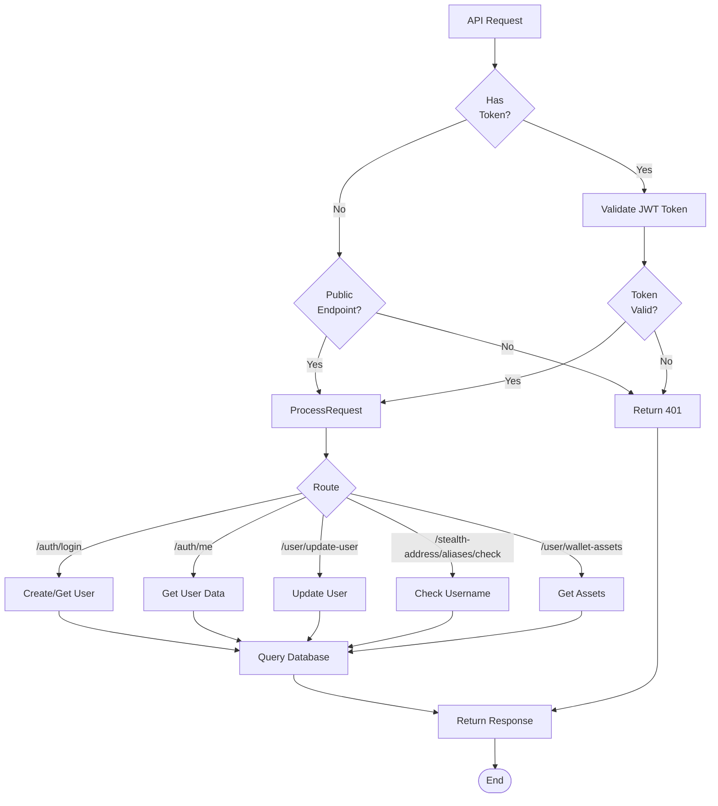
```mermaid
flowchart TD
    Request[API Request] --> CheckAuth{Has<br/>Token?}
    
    CheckAuth -->|Yes| ValidateToken[Validate JWT Token]
    CheckAuth -->|No| PublicEndpoint{Public<br/>Endpoint?}
    
    PublicEndpoint -->|Yes| ProcessRequest
    PublicEndpoint -->|No| Return401[Return 401]
    
    ValidateToken --> TokenValid{Token<br/>Valid?}
    TokenValid -->|No| Return401
    TokenValid -->|Yes| ProcessRequest
    
    ProcessRequest --> RouteRequest{Route}
    
    RouteRequest -->|/auth/login| AuthLogin[Create/Get User]
    RouteRequest -->|/auth/me| GetUser[Get User Data]
    RouteRequest -->|/user/update-user| UpdateUser[Update User]
    RouteRequest -->|/stealth-address/aliases/check| CheckAlias[Check Username]
    RouteRequest -->|/user/wallet-assets| GetAssets[Get Assets]
    
    AuthLogin --> DBQuery[Query Database]
    GetUser --> DBQuery
    UpdateUser --> DBQuery
    CheckAlias --> DBQuery
    GetAssets --> DBQuery
    
    DBQuery --> ReturnResponse[Return Response]
    Return401 --> ReturnResponse
    ReturnResponse --> End([End])
```

---

## 💾 Database Operations Flow

### Database Schema and Operations

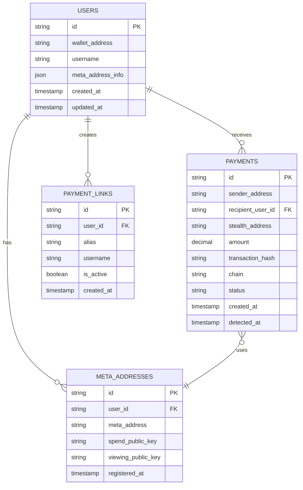
```mermaid
erDiagram
    USERS ||--o{ PAYMENTS : receives
    USERS ||--o{ META_ADDRESSES : has
    USERS ||--o{ PAYMENT_LINKS : creates
    PAYMENTS }o--|| META_ADDRESSES : uses
    
    USERS {
        string id PK
        string wallet_address
        string username
        json meta_address_info
        timestamp created_at
        timestamp updated_at
    }
    
    META_ADDRESSES {
        string id PK
        string user_id FK
        string meta_address
        string spend_public_key
        string viewing_public_key
        timestamp registered_at
    }
    
    PAYMENTS {
        string id PK
        string sender_address
        string recipient_user_id FK
        string stealth_address
        decimal amount
        string transaction_hash
        string chain
        string status
        timestamp created_at
        timestamp detected_at
    }
    
    PAYMENT_LINKS {
        string id PK
        string user_id FK
        string alias
        string username
        boolean is_active
        timestamp created_at
    }
```

### Database Operation Sequence

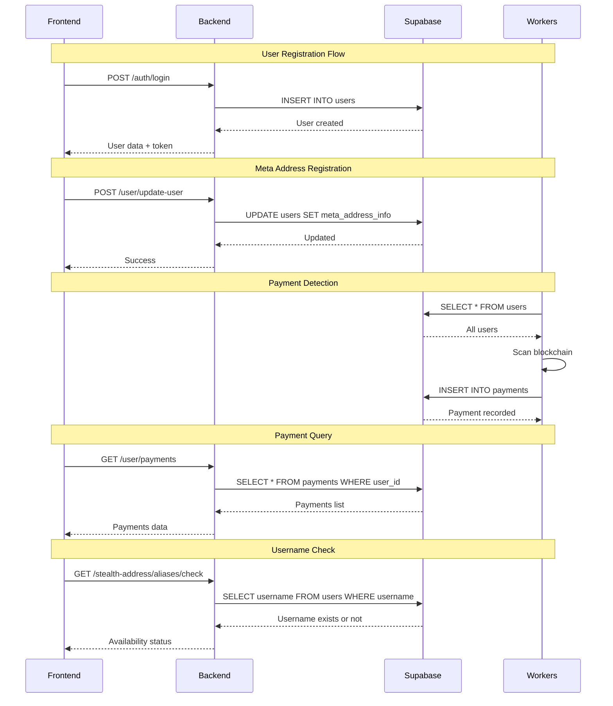
```mermaid
sequenceDiagram
    participant Frontend
    participant Backend
    participant Supabase
    participant Workers

    Note over Frontend,Workers: User Registration Flow
    Frontend->>Backend: POST /auth/login
    Backend->>Supabase: INSERT INTO users
    Supabase-->>Backend: User created
    Backend-->>Frontend: User data + token
    
    Note over Frontend,Workers: Meta Address Registration
    Frontend->>Backend: POST /user/update-user
    Backend->>Supabase: UPDATE users SET meta_address_info
    Supabase-->>Backend: Updated
    Backend-->>Frontend: Success
    
    Note over Frontend,Workers: Payment Detection
    Workers->>Supabase: SELECT * FROM users
    Supabase-->>Workers: All users
    Workers->>Workers: Scan blockchain
    Workers->>Supabase: INSERT INTO payments
    Supabase-->>Workers: Payment recorded
    
    Note over Frontend,Workers: Payment Query
    Frontend->>Backend: GET /user/payments
    Backend->>Supabase: SELECT * FROM payments WHERE user_id
    Supabase-->>Backend: Payments list
    Backend-->>Frontend: Payments data
    
    Note over Frontend,Workers: Username Check
    Frontend->>Backend: GET /stealth-address/aliases/check
    Backend->>Supabase: SELECT username FROM users WHERE username
    Supabase-->>Backend: Username exists or not
    Backend-->>Frontend: Availability status
```

---

## 🔄 Complete User Journey Flow

### End-to-End User Flow

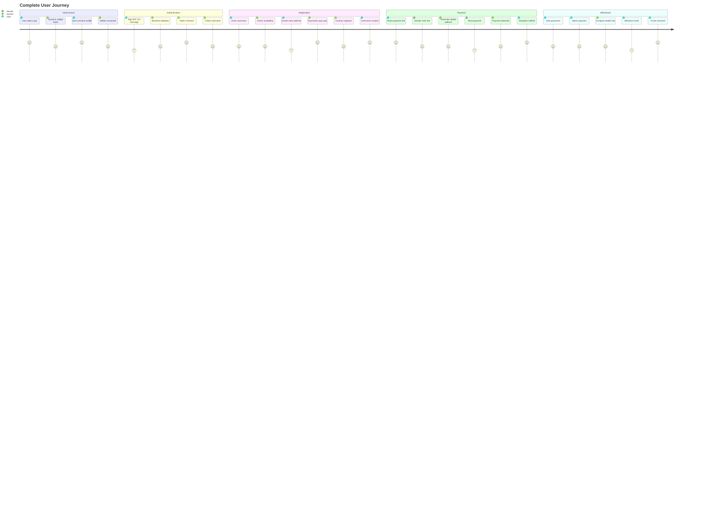
```mermaid
journey
    title Complete User Journey
    section Initial Access
      User opens app: 5: User
      Dynamic widget loads: 4: System
      User connects wallet: 5: User
      Wallet connected: 4: System
    section Authentication
      Sign EIP-712 message: 3: User
      Backend validates: 4: System
      Token received: 5: System
      Check username: 4: System
    section Registration
      Enter username: 4: User
      Check availability: 4: System
      Create meta address: 3: User
      Paymaster pays gas: 5: System
      Contract registers: 4: System
      Username created: 5: User
    section Payment
      Share payment link: 5: User
      Sender visits link: 4: Sender
      Generate stealth address: 4: System
      Send payment: 3: Sender
      Payment detected: 4: System
      Recipient notified: 5: User
    section Withdrawal
      View payments: 4: User
      Select payment: 4: User
      Compute stealth key: 4: System
      Withdraw funds: 3: User
      Funds received: 5: User
```

---

## 📊 Component Lifecycle Flow

### React Component Lifecycle

```mermaid
stateDiagram-v2
    [*] --> Mounting: Component Created
    
    Mounting --> DynamicProvider: RootProvider mounts
    DynamicProvider --> Web3Provider: DynamicProvider ready
    Web3Provider --> AuthProvider: Web3Provider ready
    AuthProvider --> UserProvider: AuthProvider ready
    UserProvider --> App: All providers ready
    
    App --> Dashboard: User authenticated
    App --> LoginScreen: User not authenticated
    
    Dashboard --> PaymentLinks: User navigates
    Dashboard --> Transactions: User navigates
    Dashboard --> Arcium: User navigates
    Dashboard --> Aztec: User navigates
    
    PaymentLinks --> Dashboard: Back
    Transactions --> Dashboard: Back
    Arcium --> Dashboard: Back
    Aztec --> Dashboard: Back
    
    LoginScreen --> Dashboard: Login successful
    
    Dashboard --> [*]: User logs out
```

---

## 🎯 Key Timing Information

### Critical Timing Points

| Event | When | Where | Duration |
|-------|------|-------|----------|
| Wallet Connection | User clicks connect | DynamicProvider | ~2-5s |
| Network Detection | After wallet connect | Web3Provider | ~1s |
| Auth Token Signing | After provider ready | AuthProvider | ~3-5s (user approval) |
| Backend Login | After token signed | Backend API | ~500ms-2s |
| Meta Address Registration | User creates username | GetStartedDialog | ~10-30s (blockchain) |
| Stealth Address Generation | Before sending payment | StealthLib | ~100ms |
| Payment Transaction | User sends payment | Blockchain | ~5-15s (confirmation) |
| Payment Detection | Background scanning | Workers | Continuous |
| Fund Withdrawal | User withdraws | WithdrawUI | ~10-30s (blockchain) |

---

## 🔐 Security Flow

### Security Validation Points

```mermaid
flowchart TD
    Start([Request]) --> CheckAuth{Authentication<br/>Required?}
    
    CheckAuth -->|Yes| ValidateToken[Validate JWT Token]
    CheckAuth -->|No| CheckRateLimit
    
    ValidateToken --> TokenValid{Token<br/>Valid?}
    TokenValid -->|No| Reject401[Reject 401]
    TokenValid -->|Yes| CheckRateLimit
    
    CheckRateLimit --> RateLimitOK{Rate Limit<br/>OK?}
    RateLimitOK -->|No| Reject429[Reject 429]
    RateLimitOK -->|Yes| ValidateInput
    
    ValidateInput --> InputValid{Input<br/>Valid?}
    InputValid -->|No| Reject400[Reject 400]
    InputValid -->|Yes| CheckPermissions
    
    CheckPermissions --> HasPermission{Has<br/>Permission?}
    HasPermission -->|No| Reject403[Reject 403]
    HasPermission -->|Yes| ProcessRequest
    
    ProcessRequest --> SanitizeData[Sanitize Data]
    SanitizeData --> ExecuteOperation[Execute Operation]
    ExecuteOperation --> LogActivity[Log Activity]
    LogActivity --> ReturnResponse[Return Response]
    
    Reject401 --> End([End])
    Reject429 --> End
    Reject400 --> End
    Reject403 --> End
    ReturnResponse --> End
```

---

This documentation provides a comprehensive view of all system flows in PrivatePay. Each diagram shows what happens, where it happens (which component/service), and when it happens (the sequence and timing).

