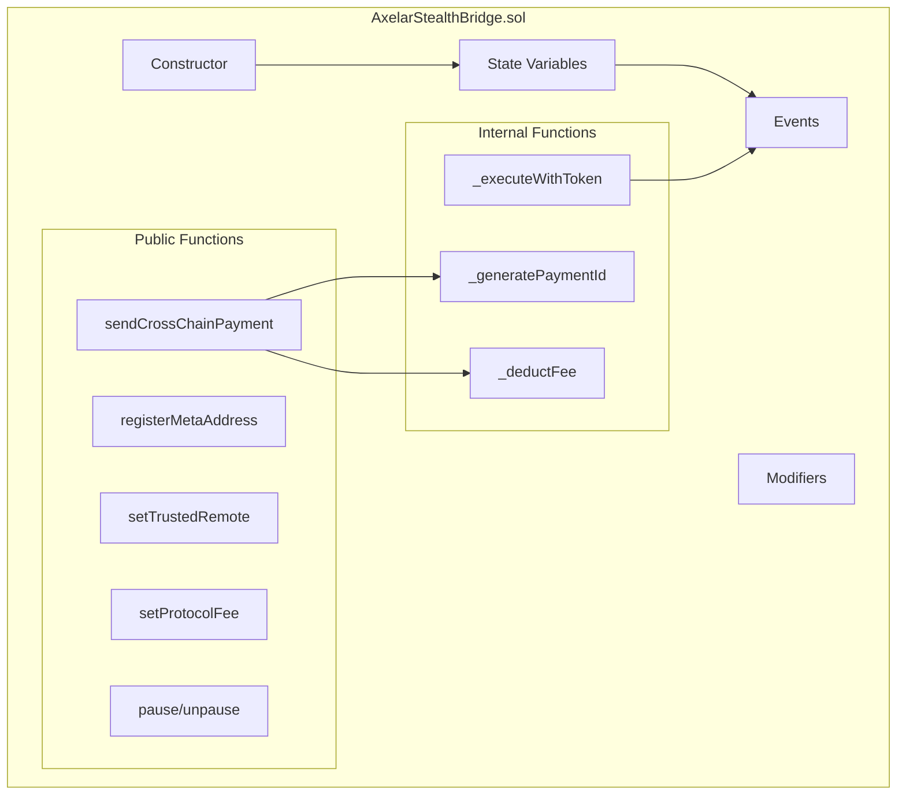
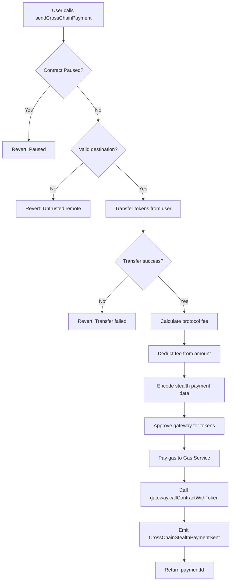
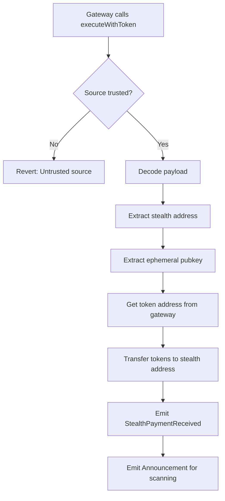
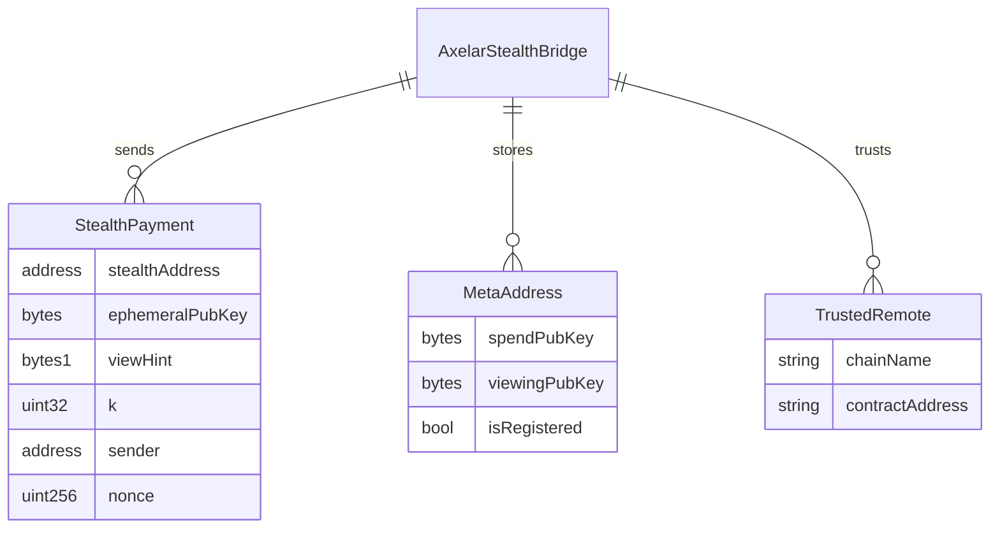
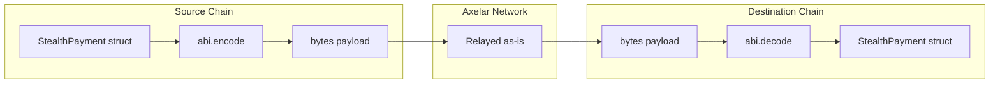
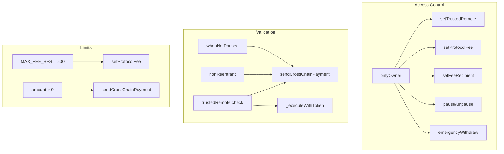
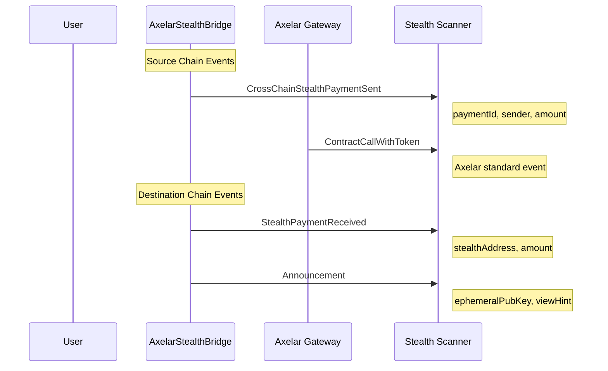

# Axelar Contract Internals

## Contract Structure



## sendCrossChainPayment() Flow



## \_executeWithToken() Flow (Destination)



## Data Structures



## Payload Encoding



### Payload Structure

```solidity
// Encoded payload (bytes)
abi.encode(
    stealthAddress,      // address - 32 bytes
    ephemeralPubKey,     // bytes   - variable
    viewHint,            // bytes1  - 1 byte
    k,                   // uint32  - 4 bytes
    sender,              // address - 32 bytes
    nonce                // uint256 - 32 bytes
)
```

## Security Checks



## Gas Costs Breakdown

| Operation             | Estimated Gas | Notes                 |
| --------------------- | ------------- | --------------------- |
| Token Approval        | ~46,000       | One-time per token    |
| sendCrossChainPayment | ~150,000      | Includes gateway call |
| \_executeWithToken    | ~80,000       | Destination execution |
| registerMetaAddress   | ~50,000       | One-time per user     |
| setTrustedRemote      | ~25,000       | Admin only            |

## Event Emissions


