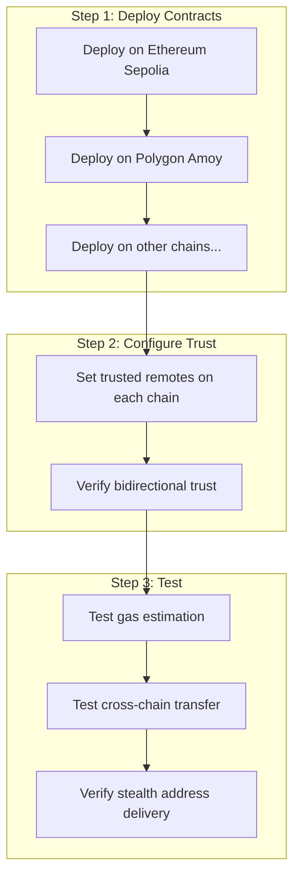
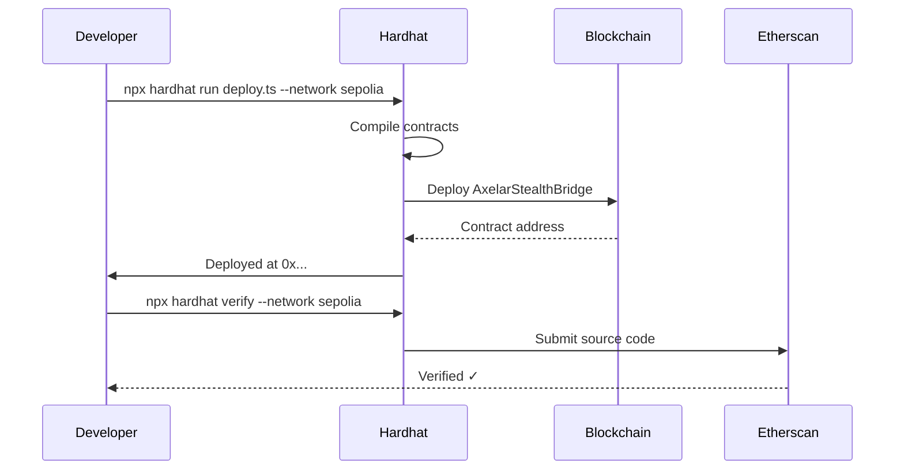
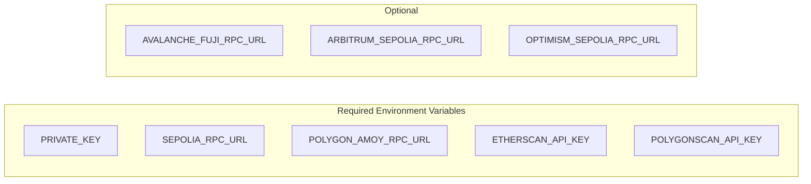
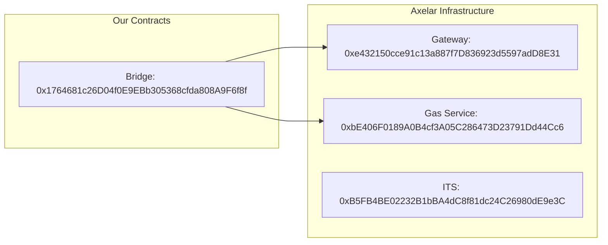
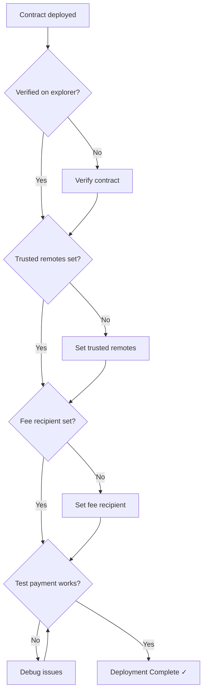
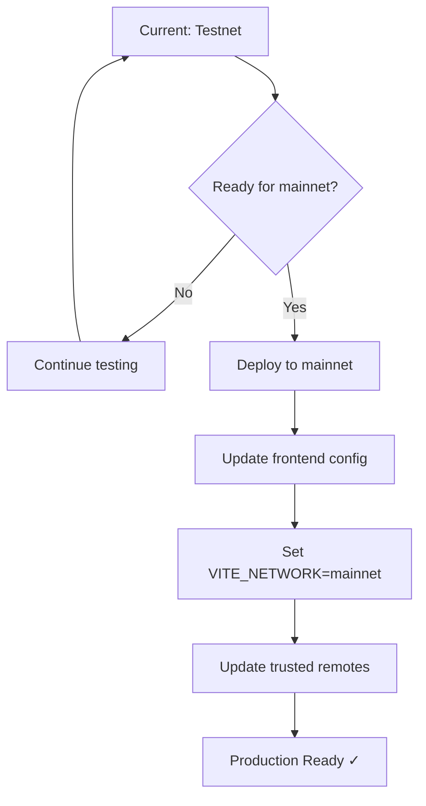

# Axelar Deployment Guide

## Deployment Architecture



## Contract Deployment Flow



## Trusted Remote Setup

```mermaid
flowchart TD
    subgraph "Chain A (Ethereum)"
        A[AxelarStealthBridge]
        A -->|setTrustedRemote| AT["polygon-sepolia" => "0xBridge_B"]
    end

    subgraph "Chain B (Polygon)"
        B[AxelarStealthBridge]
        B -->|setTrustedRemote| BT["ethereum-sepolia" => "0xBridge_A"]
    end

    AT -.->|Trust| B
    BT -.->|Trust| A
```

## Environment Setup



## Deployment Commands

### 1. Compile Contracts

```bash
cd hardhat
npx hardhat compile
```

### 2. Deploy to Sepolia

```bash
npx hardhat run scripts/deploy.ts --network ethereum-sepolia
```

### 3. Deploy to Polygon Amoy

```bash
npx hardhat run scripts/deploy.ts --network polygon-amoy
```

### 4. Set Trusted Remotes

```bash
npx hardhat run scripts/setTrustedRemotes.ts --network ethereum-sepolia
npx hardhat run scripts/setTrustedRemotes.ts --network polygon-amoy
```

### 5. Verify Contracts

```bash
npx hardhat verify --network ethereum-sepolia <CONTRACT_ADDRESS> <GATEWAY> <GAS_SERVICE> <OWNER>
```

## Testnet Addresses



## Post-Deployment Checklist



## Mainnet Deployment Differences

| Aspect      | Testnet                   | Mainnet             |
| ----------- | ------------------------- | ------------------- |
| Gateway     | 0xe432150...              | Different per chain |
| Gas Service | 0xbE406F...               | Different per chain |
| Token       | aUSDC                     | axlUSDC or USDC     |
| API         | testnet.api.axelarscan.io | api.axelarscan.io   |
| Chain Names | ethereum-sepolia          | ethereum            |

## Upgrade Path


