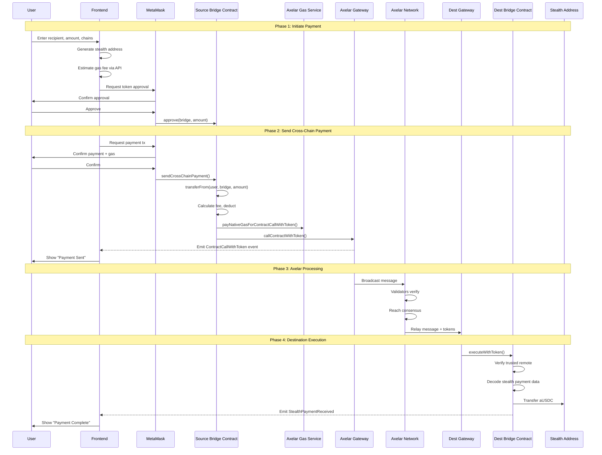
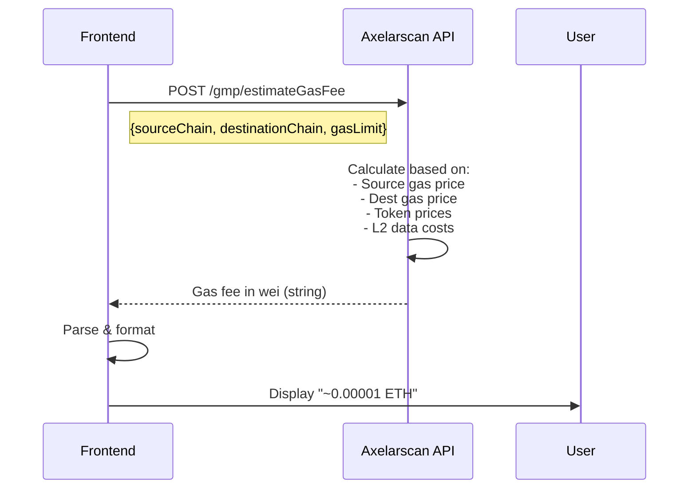
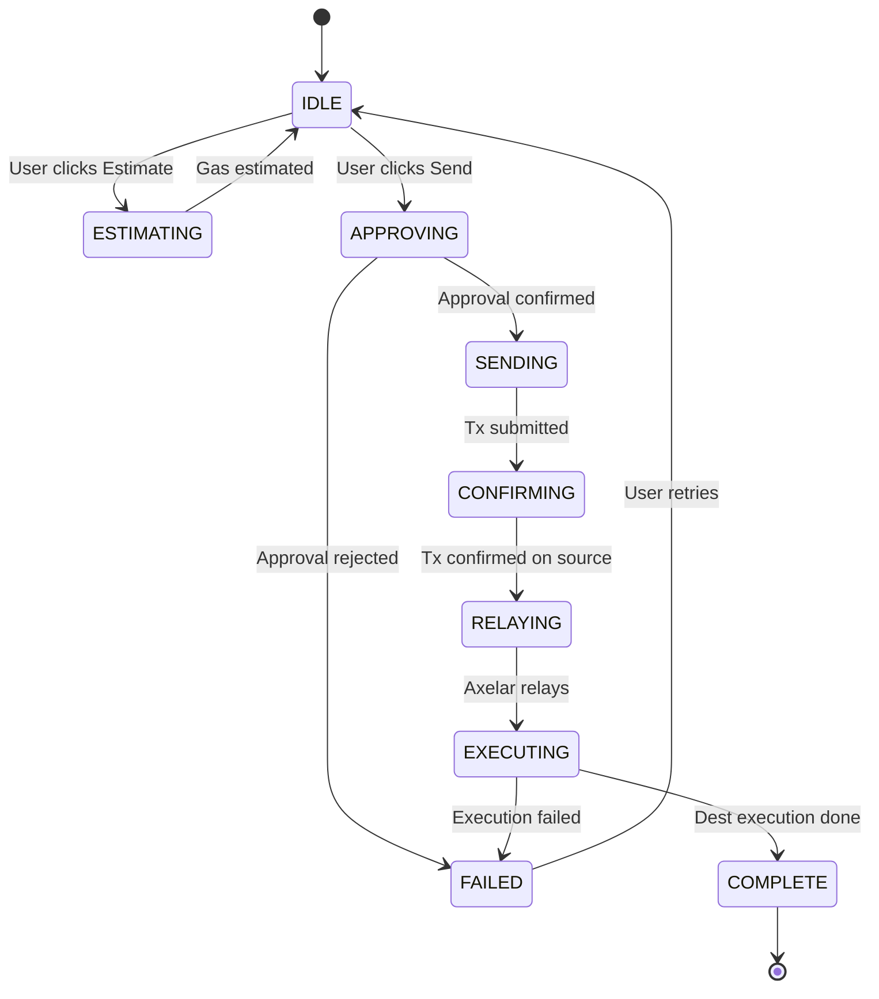
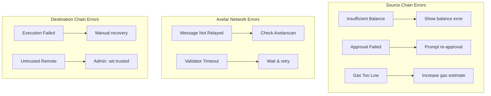

# Axelar Cross-Chain Payment Flow

## Complete Payment Flow



## Gas Estimation Flow



## Stealth Address Generation

```mermaid
flowchart TD
    A[Recipient Meta Address] --> B[Extract spend_pubkey]
    A --> C[Extract viewing_pubkey]
    B --> D[Generate ephemeral keypair]
    C --> D
    D --> E[ECDH: shared_secret = ephemeral_priv * viewing_pubkey]
    E --> F[Hash shared_secret]
    F --> G[stealth_pubkey = spend_pubkey + hash * G]
    G --> H[Stealth Address = keccak256(stealth_pubkey)]
    D --> I[Store ephemeral_pubkey in payment]
```

## Transaction States



## Error Handling



## Time Estimates

| Phase          | Duration    | Notes                        |
| -------------- | ----------- | ---------------------------- |
| Token Approval | ~15 sec     | 1 block confirmation         |
| Source Tx      | ~15 sec     | 1 block confirmation         |
| Axelar Relay   | 2-5 min     | Validator consensus          |
| Dest Execution | ~15 sec     | Auto-executed by relayer     |
| **Total**      | **3-6 min** | Varies by network congestion |
